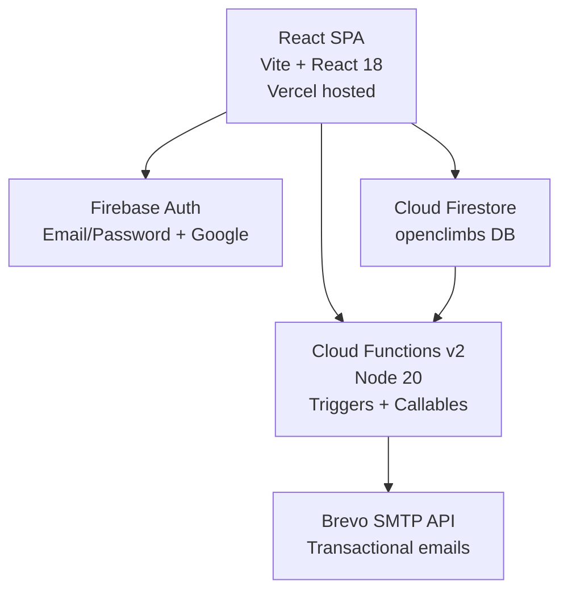
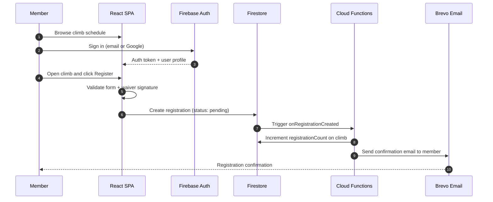
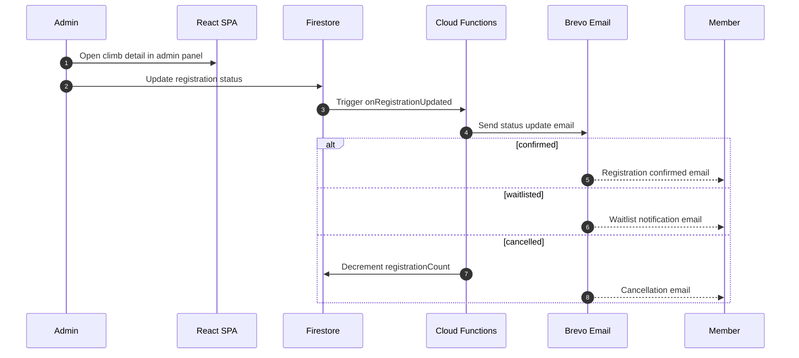
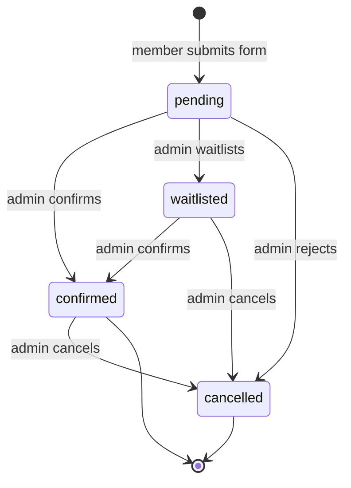

# MMS Open Climbs

Event management portal for MMS mountaineering club climbs. Members browse the climb schedule, register for events, sign digital waivers, and track their registrations. Admins manage climbs, review registrations, and handle user accounts.

## System Overview



## User Paths

### Member Registration Flow



### Admin Approval Flow



## Registration Status Lifecycle



## Local Development

### 1. Install dependencies

```bash
npm install
cd functions && npm install && cd ..
```

### 2. Configure environment

Copy `.env.example` to `.env` and fill in your Firebase project values:

```
VITE_FIREBASE_API_KEY=...
VITE_FIREBASE_AUTH_DOMAIN=...
VITE_FIREBASE_PROJECT_ID=...
VITE_FIREBASE_STORAGE_BUCKET=...
VITE_FIREBASE_MESSAGING_SENDER_ID=...
VITE_FIREBASE_APP_ID=...
```

### 3. Start emulators and dev server

```bash
# Terminal 1 — Firebase emulators
firebase emulators:start --only auth,firestore,functions

# Terminal 2 — Vite dev server
npm run dev
```

- App: `http://localhost:5173`
- Emulator UI: `http://localhost:4000`

### 4. Set first admin

```bash
node scripts/set-admin.mjs your@email.com
```

## Repository Structure

```
src/
  components/     Shared UI components
  contexts/       React contexts (AuthContext)
  data/           Static schedule data
  firebase/       Firebase client config
  pages/          Route-level page components
  pages/admin/    Admin-only pages
  styles/         Global CSS and design tokens
functions/        Firebase Cloud Functions (Node 20)
infra/            (reserved for future IaC)
scripts/          Admin utility scripts
docs/             Architecture and operational docs
```

## Documentation

- [Architecture](docs/ARCHITECTURE.md)
- [API Reference](docs/API.md)
- [Deployment Guide](docs/DEPLOYMENT.md)
- [Security](docs/SECURITY.md)
- [Contributing](docs/CONTRIBUTING.md)
- [Troubleshooting](docs/TROUBLESHOOTING.md)
