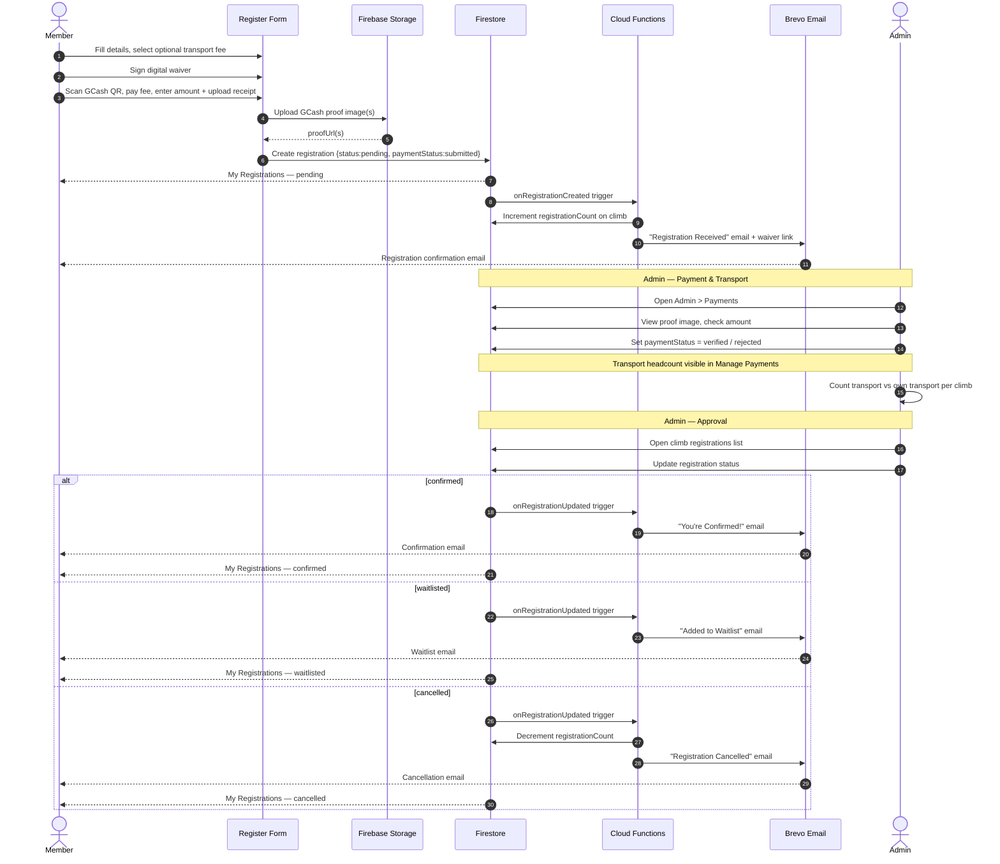
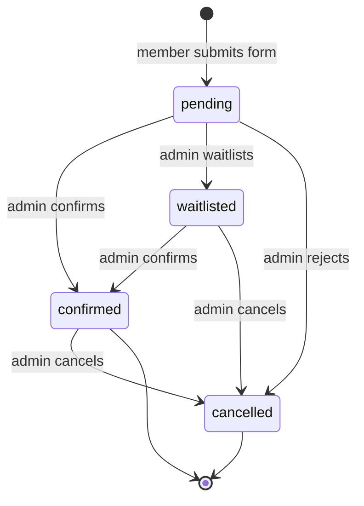

# MMS Open Climbs

Event management portal for MMS mountaineering club climbs. Members browse the climb schedule, view mountain profiles (elevation, difficulty, distances, itinerary), register for events, sign digital waivers, and track their registrations. Admins manage climbs, review registrations, and handle user accounts.

## Features

- Climb schedule with card grid — shows elevation, difficulty, and round-trip distance at a glance
- Full mountain profile per climb: summit elevation, difficulty, jump-off point, elevation gain, distances, features, water source notes, and external links (AllTrails, Strava, Coros, Google Maps)
- Member registration with digital waiver signature and optional fee selection (transport, meals, guest fee)
- GCash payment: members scan the climb's QR code, pay, and upload a screenshot as proof
- Registration status tracking (pending / confirmed / waitlisted / cancelled) with email notifications on every status change
- Admin panel:
  - Climb management — create, edit, open/close registration, set GCash details and QR code
  - Climb detail — per-climb registration list with status and payment controls
  - All registrations — cross-climb view with search, status, and payment filters; CSV export
  - Payment management — verify or reject GCash proof per registration; transport headcount per climb
  - User management — create accounts, assign roles
- Cloud Function email notifications: registration received, confirmed, waitlisted, cancelled (with reason)
- Google and email/password authentication

## System Overview


## End-to-End Flow

From member registration through payment, transportation, and admin approval with email notifications.

### Step-by-Step

#### Member — Registration

1. Member opens the schedule and browses available climbs on the card grid.
2. Member clicks a climb card to open the event page — reviews the mountain profile (elevation, difficulty, distances, itinerary, map) and checks remaining slots.
3. Member signs in with email/password or Google if not already authenticated.
4. Member opens the registration form and fills in personal details, emergency contact, experience level, and medical conditions.
5. Member selects optional fees — if the climb has an organized transport option (Transportation Fee), member checks it to avail. Non-optional fees (registration fee, guide fee, meals) are always included.
6. Member reviews the fee breakdown showing required fees plus any selected optional fees.
7. Member reads and digitally signs the liability waiver by typing their full name.

#### Member — Payment via GCash

1. Member scans the climb's GCash QR code or sends to the GCash number shown on the form.
2. Member enters the exact amount paid and uploads a screenshot or photo of the GCash receipt.
3. Member submits the form — Firestore registration document is created with `status: pending` and `paymentStatus: submitted`.
4. Member sees the registration under **My Registrations** with status `pending`.

#### Cloud Functions — Automatic (on submit)

1. `onRegistrationCreated` trigger fires:
    - Increments `registrationCount` on the climb document (seat counter updates in real time).
    - Sends a "Registration Received" email to the member via Brevo with climb details and a link to print their waiver.

#### Admin — Payment Verification

1. Admin navigates to **Admin > Payments** — sees all registrations grouped by climb with payment status badges (submitted / verified / rejected).
2. Admin opens a registration row and views the uploaded GCash proof image.
3. Admin checks the amount paid against the expected fee breakdown.
4. Admin sets `paymentStatus` to:
    - **Verified** — payment confirmed, amount matches.
    - **Rejected** — screenshot unclear or amount incorrect; member must resubmit.

#### Admin — Transportation Tracking

1. On the Manage Payments page, admin sees the transportation breakdown per climb:
    - Count of members availing organized transport (selected Transportation Fee).
    - Count of members arranging their own transport.
    - Percentage availing organized transport — used for vehicle headcount and booking.
2. Admin uses this data to coordinate vehicles, confirm pickup points, and communicate logistics to drivers.

#### Admin — Registration Approval

1. Admin navigates to **Admin > Climbs > [Climb Name]** or **Admin > All Registrations**.
2. Admin reviews each registration (personal details, experience level, medical notes, payment status, proof images).
3. Admin updates the `status`:
    - **Confirmed** — spot is secured.
    - **Waitlisted** — climb is full; member is on the waitlist.
    - **Cancelled** — registration rejected or withdrawn.
4. Admin can add internal admin notes to any registration (not visible to the member).

#### Cloud Functions — Notifications (on status change)

1. `onRegistrationUpdated` trigger fires when `status` changes:
    - **confirmed** → Brevo sends "You're Confirmed!" email. Member's My Registrations updates to `confirmed`.
    - **waitlisted** → Brevo sends "Added to Waitlist" email. Member's My Registrations updates to `waitlisted`.
    - **cancelled** → Brevo sends "Registration Cancelled" email (includes cancellation reason if provided). `registrationCount` is decremented. Member's My Registrations updates to `cancelled`.
2. Admin can later promote a `waitlisted` member to `confirmed` — a new confirmation email is sent automatically.

---



## Registration Status Lifecycle



## Local Development

### 1. Install dependencies

```bash
npm install
cd functions && npm install && cd ..
```

### 2. Configure environment

Copy `.env.example` to `.env` and fill in your Firebase project values:

```env
VITE_FIREBASE_API_KEY=...
VITE_FIREBASE_AUTH_DOMAIN=...
VITE_FIREBASE_PROJECT_ID=...
VITE_FIREBASE_STORAGE_BUCKET=...
VITE_FIREBASE_MESSAGING_SENDER_ID=...
VITE_FIREBASE_APP_ID=...
```

### 3. Start emulators and dev server

```bash
# Terminal 1 — Firebase emulators
firebase emulators:start --only auth,firestore,functions

# Terminal 2 — Vite dev server
npm run dev
```

- App: `http://localhost:5173`
- Emulator UI: `http://localhost:4000`

### 4. Set first admin

```bash
node scripts/set-admin.mjs your@email.com
```

## Repository Structure

```text
src/
  components/     Shared UI components
  contexts/       React contexts (AuthContext)
  data/           Static schedule data
  firebase/       Firebase client config
  pages/          Route-level page components
  pages/admin/    Admin-only pages
  styles/         Global CSS and design tokens
functions/        Firebase Cloud Functions (Node 20)
infra/            (reserved for future IaC)
scripts/          Admin utility scripts
docs/             Architecture and operational docs
```

## Documentation

- [Architecture](docs/ARCHITECTURE.md)
- [API Reference](docs/API.md)
- [Deployment Guide](docs/DEPLOYMENT.md)
- [Security](docs/SECURITY.md)
- [Contributing](docs/CONTRIBUTING.md)
- [Troubleshooting](docs/TROUBLESHOOTING.md)
