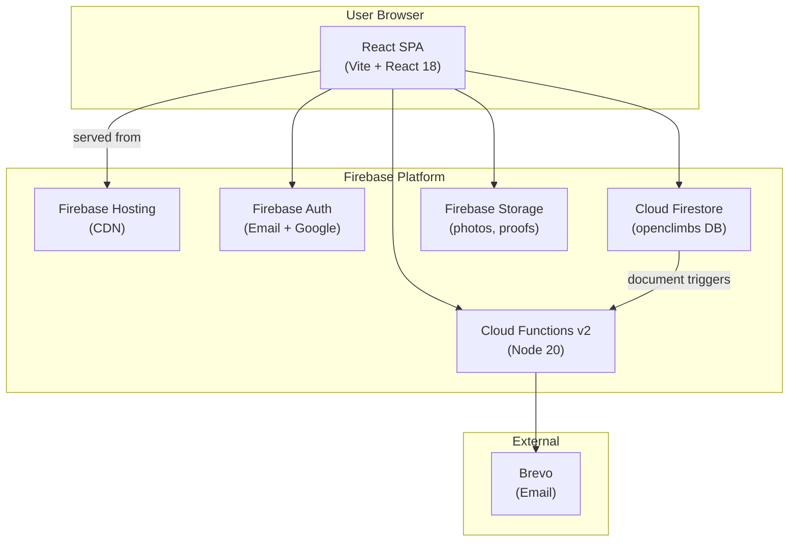
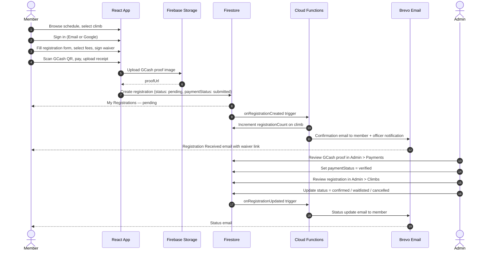

# MMS Open Climbs

Event management portal for the Metropolitan Mountaineering Society (MMS). Members browse the annual climb schedule, view mountain profiles, register for events, sign digital waivers, submit GCash payments, and track their registrations. Administrators manage climbs, review registrations, verify payments, track transportation headcounts, and manage user accounts.

---

## System Overview


```mermaid
graph TB
    subgraph Browser["User Browser"]
        SPA["React SPA\n(Vite + React 18)"]
    end

    subgraph Firebase["Firebase Platform"]
        FH["Firebase Hosting\n(CDN)"]
        FA["Firebase Auth\n(Email + Google)"]
        FS["Cloud Firestore\n(openclimbs DB)"]
        ST["Firebase Storage\n(photos, proofs)"]
        CF["Cloud Functions v2\n(Node 20)"]
    end

    subgraph External["External"]
        BV["Brevo\n(Email)"]
    end

    SPA -->|served from| FH
    SPA --> FA
    SPA --> FS
    SPA --> ST
    SPA --> CF
    FS -->|document triggers| CF
    CF --> BV
```

| Layer               | Technology                        |
| ------------------- | --------------------------------- |
| Frontend            | React 18, Vite, React Router v6   |
| Hosting             | Firebase Hosting                  |
| Database            | Cloud Firestore (`openclimbs` DB) |
| Authentication      | Firebase Auth (Email + Google)    |
| Storage             | Firebase Storage                  |
| Backend Functions   | Cloud Functions v2 (Node 20)      |
| Transactional Email | Brevo SMTP API                    |
| Testing (Frontend)  | Vitest, Testing Library           |
| Testing (Functions) | Jest                              |

---

## Features

### Member features

- Browse the climb schedule as a card grid with elevation, difficulty, and trip distance at a glance
- View full mountain profiles: summit elevation, difficulty, jump-off point, elevation gain, distances, features, itinerary, water source notes, and external links (AllTrails, Strava, Komoot, Google Maps)
- Trail photo carousel on event and registration pages — click any photo to open a full-screen lightbox with keyboard navigation
- Register for a climb with personal details, emergency contact, experience level, and medical disclosure
- Select optional fees (e.g., transport) and review the full fee breakdown before submitting
- Sign the digital liability waiver by typing your full name
- Pay via GCash — tap the QR code for a full-screen modal, scan, pay, and upload your receipt screenshot
- Track all your registrations with status (pending / confirmed / waitlisted / cancelled)
- Print your waiver for any confirmed registration

### Admin features

- Dashboard — overview of all climbs with type, slots, confirmed and pending counts
- Climbs management — create, edit, open and close registration, set GCash details and upload the QR code, manage trail photos
- Climb detail — per-climb registrations list with status and payment controls
- All registrations — cross-climb view with search, status and payment filters, and CSV export
- Payment management — verify or reject GCash proof per registration; transport headcount per climb
- User management — create accounts, assign admin roles
- Analytics — page view traffic dashboard

---

## End-to-End Registration Flow


```mermaid
sequenceDiagram
    autonumber
    actor M as Member
    participant SPA as React App
    participant ST as Firebase Storage
    participant FS as Firestore
    participant CF as Cloud Functions
    participant EM as Brevo Email
    actor AD as Admin

    M->>SPA: Browse schedule, select climb
    M->>SPA: Sign in (Email or Google)
    M->>SPA: Fill registration form, select fees, sign waiver
    M->>SPA: Scan GCash QR, pay, upload receipt
    SPA->>ST: Upload GCash proof image
    ST-->>SPA: proofUrl
    SPA->>FS: Create registration {status: pending, paymentStatus: submitted}
    FS-->>M: My Registrations — pending

    FS->>CF: onRegistrationCreated trigger
    CF->>FS: Increment registrationCount on climb
    CF->>EM: Confirmation email to member + officer notification
    EM-->>M: Registration Received email with waiver link

    AD->>FS: Review GCash proof in Admin > Payments
    AD->>FS: Set paymentStatus = verified

    AD->>FS: Review registration in Admin > Climbs
    AD->>FS: Update status = confirmed / waitlisted / cancelled

    FS->>CF: onRegistrationUpdated trigger
    CF->>EM: Status update email to member
    EM-->>M: Status email
```

---

## Repository Structure

```
src/
  App.jsx                   Main application router
  main.jsx                  React entry point
  components/               Shared UI components (Header, Footer, ClimbCard, etc.)
  contexts/                 React contexts (AuthContext, GuideContext)
  data/                     Static schedule data
  firebase/                 Firebase SDK initialization and config
  hooks/                    Custom React hooks (usePageTracking)
  pages/                    Route-level page components
  pages/admin/              Admin-only page components
  styles/                   Global CSS and design tokens
  tests/                    Frontend test suites (Vitest + Testing Library)
  test/                     Shared test helpers and setup

functions/
  index.js                  Cloud Functions (triggers + createUser callable)
  tests/                    Cloud Function test suite (Jest)

scripts/
  set-admin.mjs             Promote a user account to admin role
  seed-climbs.mjs           Seed local emulator with sample climb data
  purge-admin-pageviews.mjs Remove admin-generated pageView documents

docs/
  ARCHITECTURE.md           System design, patterns, and component diagrams
  API.md                    Cloud Functions API reference
  DEPLOYMENT.md             Production setup and deploy guide
  SECURITY.md               Security model and OWASP considerations
  CONTRIBUTING.md           Contribution workflow and coding standards
  TESTING.md                Test setup, patterns, and coverage guide
  DATA.md                   Firestore schema and data model reference
  TROUBLESHOOTING.md        Common issues and fixes
  adr/                      Architecture Decision Records

infra/                      Reserved for future infrastructure as code
```

---

## Local Development

### Prerequisites

- Node.js 20+
- Firebase CLI: `npm install -g firebase-tools`

### Setup

```bash
# 1. Install dependencies
npm install
cd functions && npm install && cd ..

# 2. Configure environment
cp .env.example .env
cp functions/.env.example functions/.env
# Fill in VITE_FIREBASE_* in .env
# Fill in BREVO_* and APP_URL in functions/.env

# 3. Start Firebase emulators (Terminal 1)
firebase emulators:start --only auth,firestore,functions

# 4. Start Vite dev server (Terminal 2)
npm run dev
```

- App: `http://localhost:5173`
- Emulator UI: `http://localhost:4000`

### Set first admin

```bash
node scripts/set-admin.mjs your@email.com
```

---

## Scripts Reference

| Command | Description |
| --- | --- |
| `npm run dev` | Start Vite dev server |
| `npm run build` | Production build to `dist/` |
| `npm run preview` | Preview production build locally |
| `npm test` | Run frontend tests (Vitest) |
| `npm run test:watch` | Frontend tests in watch mode |
| `npm run test:coverage` | Frontend tests with coverage report |
| `npm run test:all` | Run frontend + function tests |
| `npm run test:strict` | Full strict coverage gate |
| `npm run qa` | Build + strict coverage (pre-deploy gate) |

---

## Documentation

| Document | Description |
| --- | --- |
| [ARCHITECTURE.md](docs/ARCHITECTURE.md) | System design, component diagrams, data model |
| [API.md](docs/API.md) | Cloud Functions API reference |
| [DEPLOYMENT.md](docs/DEPLOYMENT.md) | Production setup and deploy steps |
| [SECURITY.md](docs/SECURITY.md) | Security model, rules, and OWASP assessment |
| [DATA.md](docs/DATA.md) | Firestore schema and data reference |
| [TESTING.md](docs/TESTING.md) | Test setup, patterns, and coverage guide |
| [CONTRIBUTING.md](docs/CONTRIBUTING.md) | Contribution workflow and coding standards |
| [TROUBLESHOOTING.md](docs/TROUBLESHOOTING.md) | Common issues and fixes |
