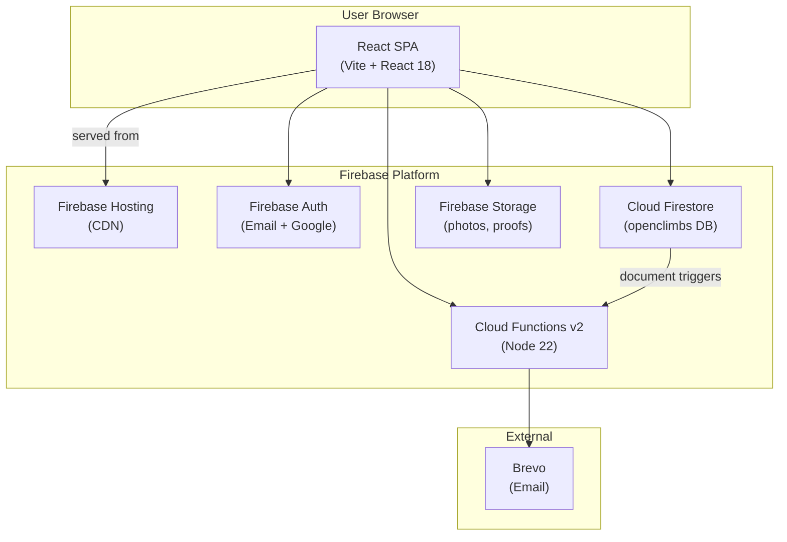
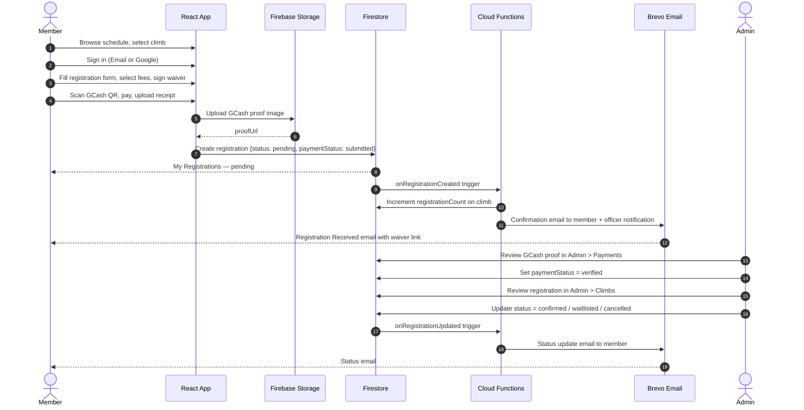

# MMS Open Climbs

Event management portal for the Metropolitan Mountaineering Society (MMS). Members browse the annual climb schedule, view mountain profiles, register for events, sign digital waivers, submit GCash payments, and track their registrations. Administrators manage climbs, review registrations, verify payments, track transportation headcounts, and manage user accounts.

---

## System Overview


```mermaid
graph TB
    subgraph Browser["User Browser"]
        SPA["React SPA\n(Vite + React 18)"]
    end

    subgraph Firebase["Firebase Platform"]
        FH["Firebase Hosting\n(CDN)"]
        FA["Firebase Auth\n(Email + Google)"]
        FS["Cloud Firestore\n(openclimbs DB)"]
        ST["Firebase Storage\n(photos, proofs)"]
        CF["Cloud Functions v2\n(Node 22)"]
    end

    subgraph External["External"]
        BV["Brevo\n(Email)"]
    end

    SPA -->|served from| FH
    SPA --> FA
    SPA --> FS
    SPA --> ST
    SPA --> CF
    FS -->|document triggers| CF
    CF --> BV
```

| Layer               | Technology                        |
| ------------------- | --------------------------------- |
| Frontend            | React 18, Vite, React Router v6   |
| Hosting             | Firebase Hosting                  |
| Database            | Cloud Firestore (`openclimbs` DB) |
| Authentication      | Firebase Auth (Email + Google)    |
| Storage             | Firebase Storage                  |
| Backend Functions   | Cloud Functions v2 (Node 22)      |
| Transactional Email | Brevo SMTP API                    |
| Testing (Frontend)  | Vitest, Testing Library           |
| Testing (Functions) | Jest                              |

---

## Features

### Member features

- Browse the climb schedule as a card grid with elevation, difficulty, and trip distance at a glance
- View full mountain profiles: summit elevation, difficulty, jump-off point, elevation gain, distances, features, itinerary, water source notes, and external links (AllTrails, Google Maps)
- Trail photo carousel on event and registration pages — click any photo to open a full-screen lightbox with keyboard navigation
- Register for a climb with personal details, emergency contact, experience level, and medical disclosure
- Select optional fees (e.g., transport) and review the full fee breakdown before submitting
- Sign the digital liability waiver by typing your full name
- Pay via GCash — tap the QR code for a full-screen modal, scan, pay, and upload your receipt screenshot
- Track all your registrations with status (pending / confirmed / waitlisted / cancelled)
- Print your waiver for any confirmed registration
- See a one-time "what's new" popup after login for the latest release note, and browse the full history at any time on the Release Notes page
- In-app notification bell for status updates and announcements
- Guided welcome tour on first login walking through key member features
- Automatic thank-you email once a climb you joined has concluded

### Admin features

- Dashboard — overview of all climbs with type, slots, confirmed and pending counts
- Climbs management — create, edit, open and close registration, set GCash details and upload the QR code, manage trail photos
- Climb detail — per-climb registrations list with status and payment controls
- All registrations — cross-climb view with search, status and payment filters, and CSV export
- Payment management — verify or reject GCash proof per registration; transport headcount per climb
- User management — create accounts, correct or delete accounts, assign admin roles, link walk-in "Add Joiner" entries to an existing member
- Analytics — page view traffic dashboard
- Failure logging — review client-side error reports (`failedRequests`) for troubleshooting
- Release notes — publish "what's new" updates and optionally email every member about a published note, with AI-assisted draft generation from recent commits

---

## End-to-End Registration Flow


```mermaid
sequenceDiagram
    autonumber
    actor M as Member
    participant SPA as React App
    participant ST as Firebase Storage
    participant FS as Firestore
    participant CF as Cloud Functions
    participant EM as Brevo Email
    actor AD as Admin

    M->>SPA: Browse schedule, select climb
    M->>SPA: Sign in (Email or Google)
    M->>SPA: Fill registration form, select fees, sign waiver
    M->>SPA: Scan GCash QR, pay, upload receipt
    SPA->>ST: Upload GCash proof image
    ST-->>SPA: proofUrl
    SPA->>FS: Create registration {status: pending, paymentStatus: submitted}
    FS-->>M: My Registrations — pending

    FS->>CF: onRegistrationCreated trigger
    CF->>FS: Increment registrationCount on climb
    CF->>EM: Confirmation email to member + officer notification
    EM-->>M: Registration Received email with waiver link

    AD->>FS: Review GCash proof in Admin > Payments
    AD->>FS: Set paymentStatus = verified

    AD->>FS: Review registration in Admin > Climbs
    AD->>FS: Update status = confirmed / waitlisted / cancelled

    FS->>CF: onRegistrationUpdated trigger
    CF->>EM: Status update email to member
    EM-->>M: Status email
```

---

## Repository Structure

```text
src/
  pages/            route screens; page-only parts in pages/event, pages/register, pages/admin/climbForm
  components/       shared UI (Modal, TextField, AuthLayout, …)
  contexts/ hooks/  auth state and reusable hooks
  services/         the only code that talks to Firebase (ADR 0004)
  utils/            pure domain logic (fees, payments, schedules)
  data/ styles/     static content, design tokens
functions/          Cloud Functions: src/{triggers,scheduled,callables,email,shared}, tests/, scripts/
firebase/           Firestore/Storage rules and indexes, CORS, storage lifecycle
tests/              unit, component, accessibility, integration, e2e, performance
scripts/            CLI helpers that use the web API key from .env
tools/              configs for dependency-cruiser, jscpd, knip, secretlint
docs/               guides/ (what it is) · solution-plans/ (how we deliver) · adr/ (why)
```

---

## Quickstart

```bash
npm install && npm --prefix functions install
cp .env.example .env            # fill in VITE_FIREBASE_*
npm run dev                     # http://localhost:5173
npm run qa                      # every quality gate, as CI runs it
```

Emulators, admin setup and the workflow: [CONTRIBUTING.md](docs/guides/CONTRIBUTING.md).
Deploys happen from CI on push to `develop`: [DEPLOYMENT.md](docs/guides/DEPLOYMENT.md).

---

## Documentation

| Question | Read |
|---|---|
| How is it built? | [ARCHITECTURE](docs/guides/ARCHITECTURE.md) · [DATA](docs/guides/DATA.md) · [API](docs/guides/API.md) · [SECURITY](docs/guides/SECURITY.md) |
| How do I work on it? | [CONTRIBUTING](docs/guides/CONTRIBUTING.md) · [TESTING](docs/guides/TESTING.md) · [CODE-QUALITY](docs/guides/CODE-QUALITY.md) · [TROUBLESHOOTING](docs/guides/TROUBLESHOOTING.md) |
| How do I use it? | [USER_MANUAL](docs/guides/USER_MANUAL.md) |
| How do we deliver it? | [docs/solution-plans/](docs/solution-plans/) — web plan, release notes, quality harness |
| Why is it like this? | [docs/adr/](docs/adr/README.md) |
| What do the words mean? | [CONTEXT.md](CONTEXT.md) — domain glossary |
