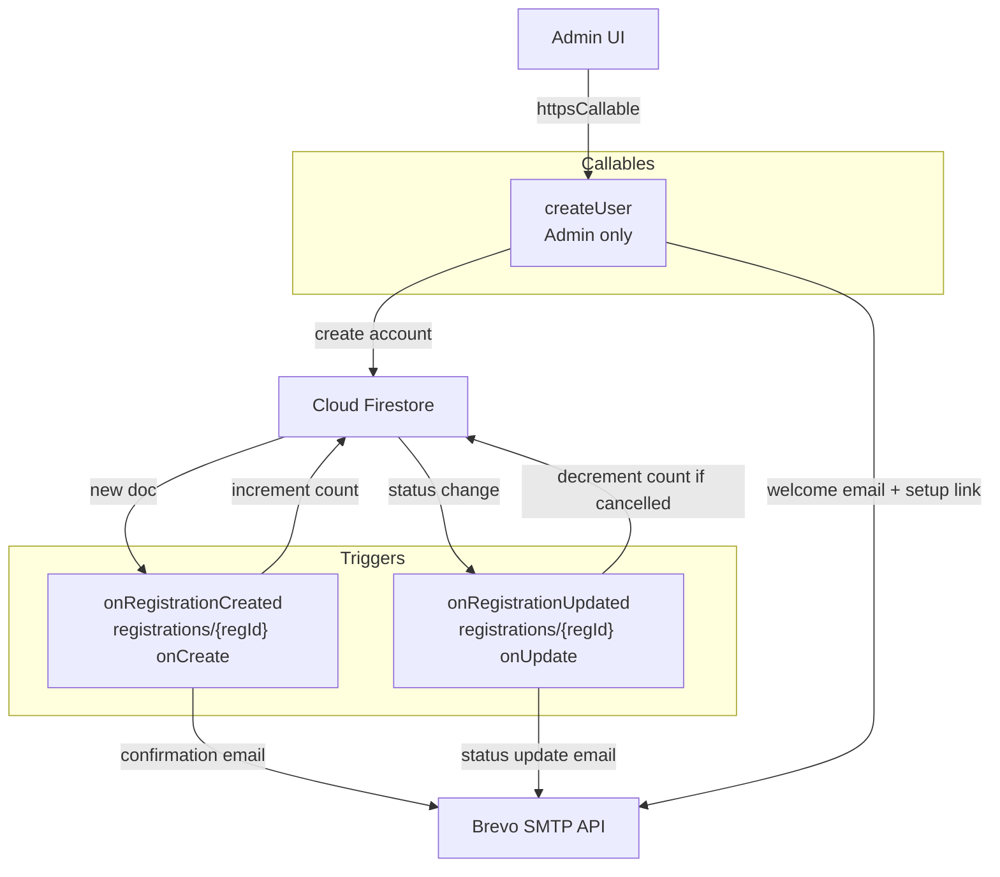
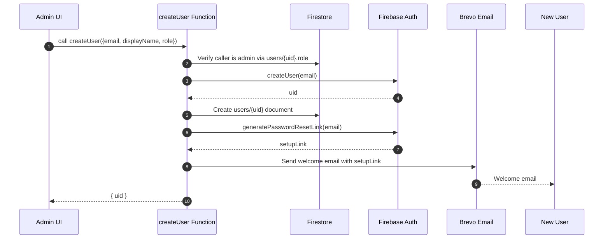

# Cloud Functions API Reference

All functions are deployed to Firebase Cloud Functions v2 in the `asia-east1` region (or the default region configured in `firebase.json`).

## Function Overview



---

## Triggers

### onRegistrationCreated

**Type:** Firestore document trigger  
**Path:** `registrations/{regId}` on create

**What it does:**
1. Increments `registrationCount` on the corresponding `climbs/{climbId}` document.
2. Sends a registration confirmation email to the participant via Brevo.

**Email includes:**
- Climb title, date, location
- Link to the printable waiver at `{APP_URL}/waiver/{regId}`

---

### onRegistrationUpdated

**Type:** Firestore document trigger  
**Path:** `registrations/{regId}` on update

**What it does:**
1. If `status` changed to `cancelled`, decrements `registrationCount` on the climb.
2. If `status` changed to `confirmed`, `cancelled`, or `waitlisted`, sends a status update email to the participant.

---

## Callable Functions

### createUser

**Caller:** Admin users only  
**SDK call:** `httpsCallable(functions, 'createUser')`



**Request payload:**

| Field       | Type   | Required | Notes                  |
|------------|--------|----------|------------------------|
| email      | string | Yes      | New user's email       |
| displayName| string | Yes      | New user's display name|
| role       | string | No       | Defaults to "member"   |

**What it does:**
1. Verifies the caller is an admin via Firestore role check.
2. Creates a Firebase Auth account for the new user.
3. Creates a Firestore `users/{uid}` document.
4. Generates a password setup link (Firebase `generatePasswordResetLink`).
5. Sends a welcome email with the setup link via Brevo.

**Response:**

```json
{ "uid": "firebase-auth-uid" }
```

**Error codes:**

| Code             | Meaning                              |
|-----------------|--------------------------------------|
| unauthenticated  | Caller is not signed in              |
| permission-denied| Caller is not an admin               |
| invalid-argument | email or displayName missing         |
| already-exists   | Email already has a Firebase account |
| internal         | Unexpected Firebase error            |

---

## Environment Variables

Set these in `functions/.env` for local emulator, or via Firebase secrets for production.

| Variable        | Description                                |
|----------------|--------------------------------------------|
| BREVO_API_KEY  | Brevo API key for sending emails           |
| BREVO_FROM_EMAIL | Sender email address verified in Brevo   |
| APP_URL        | Base URL for generating email links        |

**Production secrets (recommended):**

```
firebase functions:secrets:set BREVO_API_KEY
firebase functions:secrets:set BREVO_FROM_EMAIL
firebase functions:secrets:set APP_URL
```
