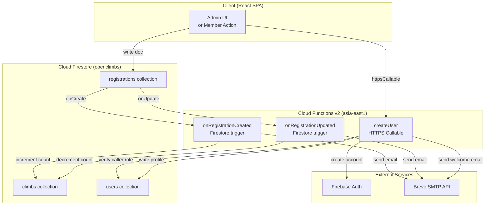
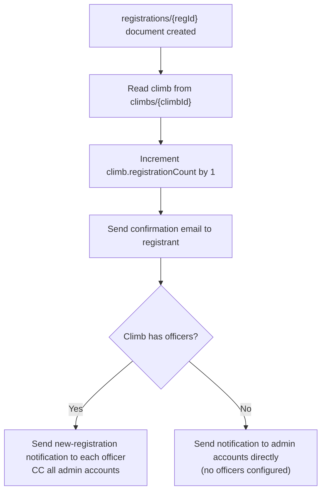
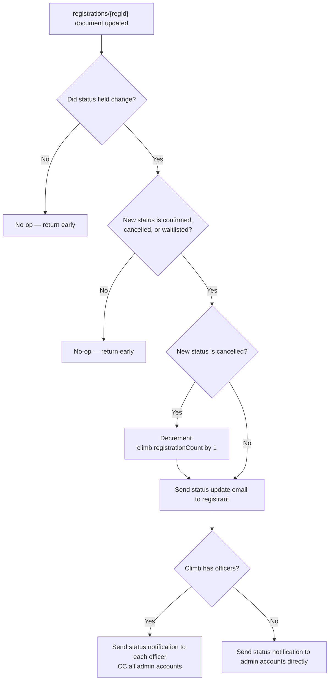
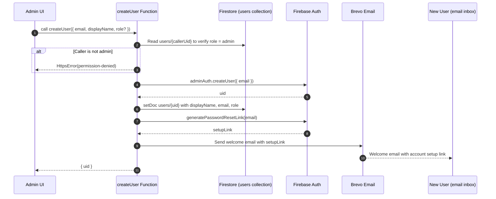
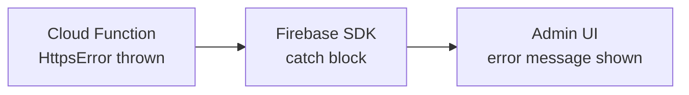
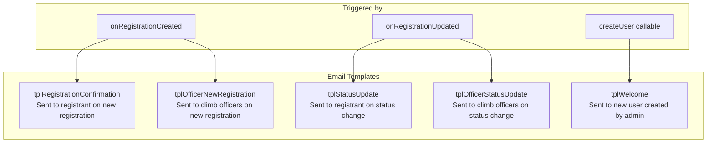

# API Reference

## Table of Contents

- [Overview](#overview)
- [Architecture](#architecture)
- [Firestore Document Triggers](#firestore-document-triggers)
  - [onRegistrationCreated](#onregistrationcreated)
  - [onRegistrationUpdated](#onregistrationupdated)
- [Scheduled Functions](#scheduled-functions)
  - [sendReminderNotifications](#sendremindernotifications)
- [HTTPS Callable Functions](#https-callable-functions)
  - [createUser](#createuser)
  - [updateUserProfile](#updateuserprofile)
  - [deleteUserAccount](#deleteuseraccount)
- [Environment Variables and Secrets](#environment-variables-and-secrets)
- [Error Codes Reference](#error-codes-reference)
- [Email Templates](#email-templates)

---

## Overview

MMS Open Climbs exposes all backend logic through Firebase Cloud Functions v2. There are no REST endpoints — the frontend communicates with Firebase services directly via the Firebase SDK. The Cloud Functions layer handles:

1. **Firestore document triggers** — automated reactions to database changes (seat counting, email dispatch)
2. **HTTPS callable functions** — admin-initiated operations (user creation)

All functions are deployed to the `asia-east1` region.

---

## Architecture


```mermaid
graph TD
    subgraph Client["Client (React SPA)"]
        UI["Admin UI\nor Member Action"]
    end

    subgraph Firestore["Cloud Firestore (openclimbs)"]
        FS_R["registrations collection"]
        FS_C["climbs collection"]
        FS_U["users collection"]
    end

    subgraph Functions["Cloud Functions v2 (asia-east1)"]
        T1["onRegistrationCreated\nFirestore trigger"]
        T2["onRegistrationUpdated\nFirestore trigger"]
        C1["createUser\nHTTPS Callable"]
    end

    subgraph External["External Services"]
        FA["Firebase Auth"]
        EM["Brevo SMTP API"]
    end

    UI -->|write doc| FS_R
    UI -->|httpsCallable| C1

    FS_R -->|onCreate| T1
    FS_R -->|onUpdate| T2

    T1 -->|increment count| FS_C
    T1 -->|send email| EM

    T2 -->|decrement count| FS_C
    T2 -->|send email| EM

    C1 -->|verify caller role| FS_U
    C1 -->|create account| FA
    C1 -->|write profile| FS_U
    C1 -->|send welcome email| EM
```

---

## Firestore Document Triggers

### onRegistrationCreated

**Type:** Firestore document trigger
**Collection path:** `registrations/{regId}`
**Event:** `onDocumentCreated`
**Database:** `openclimbs`
**Secrets required:** `BREVO_API_KEY`, `BREVO_FROM_EMAIL`

#### What it does


```mermaid
flowchart TD
    A["registrations/{regId} document created"]
    B["Read climb from climbs/{climbId}"]
    C["Increment climb.registrationCount by 1"]
    D["Send confirmation email to registrant"]
    E{"Climb has officers?"}
    F["Send new-registration notification to each officer\nCC all admin accounts"]
    G["Send notification to admin accounts directly\n(no officers configured)"]

    A --> B --> C --> D --> E
    E -- "Yes" --> F
    E -- "No" --> G
```

#### Side effects

| Effect | Target | Details |
| --- | --- | --- |
| Increment `registrationCount` | `climbs/{climbId}` | Uses `FieldValue.increment(1)` — atomic, race-condition-safe |
| Send confirmation email | Registrant | Includes climb title, date, location, and waiver print link |
| Send new-registration notification | Climb officers | CC all admin account email addresses |

#### Confirmation email content

- Climb title, date, location
- Link to printable waiver: `{APP_URL}/waiver/{regId}`

---

### onRegistrationUpdated

**Type:** Firestore document trigger
**Collection path:** `registrations/{regId}`
**Event:** `onDocumentUpdated`
**Database:** `openclimbs`
**Secrets required:** `BREVO_API_KEY`, `BREVO_FROM_EMAIL`

#### What it does


```mermaid
flowchart TD
    A["registrations/{regId} document updated"]
    B{"Did status field change?"}
    C["No-op — return early"]
    D{"New status is confirmed,\ncancelled, or waitlisted?"}
    E["No-op — return early"]
    F{"New status is cancelled?"}
    G["Decrement climb.registrationCount by 1"]
    H["Send status update email to registrant"]
    I{"Climb has officers?"}
    J["Send status notification to each officer\nCC all admin accounts"]
    K["Send status notification to admin accounts directly"]

    A --> B
    B -- "No" --> C
    B -- "Yes" --> D
    D -- "No" --> E
    D -- "Yes" --> F
    F -- "Yes" --> G --> H
    F -- "No" --> H
    H --> I
    I -- "Yes" --> J
    I -- "No" --> K
```

#### Side effects

| Effect | Condition | Details |
| --- | --- | --- |
| Decrement `registrationCount` | `status` changed to `cancelled` | Uses `FieldValue.increment(-1)` — atomic |
| Send status update email | `status` changed to `confirmed`, `cancelled`, or `waitlisted` | Email includes cancellation reason when `cancellationReason` is set |
| Send officer notification | Same status conditions | CC all admin accounts |

#### Watched status transitions

| New status | Email sent | Count decremented |
| --- | --- | --- |
| `confirmed` | Yes | No |
| `cancelled` | Yes | Yes |
| `waitlisted` | Yes | No |
| `pending` | No | No |

Both triggers also write to the `notifications` collection for the in-app bell (see `docs/DATA.md`): a payment reminder is created/re-opened whenever `paymentStatus` becomes `unpaid` or `rejected`, cleared when it becomes `verified`/`submitted`, and a `status_update` notification is written whenever `status` changes.

---

## Scheduled Functions

### sendReminderNotifications

**Type:** Scheduled (Firebase Functions v2 `onSchedule`)
**Schedule:** Daily at 09:00, `Asia/Manila`
**Access:** N/A (runs on Cloud Scheduler, not user-invoked)

Re-surfaces reminders in the notification bell for active (`pending`/`confirmed`) registrations:

| Condition | Action |
| --- | --- |
| `paymentStatus` is `unpaid` or `rejected` | Upserts `payment_{regId}` notification as unread (re-nags on every run while still unpaid) |
| `status = confirmed` and climb starts in exactly 3 days | Creates `upcoming3_{regId}` notification (once) |
| `status = confirmed` and climb starts in exactly 1 day | Creates `upcoming1_{regId}` notification (once) |

Registrations with no `userId` (e.g. walk-in participants added manually by an admin — see `AddJoinerModal` in `ClimbDetail.jsx`) are skipped, since there's no account to notify.

---

## HTTPS Callable Functions

### createUser

**Type:** HTTPS Callable (Firebase Functions v2)
**SDK invocation:** `httpsCallable(functions, 'createUser')`
**Access:** Admin users only
**Secrets required:** None (uses Firebase Admin SDK with service account)

#### Full flow


```mermaid
sequenceDiagram
    autonumber
    participant AD as Admin UI
    participant CF as createUser Function
    participant FS as Firestore (users collection)
    participant FA as Firebase Auth
    participant EM as Brevo Email
    participant U as New User (email inbox)

    AD->>CF: call createUser({ email, displayName, role? })
    CF->>FS: Read users/{callerUid} to verify role = admin
    alt Caller is not admin
        CF-->>AD: HttpsError(permission-denied)
    end
    CF->>FA: adminAuth.createUser({ email })
    FA-->>CF: uid
    CF->>FS: setDoc users/{uid} with displayName, email, role
    CF->>FA: generatePasswordResetLink(email)
    FA-->>CF: setupLink
    CF->>EM: Send welcome email with setupLink
    EM-->>U: Welcome email with account setup link
    CF-->>AD: { uid }
```

#### Request payload

| Field | Type | Required | Validation | Notes |
| --- | --- | --- | --- | --- |
| `email` | string | Yes | Must be present | New user's email address |
| `displayName` | string | Yes | Must be present | Full name for display |
| `role` | string | No | Defaults to `member` | Set to `admin` to create an admin account |

#### Response

```json
{ "uid": "firebase-auth-uid-string" }
```

#### Error codes

| Code | HTTP equivalent | Trigger |
| --- | --- | --- |
| `unauthenticated` | 401 | Caller is not signed in |
| `permission-denied` | 403 | Caller is not an admin (role check fails) |
| `invalid-argument` | 400 | `email` or `displayName` missing or empty |
| `already-exists` | 409 | Email already has a Firebase Auth account |
| `internal` | 500 | Unexpected Firebase or Brevo error |

---

### updateUserProfile

**Type:** HTTPS Callable (Firebase Functions v2)
**SDK invocation:** `httpsCallable(functions, 'updateUserProfile')`
**Access:** Admin users only

Corrects a user's name and/or email. Updates the Firebase Auth account (the actual login credential) and the Firestore `users/{uid}` profile document together, so they can't drift out of sync.

#### Request payload

| Field | Type | Required | Notes |
| --- | --- | --- | --- |
| `uid` | string | Yes | Target user's Firebase Auth UID |
| `displayName` | string | No | New full name — at least one of `displayName`/`email` required |
| `email` | string | No | New login email — at least one of `displayName`/`email` required |

#### Response

```json
{ "success": true }
```

#### Error codes

| Code | Trigger |
| --- | --- |
| `unauthenticated` | Caller is not signed in |
| `permission-denied` | Caller is not an admin |
| `invalid-argument` | `uid` missing, or neither `email` nor `displayName` provided |
| `already-exists` | Another Auth account already uses the requested email |
| `not-found` | The target user's Auth account no longer exists |
| `internal` | Unexpected Firebase error |

---

### deleteUserAccount

**Type:** HTTPS Callable (Firebase Functions v2)
**SDK invocation:** `httpsCallable(functions, 'deleteUserAccount')`
**Access:** Admin users only

Permanently deletes a user's Firebase Auth login and their Firestore `users/{uid}` profile. Does not touch their past `registrations` — those keep their denormalized name/email so historical records stay intact. If the Auth account is already gone (e.g. previously deleted out-of-band), the Firestore profile is still cleaned up rather than erroring out.

#### Request payload

| Field | Type | Required | Notes |
| --- | --- | --- | --- |
| `uid` | string | Yes | Target user's Firebase Auth UID |

#### Response

```json
{ "success": true }
```

#### Error codes

| Code | Trigger |
| --- | --- |
| `unauthenticated` | Caller is not signed in |
| `permission-denied` | Caller is not an admin |
| `invalid-argument` | `uid` missing |
| `failed-precondition` | Caller tried to delete their own account |
| `internal` | Unexpected Firebase error |

---

## Environment Variables and Secrets

### Cloud Functions (`functions/.env` for emulator, Firebase secrets for production)

| Variable | Type | Required | Description |
| --- | --- | --- | --- |
| `BREVO_API_KEY` | Secret | Yes | Brevo REST API key for sending emails |
| `BREVO_FROM_EMAIL` | Secret | Yes | Verified sender email address in Brevo |
| `APP_URL` | Secret | Yes | Base URL for generating waiver links in emails |

### Frontend (`VITE_*` in `.env`)

These values are baked into the frontend bundle at build time by Vite. Firebase API keys are intentionally public — they are protected by Firestore security rules and Auth domain restrictions.

| Variable | Description |
| --- | --- |
| `VITE_FIREBASE_API_KEY` | Firebase project API key |
| `VITE_FIREBASE_AUTH_DOMAIN` | Firebase Auth domain |
| `VITE_FIREBASE_PROJECT_ID` | Firebase project ID |
| `VITE_FIREBASE_STORAGE_BUCKET` | Firebase Storage bucket |
| `VITE_FIREBASE_MESSAGING_SENDER_ID` | Firebase Cloud Messaging sender ID |
| `VITE_FIREBASE_APP_ID` | Firebase app ID |

### Setting production secrets

```bash
firebase functions:secrets:set BREVO_API_KEY
firebase functions:secrets:set BREVO_FROM_EMAIL
firebase functions:secrets:set APP_URL
```

---

## Error Codes Reference

All callable function errors follow the Firebase `HttpsError` convention and are surfaced to the client via the Firebase SDK.


```mermaid
flowchart LR
    CF["Cloud Function\nHttpsError thrown"]
    SDK["Firebase SDK\ncatch block"]
    UI["Admin UI\nerror message shown"]

    CF --> SDK --> UI
```

| Error Code | Client receives | Typical cause |
| --- | --- | --- |
| `unauthenticated` | `functions/unauthenticated` | Calling a protected function without being signed in |
| `permission-denied` | `functions/permission-denied` | Signed in but not an admin |
| `invalid-argument` | `functions/invalid-argument` | Missing required payload fields |
| `already-exists` | `functions/already-exists` | Attempting to create a user whose email already exists |
| `internal` | `functions/internal` | Unhandled exception in the function |

---

## Email Templates

All email templates are rendered server-side inside Cloud Functions and sent via Brevo. Templates are defined in `functions/src/index.js`.


```mermaid
graph TD
    subgraph Templates["Email Templates"]
        T1["tplRegistrationConfirmation\nSent to registrant on new registration"]
        T2["tplStatusUpdate\nSent to registrant on status change"]
        T3["tplOfficerNewRegistration\nSent to climb officers on new registration"]
        T4["tplOfficerStatusUpdate\nSent to climb officers on status change"]
        T5["tplWelcome\nSent to new user created by admin"]
    end

    subgraph Trigger["Triggered by"]
        TR1["onRegistrationCreated"]
        TR2["onRegistrationUpdated"]
        TR3["createUser callable"]
    end

    TR1 --> T1
    TR1 --> T3
    TR2 --> T2
    TR2 --> T4
    TR3 --> T5
```

| Template | Recipient | Trigger | Key content |
| --- | --- | --- | --- |
| `tplRegistrationConfirmation` | Registrant | `onRegistrationCreated` | Climb title, date, location, waiver link |
| `tplStatusUpdate` | Registrant | `onRegistrationUpdated` | New status, cancellation reason (if applicable) |
| `tplOfficerNewRegistration` | Climb officers | `onRegistrationCreated` | Registrant name, email, climb details, link to admin |
| `tplOfficerStatusUpdate` | Climb officers | `onRegistrationUpdated` | Registrant name, new status, reason, link to admin |
| `tplWelcome` | New user | `createUser` | Welcome message, account setup link (password reset URL) |
