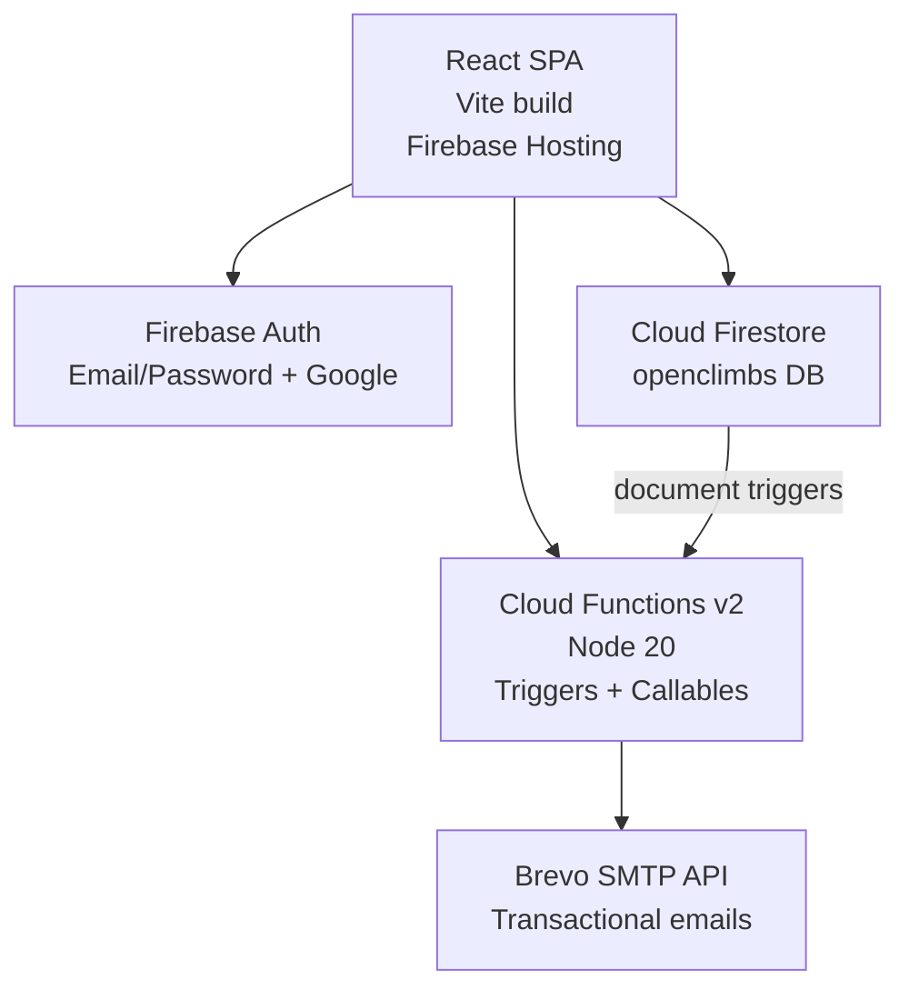
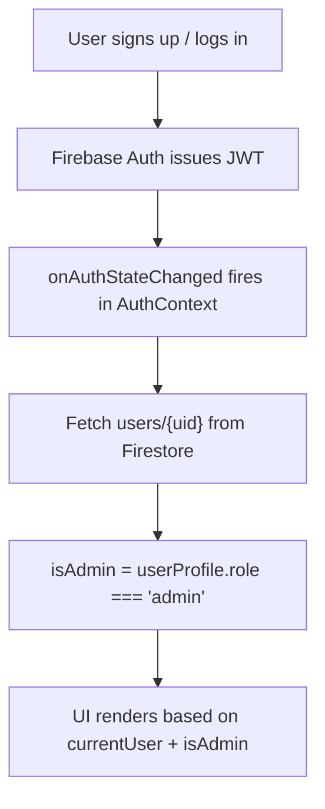

# Architecture

## System Overview

MMS Open Climbs is a single-page application backed by Firebase services.

## Data Model (Firestore)

Database name: `openclimbs`

### Collection: climbs

| Field             | Type      | Notes                                                                               |
| ----------------- | --------- | ----------------------------------------------------------------------------------- |
| title             | string    | Climb name                                                                          |
| dateLabel         | string    | Display date e.g. "July 19-20"                                                      |
| month             | string    | jan / feb / ... / dec                                                               |
| startDate         | timestamp | For ordering                                                                        |
| endDate           | timestamp |                                                                                     |
| location          | string    |                                                                                     |
| type              | string    | minor / major / special                                                             |
| status            | string    | draft / open / closed / completed                                                   |
| color             | string    | Card color token e.g. "c-slate"                                                     |
| maxParticipants   | number    |                                                                                     |
| registrationCount | number    | Maintained by Cloud Functions                                                       |
| isWide            | boolean   | Card spans 2 columns                                                                |
| itineraryReady    | boolean   |                                                                                     |
| description       | string    | Mountain description                                                                |
| elevation         | string    | Summit elevation in MASL                                                            |
| difficulty        | string    | Difficulty rating                                                                   |
| jumpOff           | string    | Jump-off point name                                                                 |
| jumpOffElevation  | string    | Jump-off elevation in meters                                                        |
| elevationGain     | string    | Total elevation gain                                                                |
| distanceToSummit  | string    | Jump-off to peak distance                                                           |
| roundTripDistance | string    | Total round trip distance                                                           |
| recommendedDays   | string    | Recommended number of days                                                          |
| features          | string    | Terrain features description                                                        |
| googleMapsUrl     | string    | Google Maps URL for embedded map                                                    |
| allTrailsUrl      | string    | AllTrails link                                                                      |
| stravaUrl         | string    | Strava link                                                                         |
| komootUrl         | string    | Komoot tour link                                                                    |
| trailImages       | string[]  | Firebase Storage or CDN image URLs; shown as carousel on event + registration pages |
| waterSourceNote   | string    | Water source information                                                            |
| weatherNote       | string    | Weather notes                                                                       |
| thingsToBring     | string[]  |                                                                                     |
| expenses          | object[]  | {label, amount, note, optional}                                                     |
| officers          | object[]  | {name, role, mobile}                                                                |
| itinerary         | object[]  | [{day, entries:[{time, activity}]}]                                                 |
| gcashName         | string    | GCash account name for payment                                                      |
| gcashNumber       | string    | GCash number for payment                                                            |
| gcashQrUrl        | string    | Uploaded GCash QR code image URL                                                    |

### Collection: registrations

| Field              | Type      | Notes                                        |
| ------------------ | --------- | -------------------------------------------- |
| climbId            | string    | Ref to climbs doc                            |
| climbTitle         | string    | Denormalized climb name                      |
| climbDate          | string    | Denormalized dateLabel                       |
| climbLocation      | string    | Denormalized location                        |
| userId             | string    | Firebase Auth UID                            |
| status             | string    | pending / confirmed / waitlisted / cancelled |
| memberType         | string    | member / guest                               |
| name               | string    | Full name                                    |
| email              | string    |                                              |
| mobile             | string    |                                              |
| dateOfBirth        | string    |                                              |
| address            | string    |                                              |
| emergencyContact   | object    | {name, mobile, relationship}                 |
| medicalConditions  | string    |                                              |
| experienceLevel    | string    | beginner / intermediate / experienced        |
| waiverSigned       | boolean   |                                              |
| waiverSignedAt     | timestamp |                                              |
| waiverSignedName   | string    | Digital signature name                       |
| paymentStatus      | string    | submitted / verified / rejected              |
| amountPaid         | number    | Exact amount sent via GCash                  |
| paymentProofs      | object[]  | [{url, fileName}] — uploaded receipt images  |
| feeBreakdown       | object[]  | [{label, amount, optional, selected}]        |
| adminNotes         | string    | Admin-only notes                             |
| cancellationReason | string    | Optional reason when status = cancelled      |
| confirmedAt        | timestamp | Set when status changes to confirmed         |
| createdAt          | timestamp |                                              |
| updatedAt          | timestamp |                                              |

### Collection: users

| Field       | Type      | Notes                          |
| ----------- | --------- | ------------------------------ |
| displayName | string    |                                |
| email       | string    |                                |
| role        | string    | member / admin                 |
| photoURL    | string    | Google profile photo, optional |
| createdAt   | timestamp |                                |
| addedBy     | string    | UID of creator, or "self"      |

## Routing

| Path                    | Access       | Component                                        |
| ----------------------- | ------------ | ------------------------------------------------ |
| /                       | Public       | Schedule                                         |
| /event/:climbId         | Public       | Event detail                                     |
| /login                  | Public       | Login                                            |
| /signup                 | Public       | Signup                                           |
| /forgot-password        | Public       | ForgotPassword                                   |
| /register/:climbId      | Auth         | Registration form                                |
| /my-registrations       | Auth         | My registrations                                 |
| /waiver/:registrationId | Auth (owner) | Waiver print                                     |
| /admin                  | Admin        | Dashboard                                        |
| /admin/climbs           | Admin        | Climbs list                                      |
| /admin/climbs/new       | Admin        | Create climb                                     |
| /admin/climbs/:id/edit  | Admin        | Edit climb                                       |
| /admin/climbs/:id       | Admin        | Climb detail + registrations                     |
| /admin/users            | Admin        | User management                                  |
| /admin/registrations    | Admin        | All registrations across all climbs              |
| /admin/payments         | Admin        | GCash payment verification + transport headcount |

## Auth Flow

## Key Design Decisions

- Registration count is maintained by a Cloud Function trigger (not client-side) to prevent race conditions.
- Firestore security rules enforce ownership and role checks server-side.
- Email is sent by Cloud Functions only — the client never holds Brevo credentials.
- The SPA is deployed to Firebase Hosting as a static build; all routing is handled client-side via React Router with the `rewrites` rule in `firebase.json`.
- Payment is handled out-of-band via GCash — the app records proof uploads and amount paid, but does not process card payments directly.
- The GCash QR code on the registration form is always tappable. Clicking opens a full-screen modal with the QR enlarged for easy phone scanning. If no QR has been uploaded for the climb, the modal displays an informational message instead of an image.
- Transportation opt-in is modelled as an optional expense item (`Transportation Fee`) in the `feeBreakdown`. Admins read the transport headcount from the Manage Payments page to coordinate vehicles.
- Denormalized fields (`climbTitle`, `climbDate`, `climbLocation`) are stored on registration documents so the admin registrations list does not require per-registration climb lookups.
- The admin Dashboard Climbs Overview table includes a Type column (minor / major / special) alongside date, status, slots, confirmed, and pending counts, giving a quick per-climb summary at a glance.
- Trail photos are stored as a `trailImages` string array on the climb document. Admins can upload images directly to Firebase Storage via the Edit Climb form (path: `trail-images/{climbId}/`) or paste any direct image URL. Photos are displayed as a scrollable carousel with thumbnail strip on the public event page and registration form. Clicking the main image opens a full-screen lightbox with prev/next arrow navigation and keyboard support (arrow keys to navigate, Escape to close). Coros and Garmin route links have been replaced with Komoot (`komootUrl`).
