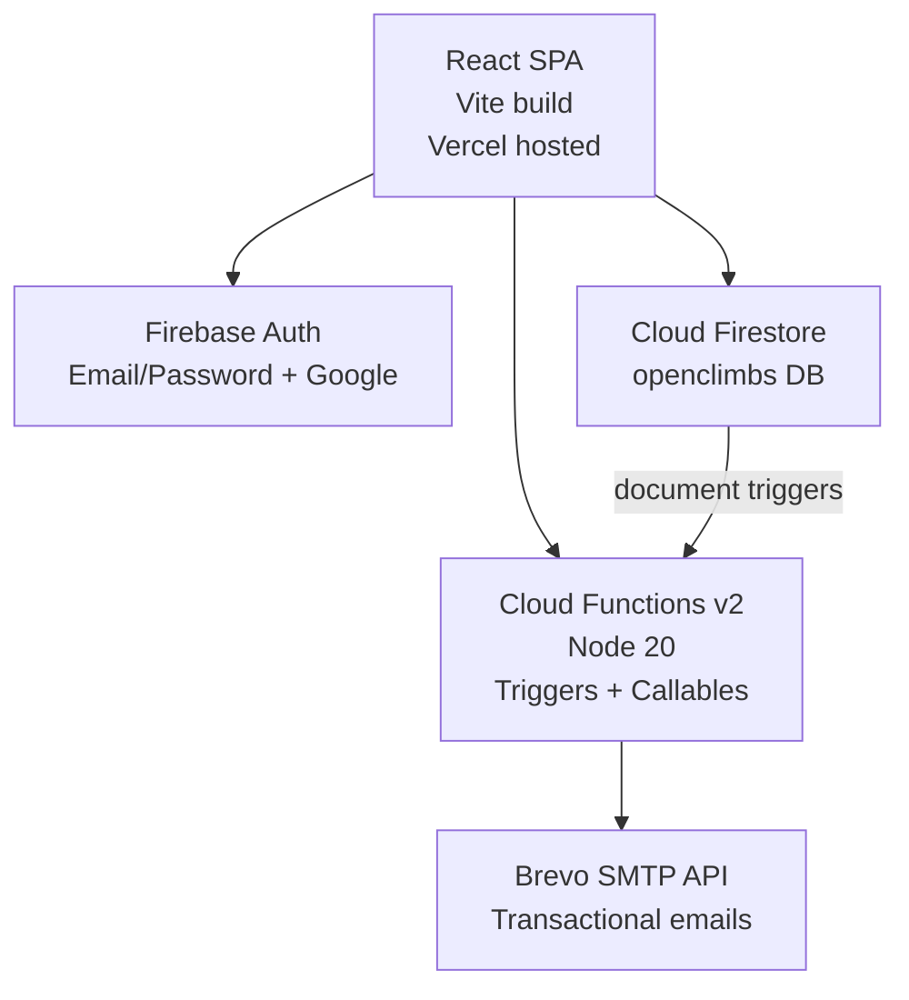
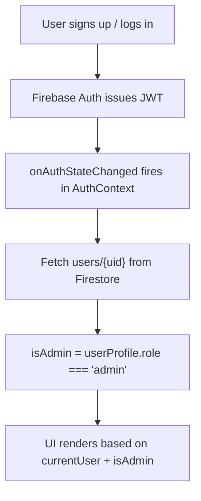

# Architecture

## System Overview

MMS Open Climbs is a single-page application backed by Firebase services.

## Data Model (Firestore)

Database name: `openclimbs`

### Collection: climbs

| Field             | Type      | Notes                                  |
| ----------------- | --------- | -------------------------------------- |
| title             | string    | Climb name                             |
| dateLabel         | string    | Display date e.g. "July 19-20"         |
| month             | string    | jul / aug / sep / oct / nov / dec      |
| startDate         | timestamp | For ordering                           |
| endDate           | timestamp |                                        |
| location          | string    |                                        |
| type              | string    | minor / major / special                |
| status            | string    | draft / open / closed / completed      |
| color             | string    | Card color token e.g. "c-slate"        |
| maxParticipants   | number    |                                        |
| registrationCount | number    | Maintained by Cloud Functions          |
| isWide            | boolean   | Card spans 2 columns                   |
| itineraryReady    | boolean   |                                        |
| description       | string    | Rich text description                  |
| thingsToBring     | string[]  |                                        |
| expenses          | object[]  | {label, amount, note}                  |
| officers          | object[]  | {name, role, mobile}                   |
| itinerary         | object[]  | [{day, entries:[{time, description}]}] |

### Collection: registrations

| Field             | Type      | Notes                                        |
| ----------------- | --------- | -------------------------------------------- |
| climbId           | string    | Ref to climbs doc                            |
| userId            | string    | Firebase Auth UID                            |
| status            | string    | pending / confirmed / waitlisted / cancelled |
| name              | string    | Full name                                    |
| email             | string    |                                              |
| mobile            | string    |                                              |
| dateOfBirth       | string    |                                              |
| address           | string    |                                              |
| emergencyContact  | object    | {name, mobile, relationship}                 |
| medicalConditions | string    |                                              |
| experienceLevel   | string    | beginner / intermediate / experienced        |
| waiverSigned      | boolean   |                                              |
| waiverSignedAt    | timestamp |                                              |
| waiverSignedName  | string    | Digital signature name                       |
| adminNotes        | string    | Admin-only notes                             |
| createdAt         | timestamp |                                              |
| updatedAt         | timestamp |                                              |

### Collection: users

| Field       | Type      | Notes                          |
| ----------- | --------- | ------------------------------ |
| displayName | string    |                                |
| email       | string    |                                |
| role        | string    | member / admin                 |
| photoURL    | string    | Google profile photo, optional |
| createdAt   | timestamp |                                |
| addedBy     | string    | UID of creator, or "self"      |

## Routing

| Path                    | Access       | Component                    |
| ----------------------- | ------------ | ---------------------------- |
| /                       | Public       | Schedule                     |
| /event/:climbId         | Public       | Event detail                 |
| /login                  | Public       | Login                        |
| /signup                 | Public       | Signup                       |
| /forgot-password        | Public       | ForgotPassword               |
| /register/:climbId      | Auth         | Registration form            |
| /my-registrations       | Auth         | My registrations             |
| /waiver/:registrationId | Auth (owner) | Waiver print                 |
| /admin                  | Admin        | Dashboard                    |
| /admin/climbs           | Admin        | Climbs list                  |
| /admin/climbs/new       | Admin        | Create climb                 |
| /admin/climbs/:id/edit  | Admin        | Edit climb                   |
| /admin/climbs/:id       | Admin        | Climb detail + registrations |
| /admin/users            | Admin        | User management              |

## Auth Flow

## Key Design Decisions

- Registration count is maintained by a Cloud Function trigger (not client-side) to prevent race conditions.
- Firestore security rules enforce ownership and role checks server-side.
- Email is sent by Cloud Functions only — the client never holds Brevo credentials.
- The SPA is deployed to Vercel as a static build; all routing is handled client-side via React Router with `vercel.json` rewrites.
