# Architecture

## Table of Contents

- [System Overview](#system-overview)
- [Technology Stack](#technology-stack)
- [High-Level Architecture](#high-level-architecture)
- [Frontend Architecture](#frontend-architecture)
- [Backend Architecture](#backend-architecture)
- [Data Architecture](#data-architecture)
- [Authentication and Authorization](#authentication-and-authorization)
- [Email Notification Architecture](#email-notification-architecture)
- [Routing Architecture](#routing-architecture)
- [State Management](#state-management)
- [Key Design Decisions](#key-design-decisions)

---

## System Overview

MMS Open Climbs is an event management portal built for the Metropolitan Mountaineering Society (MMS). It enables members to browse the annual climb schedule, view detailed mountain profiles, register for climbs, sign digital waivers, and submit GCash payment proofs. Administrators manage climbs, approve registrations, verify payments, and track transportation headcounts.

The system is fully serverless — there is no custom application server. All compute runs either in the browser as a React single-page application (SPA) or in Firebase Cloud Functions on-demand. Infrastructure is managed entirely by Firebase.

---

## Technology Stack

| Layer               | Technology                         | Purpose                                               |
| ------------------- | ---------------------------------- | ----------------------------------------------------- |
| Frontend            | React 18, Vite, React Router v6    | SPA, client-side routing, fast HMR in development     |
| Hosting             | Firebase Hosting                   | CDN-backed static hosting with SPA rewrite rules      |
| Database            | Cloud Firestore (`openclimbs` DB)  | NoSQL document store for climbs, registrations, users |
| Authentication      | Firebase Auth                      | Email/Password and Google OAuth identity              |
| File Storage        | Firebase Storage                   | Trail photos, GCash payment proof images              |
| Backend Functions   | Cloud Functions v2 (Node 20)       | Automated triggers, callable APIs, email dispatch     |
| Transactional Email | Brevo SMTP API                     | Registration confirmations and status update emails   |
| Testing (Frontend)  | Vitest, Testing Library            | Unit and integration tests                            |
| Testing (Functions) | Jest                               | Unit tests for Cloud Function logic                   |

---

## High-Level Architecture

The diagram below shows how the five primary Firebase services and the external email provider interconnect. All browser communication uses the Firebase SDK. The Cloud Functions layer is the only component with access to external API secrets.

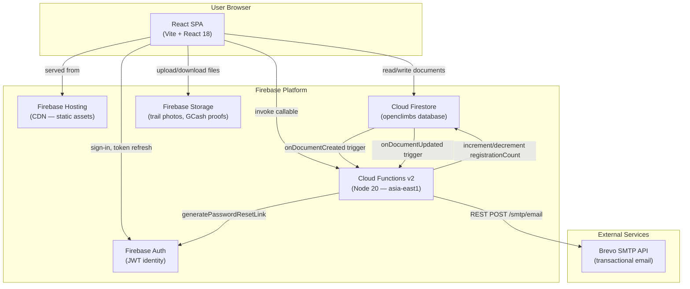
```mermaid
graph TB
    subgraph Browser["User Browser"]
        SPA["React SPA\n(Vite + React 18)"]
    end

    subgraph Firebase["Firebase Platform"]
        FH["Firebase Hosting\n(CDN — static assets)"]
        FA["Firebase Auth\n(JWT identity)"]
        FS["Cloud Firestore\n(openclimbs database)"]
        ST["Firebase Storage\n(trail photos, GCash proofs)"]
        CF["Cloud Functions v2\n(Node 20 — asia-east1)"]
    end

    subgraph External["External Services"]
        BV["Brevo SMTP API\n(transactional email)"]
    end

    SPA -->|served from| FH
    SPA -->|sign-in, token refresh| FA
    SPA -->|read/write documents| FS
    SPA -->|upload/download files| ST
    SPA -->|invoke callable| CF

    FS -->|onDocumentCreated trigger| CF
    FS -->|onDocumentUpdated trigger| CF

    CF -->|REST POST /smtp/email| BV
    CF -->|increment/decrement registrationCount| FS
    CF -->|generatePasswordResetLink| FA
```

---

## Frontend Architecture

### Application Bootstrap

The entry point `src/main.jsx` mounts the React application inside `AuthProvider` (for identity state) and `BrowserRouter` (for client-side routing). `App.jsx` composes all route definitions and wraps route groups with the `GuideProvider` context.

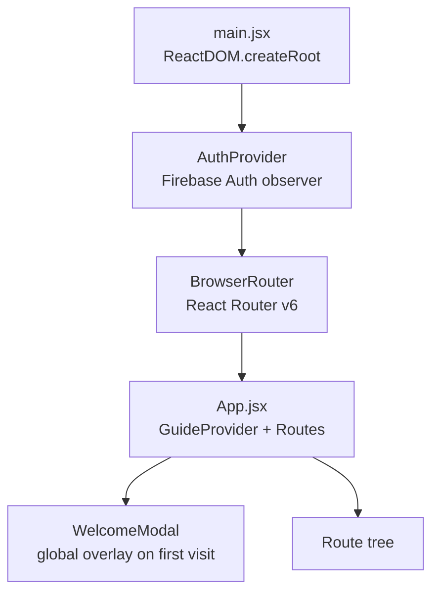
```mermaid
graph TD
    Main["main.jsx\nReactDOM.createRoot"]
    Auth["AuthProvider\nFirebase Auth observer"]
    Router["BrowserRouter\nReact Router v6"]
    App["App.jsx\nGuideProvider + Routes"]
    WM["WelcomeModal\nglobal overlay on first visit"]

    Main --> Auth
    Auth --> Router
    Router --> App
    App --> WM
    App --> Routes["Route tree"]
```

### Component Hierarchy

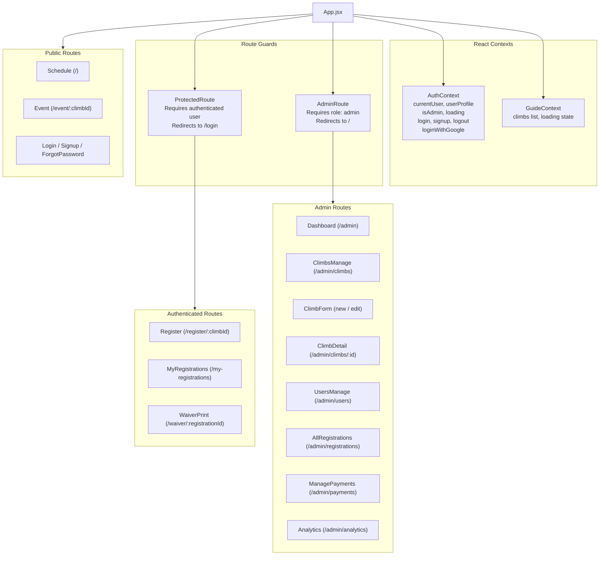
```mermaid
graph TD
    App["App.jsx"]

    subgraph Contexts["React Contexts"]
        AC["AuthContext\ncurrentUser, userProfile\nisAdmin, loading\nlogin, signup, logout\nloginWithGoogle"]
        GC["GuideContext\nclimbs list, loading state"]
    end

    subgraph Guards["Route Guards"]
        PR["ProtectedRoute\nRequires authenticated user\nRedirects to /login"]
        AR["AdminRoute\nRequires role: admin\nRedirects to /"]
    end

    subgraph Public["Public Routes"]
        SC["Schedule (/)"]
        EV["Event (/event/:climbId)"]
        LG["Login / Signup / ForgotPassword"]
    end

    subgraph Member["Authenticated Routes"]
        RE["Register (/register/:climbId)"]
        MR["MyRegistrations (/my-registrations)"]
        WP["WaiverPrint (/waiver/:registrationId)"]
    end

    subgraph Admin["Admin Routes"]
        DA["Dashboard (/admin)"]
        CM["ClimbsManage (/admin/climbs)"]
        CF["ClimbForm (new / edit)"]
        CD["ClimbDetail (/admin/climbs/:id)"]
        UM["UsersManage (/admin/users)"]
        AR2["AllRegistrations (/admin/registrations)"]
        MP["ManagePayments (/admin/payments)"]
        AN["Analytics (/admin/analytics)"]
    end

    App --> AC
    App --> GC
    App --> PR
    App --> AR
    PR --> Member
    AR --> Admin
    App --> Public
```

### Page Tracking

The `usePageTracking` hook (`src/hooks/usePageTracking.js`) writes a `pageViews` document to Firestore on every route change. This enables the Analytics admin page to report page-level traffic without any third-party analytics SDK.

---

## Backend Architecture

### Cloud Functions Overview

All backend logic runs in Cloud Functions v2 deployed to the `asia-east1` region. There are two Firestore document-level event triggers and one HTTPS callable function.

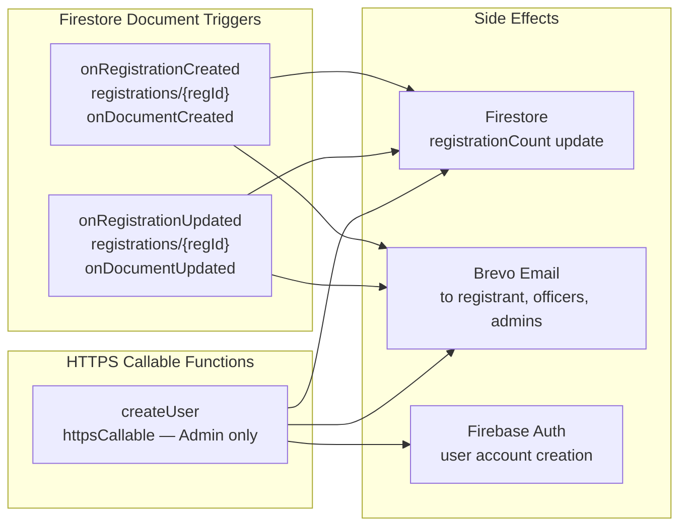
```mermaid
graph LR
    subgraph Triggers["Firestore Document Triggers"]
        T1["onRegistrationCreated\nregistrations/{regId}\nonDocumentCreated"]
        T2["onRegistrationUpdated\nregistrations/{regId}\nonDocumentUpdated"]
    end

    subgraph Callables["HTTPS Callable Functions"]
        C1["createUser\nhttpsCallable — Admin only"]
    end

    subgraph Outputs["Side Effects"]
        FS["Firestore\nregistrationCount update"]
        EM["Brevo Email\nto registrant, officers, admins"]
        AU["Firebase Auth\nuser account creation"]
    end

    T1 --> FS
    T1 --> EM
    T2 --> FS
    T2 --> EM
    C1 --> FS
    C1 --> EM
    C1 --> AU
```

### Registration Created Flow

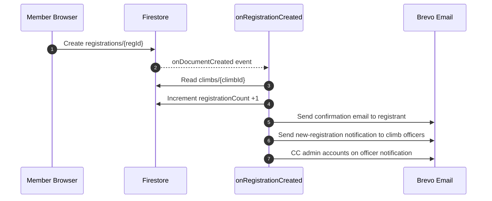
```mermaid
sequenceDiagram
    autonumber
    participant M as Member Browser
    participant FS as Firestore
    participant CF as onRegistrationCreated
    participant EM as Brevo Email

    M->>FS: Create registrations/{regId}
    FS-->>CF: onDocumentCreated event
    CF->>FS: Read climbs/{climbId}
    CF->>FS: Increment registrationCount +1
    CF->>EM: Send confirmation email to registrant
    CF->>EM: Send new-registration notification to climb officers
    CF->>EM: CC admin accounts on officer notification
```

### Registration Updated Flow

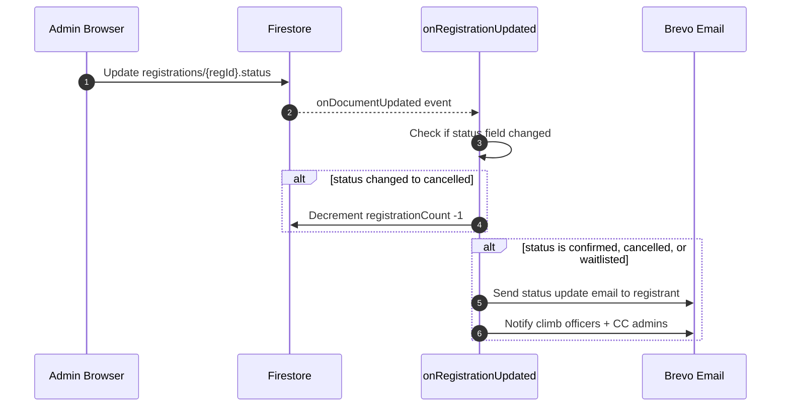
```mermaid
sequenceDiagram
    autonumber
    participant A as Admin Browser
    participant FS as Firestore
    participant CF as onRegistrationUpdated
    participant EM as Brevo Email

    A->>FS: Update registrations/{regId}.status
    FS-->>CF: onDocumentUpdated event
    CF->>CF: Check if status field changed
    alt status changed to cancelled
        CF->>FS: Decrement registrationCount -1
    end
    alt status is confirmed, cancelled, or waitlisted
        CF->>EM: Send status update email to registrant
        CF->>EM: Notify climb officers + CC admins
    end
```

---

## Data Architecture

### Firestore Database

The Firestore database is named `openclimbs` (not the default `(default)` database). This intentionally namespaces the application data.

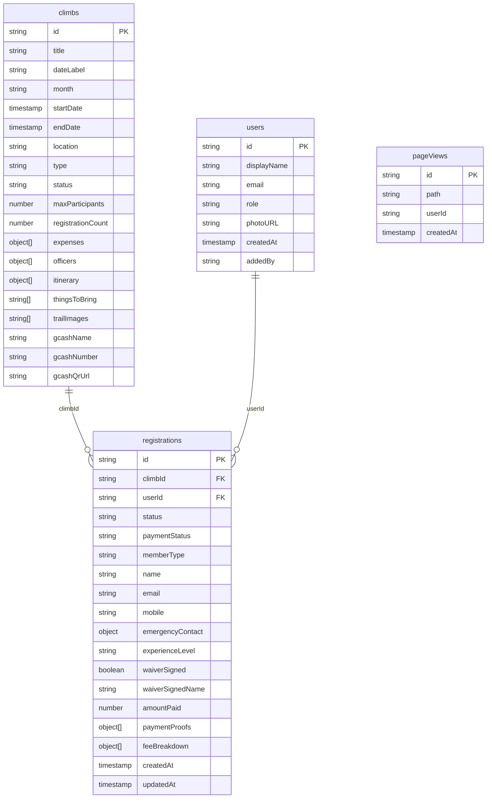
```mermaid
erDiagram
    climbs {
        string id PK
        string title
        string dateLabel
        string month
        timestamp startDate
        timestamp endDate
        string location
        string type
        string status
        number maxParticipants
        number registrationCount
        object[] expenses
        object[] officers
        object[] itinerary
        string[] thingsToBring
        string[] trailImages
        string gcashName
        string gcashNumber
        string gcashQrUrl
    }

    registrations {
        string id PK
        string climbId FK
        string userId FK
        string status
        string paymentStatus
        string memberType
        string name
        string email
        string mobile
        object emergencyContact
        string experienceLevel
        boolean waiverSigned
        string waiverSignedName
        number amountPaid
        object[] paymentProofs
        object[] feeBreakdown
        timestamp createdAt
        timestamp updatedAt
    }

    users {
        string id PK
        string displayName
        string email
        string role
        string photoURL
        timestamp createdAt
        string addedBy
    }

    pageViews {
        string id PK
        string path
        string userId
        timestamp createdAt
    }

    climbs ||--o{ registrations : "climbId"
    users ||--o{ registrations : "userId"
```

### Registration Status State Machine

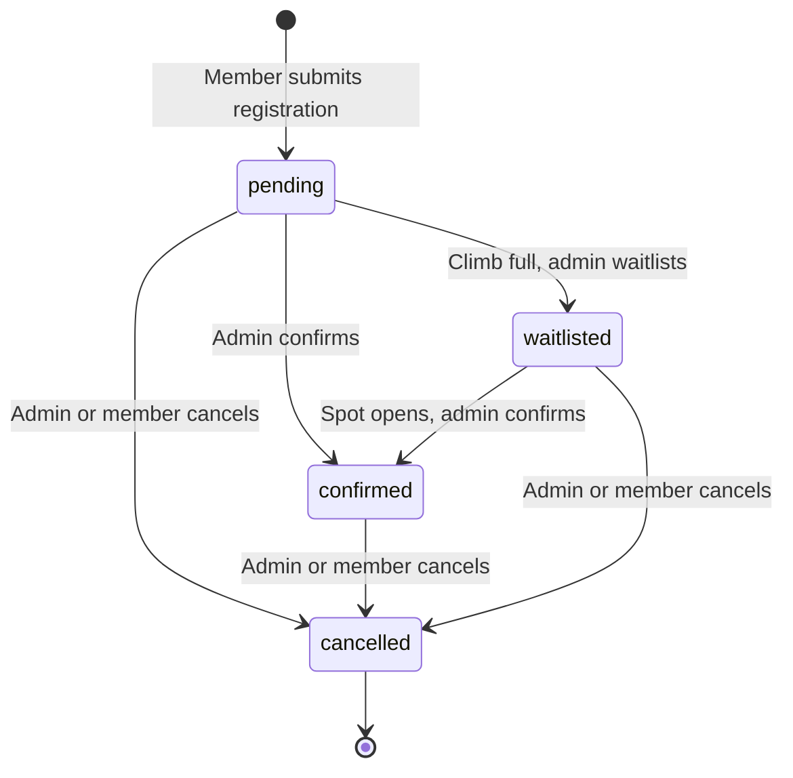
```mermaid
stateDiagram-v2
    [*] --> pending : Member submits registration
    pending --> confirmed : Admin confirms
    pending --> waitlisted : Climb full, admin waitlists
    pending --> cancelled : Admin or member cancels
    confirmed --> cancelled : Admin or member cancels
    waitlisted --> confirmed : Spot opens, admin confirms
    waitlisted --> cancelled : Admin or member cancels
    cancelled --> [*]
```

### Payment Status State Machine

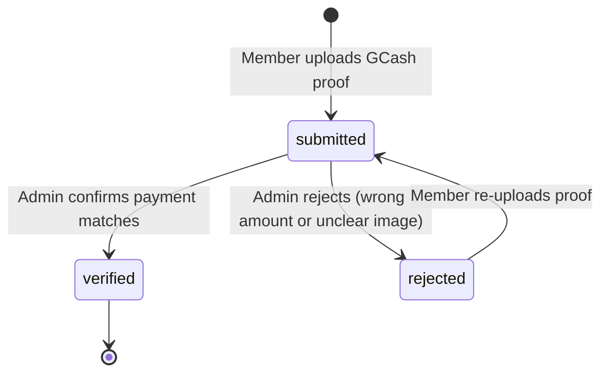
```mermaid
stateDiagram-v2
    [*] --> submitted : Member uploads GCash proof
    submitted --> verified : Admin confirms payment matches
    submitted --> rejected : Admin rejects (wrong amount or unclear image)
    rejected --> submitted : Member re-uploads proof
    verified --> [*]
```

---

## Authentication and Authorization

### Authentication Flow

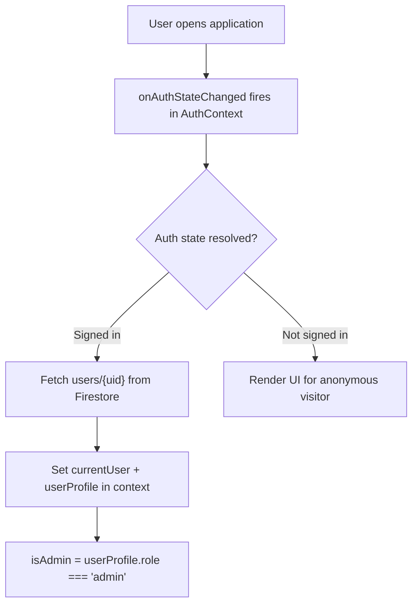
```mermaid
flowchart TD
    A["User opens application"]
    B{"Auth state resolved?"}
    C["onAuthStateChanged fires in AuthContext"]
    D["Fetch users/{uid} from Firestore"]
    E["Set currentUser + userProfile in context"]
    F["isAdmin = userProfile.role === 'admin'"]
    G["Render UI for anonymous visitor"]

    A --> C
    C --> B
    B -- "Signed in" --> D
    D --> E --> F
    B -- "Not signed in" --> G
```

### Authorization Layers

Access control is enforced at two independent layers: React route guards on the client and Firestore security rules on the server. Both must pass for any privileged operation to succeed.

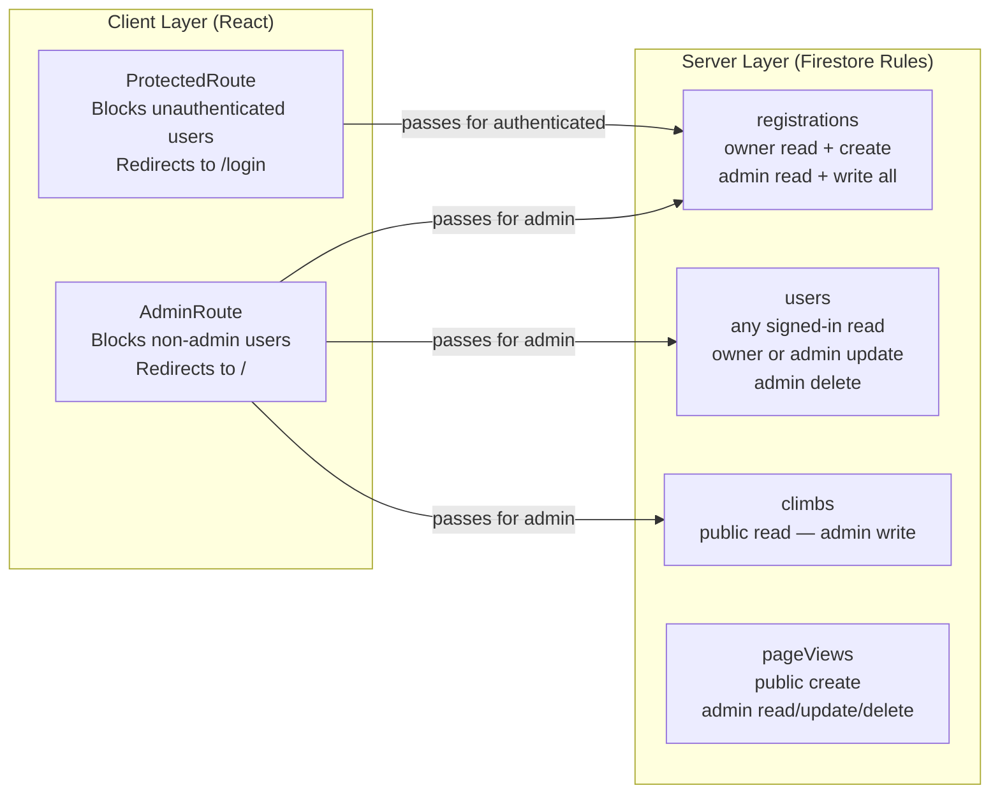
```mermaid
flowchart LR
    subgraph Client["Client Layer (React)"]
        PG["ProtectedRoute\nBlocks unauthenticated users\nRedirects to /login"]
        AG["AdminRoute\nBlocks non-admin users\nRedirects to /"]
    end

    subgraph Server["Server Layer (Firestore Rules)"]
        CR["climbs\npublic read — admin write"]
        RR["registrations\nowner read + create\nadmin read + write all"]
        UR["users\nany signed-in read\nowner or admin update\nadmin delete"]
        PV["pageViews\npublic create\nadmin read/update/delete"]
    end

    PG -->|passes for authenticated| RR
    AG -->|passes for admin| CR
    AG -->|passes for admin| UR
    AG -->|passes for admin| RR
```

---

## Email Notification Architecture

Email credentials (`BREVO_API_KEY`, `BREVO_FROM_EMAIL`) are stored as Firebase Function secrets and are never exposed to the browser or source code.

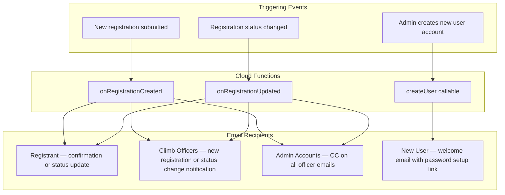
```mermaid
flowchart TD
    subgraph Events["Triggering Events"]
        E1["New registration submitted"]
        E2["Registration status changed"]
        E3["Admin creates new user account"]
    end

    subgraph Functions["Cloud Functions"]
        F1["onRegistrationCreated"]
        F2["onRegistrationUpdated"]
        F3["createUser callable"]
    end

    subgraph Recipients["Email Recipients"]
        R1["Registrant — confirmation or status update"]
        R2["Climb Officers — new registration or status change notification"]
        R3["Admin Accounts — CC on all officer emails"]
        R4["New User — welcome email with password setup link"]
    end

    E1 --> F1
    E2 --> F2
    E3 --> F3

    F1 --> R1
    F1 --> R2
    F1 --> R3

    F2 --> R1
    F2 --> R2
    F2 --> R3

    F3 --> R4
```

---

## Routing Architecture

The application uses React Router v6 with nested routes and layout-based route guards.

| Route                     | Access        | Component        | Description                                 |
| ------------------------- | ------------- | ---------------- | ------------------------------------------- |
| `/`                       | Public        | Schedule         | Climb schedule card grid                    |
| `/event/:climbId`         | Public        | Event            | Mountain profile and event detail           |
| `/login`                  | Public        | Login            | Email/password and Google sign-in           |
| `/signup`                 | Public        | Signup           | New member account creation                 |
| `/forgot-password`        | Public        | ForgotPassword   | Password reset request                      |
| `/register/:climbId`      | Authenticated | Register         | Climb registration form with waiver         |
| `/my-registrations`       | Authenticated | MyRegistrations  | Member's personal registration history      |
| `/waiver/:registrationId` | Auth (owner)  | WaiverPrint      | Printable liability waiver                  |
| `/admin`                  | Admin         | Dashboard        | Overview table of all climbs                |
| `/admin/climbs`           | Admin         | ClimbsManage     | Climb list with create and manage actions   |
| `/admin/climbs/new`       | Admin         | ClimbForm        | Create new climb                            |
| `/admin/climbs/:id/edit`  | Admin         | ClimbForm        | Edit existing climb                         |
| `/admin/climbs/:id`       | Admin         | ClimbDetail      | Climb registrations and management          |
| `/admin/users`            | Admin         | UsersManage      | User accounts and role management           |
| `/admin/registrations`    | Admin         | AllRegistrations | Cross-climb registration table with export  |
| `/admin/payments`         | Admin         | ManagePayments   | GCash verification and transport headcount  |
| `/admin/analytics`        | Admin         | Analytics        | Page view analytics dashboard               |

---

## State Management

The application uses React Context for shared state. There is no external state management library (Redux, Zustand, etc.).

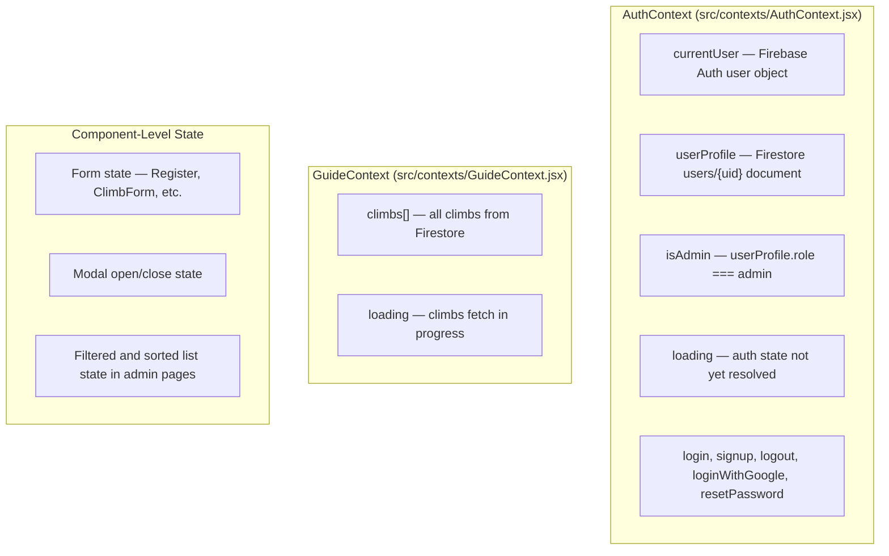
```mermaid
graph TD
    subgraph AuthContext["AuthContext (src/contexts/AuthContext.jsx)"]
        AU1["currentUser — Firebase Auth user object"]
        AU2["userProfile — Firestore users/{uid} document"]
        AU3["isAdmin — userProfile.role === admin"]
        AU4["loading — auth state not yet resolved"]
        AU5["login, signup, logout, loginWithGoogle, resetPassword"]
    end

    subgraph GuideContext["GuideContext (src/contexts/GuideContext.jsx)"]
        GU1["climbs[] — all climbs from Firestore"]
        GU2["loading — climbs fetch in progress"]
    end

    subgraph LocalState["Component-Level State"]
        LS1["Form state — Register, ClimbForm, etc."]
        LS2["Modal open/close state"]
        LS3["Filtered and sorted list state in admin pages"]
    end
```

---

## Key Design Decisions

| Decision | Rationale |
| --- | --- |
| Serverless-only architecture | Eliminates server provisioning, patching, and scaling concerns. Firebase handles all infrastructure automatically. |
| Named Firestore database (`openclimbs`) | Namespaces data away from the default database, allowing future multi-app use of the same Firebase project. |
| `registrationCount` maintained by Cloud Functions | Prevents race conditions that would occur if multiple clients tried to read-increment-write the count concurrently. |
| Firestore security rules as primary access control | Server-side rules enforce ownership and role checks regardless of client behavior. React route guards are a UX convenience layer only. |
| Brevo for transactional email | Full control over email HTML, CC logic, and officer-notification routing without dependency on a Firebase Extension. |
| GCash payment (not card processing) | Appropriate for the Philippine market and the club's operational model. The app records proof and amount but does not process payments directly. |
| Vite with `@` path alias | Keeps import paths clean and refactor-friendly across a growing component tree. |
| No TypeScript | Intentional for this project phase. The team agreed to defer a TypeScript migration to avoid premature complexity on a small-team project. |
| React Context over Redux/Zustand | The application's shared state surface is small (auth + climbs list). A full state management library would add unnecessary complexity. |
