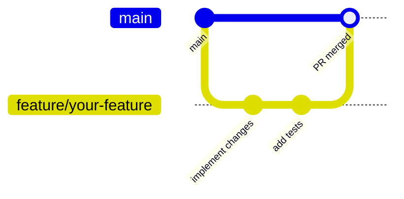

# Contributing

## Getting Started

1. Fork or clone the repository.
2. Follow the setup steps in [README.md](../README.md).
3. Create a feature branch from `main`:

```bash
git checkout -b feature/your-feature-name
```

## Git Workflow



---

## Branch Naming

| Prefix    | Use for                              |
|-----------|--------------------------------------|
| feature/  | New features                         |
| fix/      | Bug fixes                            |
| docs/     | Documentation changes only           |
| chore/    | Dependency updates, config changes   |

---

## Coding Standards

- **JavaScript/JSX**: Follow existing patterns in `src/`. No TypeScript migration without team agreement.
- **CSS**: Use the design tokens defined in `src/styles/globals.css`. Do not introduce Tailwind or CSS-in-JS.
- **Naming**: See [general-coding.instructions.md](../.github/instructions/general-coding.instructions.md).
- **Comments**: Only where intent is non-obvious.
- **Secrets**: Never commit API keys, tokens, or `.env` files.

---

## Before Committing

Run these checks for changed areas:

```
# Frontend
npm run build       # ensure no build errors

# Functions (if changed)
cd functions && npm install
```

---

## Pull Request Process

1. Keep PRs scoped to a single concern.
2. Update `README.md` and docs under `docs/` if behavior or setup changes.
3. For architecture changes, add or update an ADR in `docs/adr/`.
4. Request review from at least one other contributor.

---

## Data & Firebase

- Do not commit real Firebase project IDs or config values.
- Use the Firebase emulator for local development and testing.
- If you change Firestore rules, test them with the emulator before deploying.

---

## Reporting Issues

Open a GitHub Issue with:
- Steps to reproduce
- Expected vs actual behavior
- Browser / Node version if relevant
