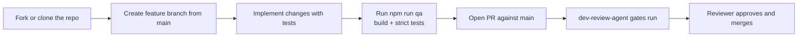
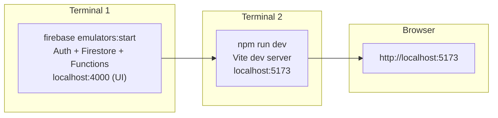
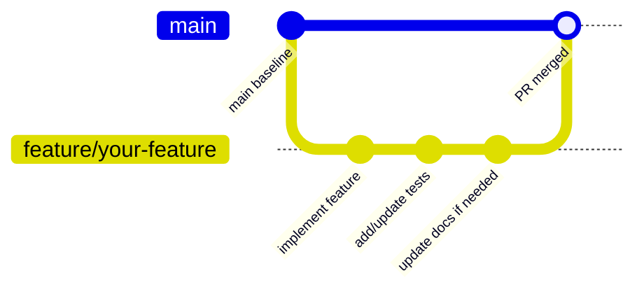
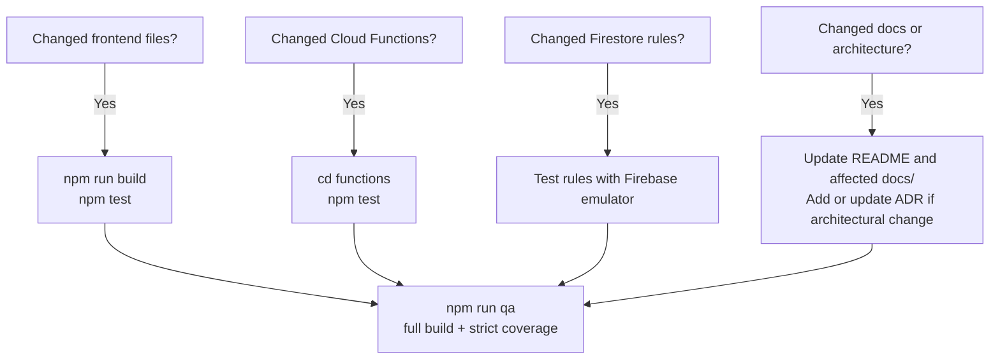
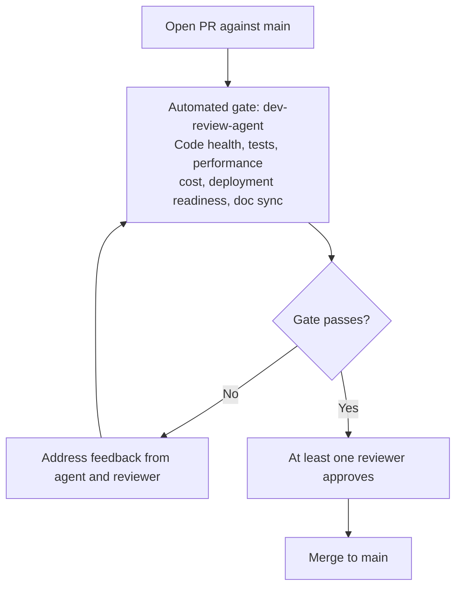
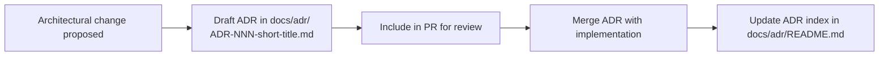

# Contributing

## Table of Contents

- [Overview](#overview)
- [Getting Started](#getting-started)
- [Development Environment Setup](#development-environment-setup)
- [Git Workflow](#git-workflow)
- [Branch Naming](#branch-naming)
- [Coding Standards](#coding-standards)
- [Before Committing](#before-committing)
- [Pull Request Process](#pull-request-process)
- [Architecture Decision Records](#architecture-decision-records)
- [Testing Requirements](#testing-requirements)
- [Data and Firebase Guidelines](#data-and-firebase-guidelines)
- [Reporting Issues](#reporting-issues)

---

## Overview

Contributions follow a standard fork-branch-pull-request workflow. All changes are reviewed before merge. The `dev-review-agent` runs as part of every PR review to gate on code health, tests, performance, cost efficiency, deployment readiness, and documentation sync.


```mermaid
flowchart LR
    A["Fork or clone the repo"]
    B["Create feature branch from main"]
    C["Implement changes with tests"]
    D["Run npm run qa\nbuild + strict tests"]
    E["Open PR against main"]
    F["dev-review-agent gates run"]
    G["Reviewer approves and merges"]

    A --> B --> C --> D --> E --> F --> G
```

---

## Getting Started

1. Fork or clone the repository.
2. Follow the [Development Environment Setup](#development-environment-setup) steps below.
3. Create a feature branch from `main`.
4. Make your changes with appropriate tests.
5. Run `npm run qa` to verify the build and test suite.
6. Open a pull request against `main`.

---

## Development Environment Setup

### Prerequisites

| Tool | Version | Install |
| --- | --- | --- |
| Node.js | 20+ | https://nodejs.org |
| npm | 10+ | Bundled with Node 20 |
| Firebase CLI | Latest | `npm install -g firebase-tools` |
| Git | Any | https://git-scm.com |

### Steps

```bash
# 1. Clone the repository
git clone https://github.com/<org>/mms-open-climbs.git
cd mms-open-climbs

# 2. Install frontend dependencies
npm install

# 3. Install Cloud Function dependencies
cd functions && npm install && cd ..

# 4. Copy and configure environment files
cp .env.example .env
cp functions/.env.example functions/.env
# Fill in VITE_FIREBASE_* in .env
# Fill in BREVO_API_KEY, BREVO_FROM_EMAIL, APP_URL in functions/.env

# 5. Start Firebase emulators (Terminal 1)
firebase emulators:start --only auth,firestore,functions

# 6. Start Vite dev server (Terminal 2)
npm run dev
```


```mermaid
flowchart LR
    subgraph Terminal1["Terminal 1"]
        E["firebase emulators:start\nAuth + Firestore + Functions\nlocalhost:4000 (UI)"]
    end
    subgraph Terminal2["Terminal 2"]
        V["npm run dev\nVite dev server\nlocalhost:5173"]
    end
    subgraph Browser["Browser"]
        B["http://localhost:5173"]
    end

    V --> B
    E --> V
```

---

## Git Workflow


```mermaid
gitGraph
    commit id: "main baseline"
    branch feature/your-feature
    checkout feature/your-feature
    commit id: "implement feature"
    commit id: "add/update tests"
    commit id: "update docs if needed"
    checkout main
    merge feature/your-feature id: "PR merged"
```

### Rules

- Always branch from the latest `main`.
- Keep branches short-lived. Merge or close within a reasonable timeframe.
- Squash commits if the history is noisy before requesting review.
- Never force-push to `main`.

---

## Branch Naming

| Prefix | Use for | Example |
| --- | --- | --- |
| `feature/` | New features or enhancements | `feature/trail-photo-lightbox` |
| `fix/` | Bug fixes | `fix/registration-count-race` |
| `docs/` | Documentation changes only | `docs/update-deployment-guide` |
| `chore/` | Dependency updates, config changes | `chore/bump-firebase-sdk` |
| `test/` | Test additions or improvements only | `test/admin-registrations-coverage` |

---

## Coding Standards

### JavaScript / JSX

- Follow existing patterns in `src/`. No TypeScript migration without team agreement.
- Use functional components with hooks — no class components.
- Use the `@` path alias for imports (e.g., `import Foo from "@/components/Foo"`).
- No inline styles. Use design tokens from `src/styles/globals.css`.
- Do not introduce Tailwind, CSS-in-JS, or additional CSS frameworks.

### Naming conventions

| Construct | Convention | Example |
| --- | --- | --- |
| React components | PascalCase | `ClimbCard`, `AdminRoute` |
| Variables and functions | camelCase | `handleSubmit`, `climbId` |
| Constants | ALL_CAPS | `MAX_PHOTOS` |
| Private class members | Underscore prefix | `_internalState` |
| CSS custom properties | kebab-case | `--color-primary` |

### Comments

- Only add comments where the intent is non-obvious.
- Do not add JSDoc or type annotation comments to code you did not write.
- Use US English in all code, comments, and documentation.

### Secrets

- Never commit API keys, tokens, `.env` files, or Firebase project IDs.
- Use `.env.example` as the only committed template.

---

## Before Committing

Run checks for all areas you touched. The `dev-review-agent` will flag failures during PR review, but catching issues locally is faster.


```mermaid
flowchart TD
    A["Changed frontend files?"]
    B["npm run build\nnpm test"]
    C["Changed Cloud Functions?"]
    D["cd functions\nnpm test"]
    E["Changed Firestore rules?"]
    F["Test rules with Firebase emulator"]
    G["Changed docs or architecture?"]
    H["Update README and affected docs/\nAdd or update ADR if architectural change"]
    I["npm run qa\nfull build + strict coverage"]

    A -- "Yes" --> B
    C -- "Yes" --> D
    E -- "Yes" --> F
    G -- "Yes" --> H
    B --> I
    D --> I
    F --> I
    H --> I
```

### Commands reference

```bash
# Build frontend (catches import errors, unused exports)
npm run build

# Run all frontend tests
npm test

# Run all function tests
npm --prefix functions test

# Run frontend + function tests
npm run test:all

# Run with full coverage (CI gate)
npm run test:strict

# Full QA: build + strict coverage
npm run qa
```

---

## Pull Request Process


```mermaid
flowchart TD
    A["Open PR against main"]
    B["Automated gate: dev-review-agent\nCode health, tests, performance\ncost, deployment readiness, doc sync"]
    C{"Gate passes?"}
    D["Address feedback from agent and reviewer"]
    E["At least one reviewer approves"]
    F["Merge to main"]

    A --> B --> C
    C -- "No" --> D --> B
    C -- "Yes" --> E --> F
```

### PR checklist

- [ ] Changes are scoped to a single concern
- [ ] `npm run qa` passes locally
- [ ] New logic has corresponding tests
- [ ] `README.md` and affected `docs/` files are updated if behavior, setup, or architecture changed
- [ ] For architectural changes: ADR added or updated in `docs/adr/`
- [ ] No secrets, real Firebase project IDs, or `.env` files committed
- [ ] PR description explains the change and links to any related issues

---

## Architecture Decision Records

Significant architectural decisions are documented as ADRs in `docs/adr/`. When making a decision that affects the overall design — such as changing the authentication provider, adding a new backend service, or introducing a new pattern — create or update an ADR.


```mermaid
flowchart LR
    A["Architectural change proposed"]
    B["Draft ADR in docs/adr/\nADR-NNN-short-title.md"]
    C["Include in PR for review"]
    D["Merge ADR with implementation"]
    E["Update ADR index in docs/adr/README.md"]

    A --> B --> C --> D --> E
```

ADRs follow the template in `docs/adr/`. Do not edit the template itself.

---

## Testing Requirements

See [TESTING.md](TESTING.md) for the full guide. Key requirements for contributors:

- New components must have corresponding tests in `tests/`.
- New Cloud Function logic must have corresponding tests in `functions/tests/`.
- Use the shared render helper `tests/helpers.jsx` to wrap components with required providers.
- Do not reduce coverage for lines you change. The `npm run test:strict` gate will fail if coverage drops.

---

## Data and Firebase Guidelines

- Do not commit real Firebase project IDs, config values, or Firestore export data.
- Use the Firebase emulator for all local development and testing.
- If you change Firestore security rules, test them with the emulator before opening a PR.
- If you change Firestore indexes, run `firebase deploy --only firestore:indexes` to apply them.
- Seed data for local development is in `scripts/` — use `node scripts/seed-climbs.mjs` to populate the local emulator.

---

## Reporting Issues

Open a GitHub Issue with:

- A clear and specific title
- Steps to reproduce the issue
- Expected behavior vs. actual behavior
- Browser name and version (for frontend issues)
- Node.js version (for function or script issues)
- Any relevant error messages from the browser console or `firebase functions:log`
