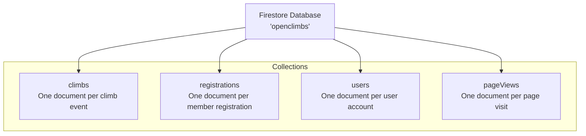
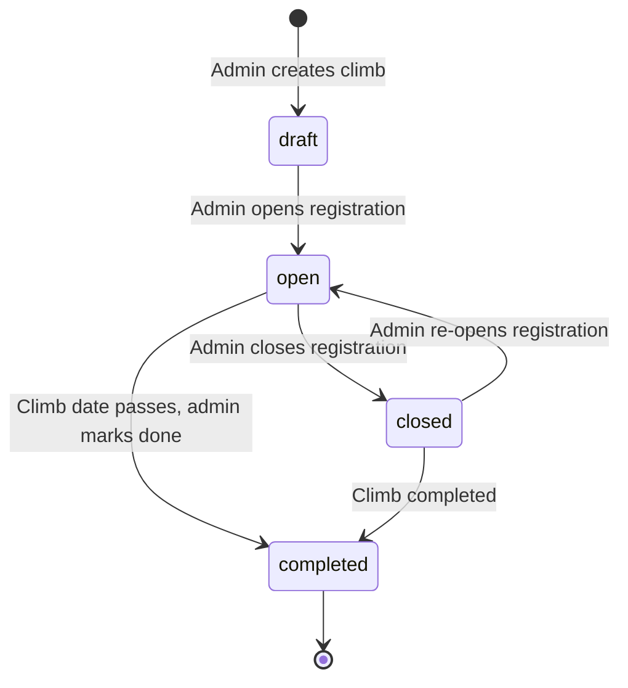
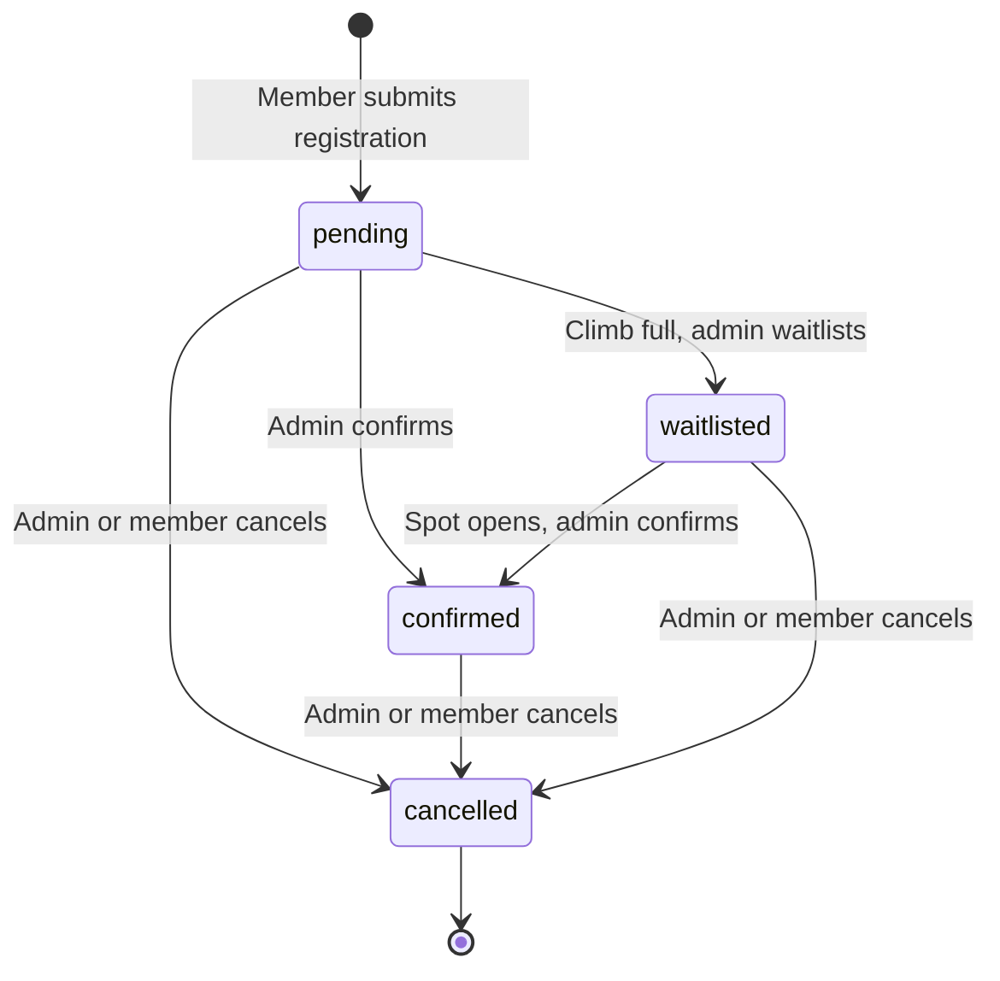
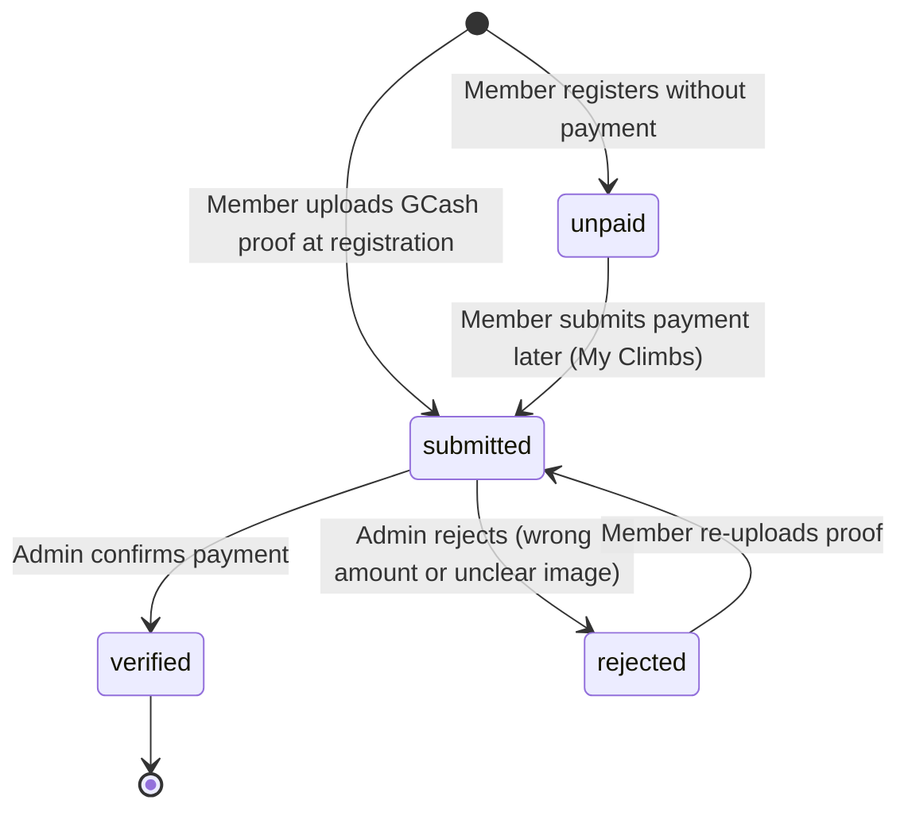
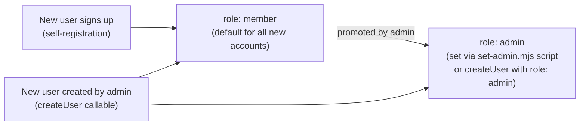
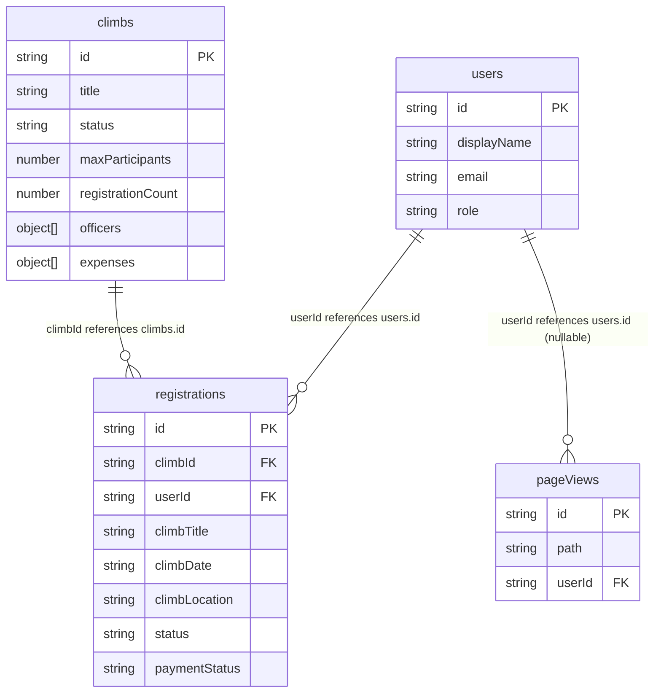
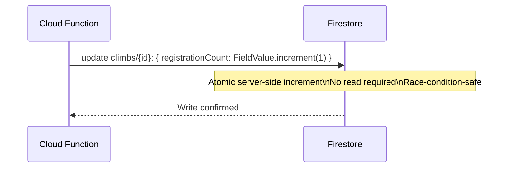

# Data

## Table of Contents

- [Overview](#overview)
- [Firestore Database](#firestore-database)
- [Collections Reference](#collections-reference)
  - [climbs](#climbs)
  - [registrations](#registrations)
  - [users](#users)
  - [pageViews](#pageviews)
- [Data Relationships](#data-relationships)
- [Status Enumerations](#status-enumerations)
- [Denormalization Strategy](#denormalization-strategy)
- [Atomic Counters](#atomic-counters)
- [Data Seeding](#data-seeding)
- [Data Export](#data-export)
- [Data Retention](#data-retention)

---

## Overview

MMS Open Climbs uses Cloud Firestore as its sole database. Firestore is a NoSQL document store. All data is organized in the named database `openclimbs` under four top-level collections: `climbs`, `registrations`, `users`, and `pageViews`.

There is no SQL schema. Documents in the same collection can have varying fields, though the application follows a consistent structure as documented here.

---

## Firestore Database



---

## Collections Reference

### climbs

Each document represents a single climb event in the schedule. Documents are identified by an auto-generated Firestore document ID.

| Field | Type | Required | Notes |
| --- | --- | --- | --- |
| `title` | string | Yes | Climb name, e.g. "Mt. Pulag" |
| `dateLabel` | string | Yes | Display date, e.g. "July 19-20" |
| `month` | string | Yes | Lowercase month key: `jan`, `feb`, ... `dec` |
| `startDate` | timestamp | Yes | Used for sorting the schedule |
| `endDate` | timestamp | No | End date for multi-day climbs |
| `location` | string | Yes | Location description |
| `type` | string | Yes | `minor` / `major` / `special` |
| `status` | string | Yes | `draft` / `open` / `closed` / `completed` |
| `color` | string | No | Card color token, e.g. `c-slate` |
| `maxParticipants` | number | Yes | Maximum allowed registrations |
| `registrationCount` | number | Yes | Maintained by Cloud Functions — do not edit client-side |
| `isWide` | boolean | No | Card spans 2 columns on the schedule grid |
| `itineraryReady` | boolean | No | Shows itinerary section on event page when `true` |
| `description` | string | No | Mountain description for the event page |
| `elevation` | string | No | Summit elevation in MASL |
| `difficulty` | string | No | Difficulty rating, e.g. "Moderate", "Difficult" |
| `jumpOff` | string | No | Jump-off point name |
| `jumpOffElevation` | string | No | Jump-off elevation in meters |
| `elevationGain` | string | No | Total elevation gain |
| `distanceToSummit` | string | No | Jump-off to peak distance |
| `roundTripDistance` | string | No | Total round trip distance |
| `recommendedDays` | string | No | Recommended number of days |
| `features` | string | No | Terrain features description |
| `googleMapsUrl` | string | No | Google Maps URL for the embedded map |
| `allTrailsUrl` | string | No | AllTrails link |
| `stravaUrl` | string | No | Strava segment or activity link |
| `komootUrl` | string | No | Komoot tour link |
| `trailImages` | string[] | No | Firebase Storage or CDN image URLs for the photo carousel |
| `waterSourceNote` | string | No | Water source information |
| `weatherNote` | string | No | Seasonal weather notes |
| `thingsToBring` | string[] | No | Recommended gear and supplies |
| `expenses` | object[] | No | `[{ label, amount, note, optional }]` |
| `officers` | object[] | No | `[{ name, role, mobile, email }]` — used for email notifications |
| `itinerary` | object[] | No | `[{ day, entries: [{ time, activity }] }]` |
| `gcashName` | string | No | GCash account holder name |
| `gcashNumber` | string | No | GCash mobile number |
| `gcashQrUrl` | string | No | Firebase Storage URL for the GCash QR code image |

#### Climb status lifecycle



---

### registrations

Each document represents a single member's registration for a single climb.

| Field | Type | Required | Notes |
| --- | --- | --- | --- |
| `climbId` | string | Yes | Document ID of the referenced climb |
| `climbTitle` | string | Yes | Denormalized climb name (for display without extra reads) |
| `climbDate` | string | Yes | Denormalized `dateLabel` |
| `climbLocation` | string | Yes | Denormalized location |
| `userId` | string | Yes | Firebase Auth UID of the registrant |
| `status` | string | Yes | `pending` / `confirmed` / `waitlisted` / `cancelled` |
| `memberType` | string | Yes | `member` / `guest` |
| `name` | string | Yes | Full name |
| `email` | string | Yes | Email address |
| `mobile` | string | Yes | Mobile number |
| `dateOfBirth` | string | No | Date of birth (YYYY-MM-DD) |
| `address` | string | No | Home address |
| `emergencyContact` | object | Yes | `{ name, mobile, relationship }` |
| `medicalConditions` | string | No | Disclosed medical conditions |
| `experienceLevel` | string | Yes | `beginner` / `intermediate` / `experienced` |
| `waiverSigned` | boolean | Yes | `true` when member typed their signature |
| `waiverSignedAt` | timestamp | No | Timestamp of digital signature |
| `waiverSignedName` | string | No | Typed full name as digital signature |
| `paymentStatus` | string | No | `unpaid` / `submitted` / `verified` / `rejected` — members can register without paying; the registration is created as `unpaid` until a GCash proof is submitted |
| `amountPaid` | number | No | Exact amount sent via GCash |
| `paymentProofs` | object[] | No | `[{ url, fileName }]` — uploaded receipt images |
| `feeBreakdown` | object[] | No | `[{ label, amount, optional, selected }]` |
| `adminNotes` | string | No | Admin-only internal notes |
| `cancellationReason` | string | No | Reason provided when `status = cancelled` |
| `confirmedAt` | timestamp | No | Set when status changes to `confirmed` |
| `createdAt` | timestamp | Yes | Firestore server timestamp on creation |
| `updatedAt` | timestamp | Yes | Firestore server timestamp on last update |

#### Registration status lifecycle



#### Payment status lifecycle



---

### users

Each document represents one user account. The document ID equals the Firebase Auth UID.

| Field | Type | Required | Notes |
| --- | --- | --- | --- |
| `displayName` | string | Yes | User's full name |
| `email` | string | Yes | User's email address |
| `role` | string | Yes | `member` (default) or `admin` |
| `photoURL` | string | No | Google profile photo URL (Google sign-in accounts only) |
| `createdAt` | timestamp | Yes | Firestore server timestamp on creation |
| `addedBy` | string | Yes | Firebase Auth UID of the creating admin, or `"self"` for self-registration |

#### User role model



---

### pageViews

Each document records one page view event. Used by the Admin Analytics page.

| Field | Type | Required | Notes |
| --- | --- | --- | --- |
| `path` | string | Yes | URL path, e.g. `/event/abc123` |
| `userId` | string | No | Firebase Auth UID if signed in, otherwise `null` |
| `createdAt` | timestamp | Yes | Firestore server timestamp of the page view |

Write access is public (any visitor can write). Read, update, and delete are restricted to admins only.

---

### notifications

Each document is one in-app reminder shown in the notification bell. Written only by Cloud Functions (Admin SDK bypasses security rules) — clients cannot create or delete them, only toggle `read`.

| Field | Type | Required | Notes |
| --- | --- | --- | --- |
| `userId` | string | Yes | Firebase Auth UID of the recipient |
| `type` | string | Yes | `payment_reminder` / `payment_verified` / `status_update` / `upcoming_climb` |
| `title` | string | Yes | Short headline shown in the bell dropdown |
| `message` | string | No | Supporting detail text |
| `link` | string | No | In-app path to navigate to on click (e.g. `/my-registrations`) |
| `read` | boolean | Yes | Toggled by the owning member when they open/dismiss it |
| `createdAt` | timestamp | Yes | Firestore server timestamp — reminders may bump this to resurface as unread |

Some notification IDs are deterministic (e.g. `payment_{regId}`, `upcoming3_{regId}`, `upcoming1_{regId}`) so recurring reminders upsert the same document instead of piling up duplicates. A daily scheduled function (`sendReminderNotifications`) re-flags unpaid/rejected registrations as unread and notifies confirmed registrants 3 days and 1 day before their climb's `startDate`.

---

## Data Relationships

Firestore is a document database with no native joins. Relationships are expressed through document ID references and selective denormalization.



---

## Status Enumerations

### Climb status

| Value | Meaning |
| --- | --- |
| `draft` | Climb created but not yet visible for registration |
| `open` | Registration is open — members can submit registrations |
| `closed` | Registration is closed — no new registrations accepted |
| `completed` | Climb has taken place |

### Registration status

| Value | Meaning |
| --- | --- |
| `pending` | Submitted, awaiting admin confirmation |
| `confirmed` | Admin-confirmed — member has a guaranteed spot |
| `waitlisted` | Climb full — member is on the waitlist |
| `cancelled` | Registration cancelled by admin or member |

### Payment status

| Value | Meaning |
| --- | --- |
| `unpaid` | Member registered without submitting a GCash proof yet |
| `submitted` | Member uploaded a GCash proof — awaiting admin review |
| `verified` | Admin confirmed payment matches the expected amount |
| `rejected` | Admin rejected the proof — member must resubmit |

### Member type

| Value | Meaning |
| --- | --- |
| `member` | MMS club member |
| `guest` | Non-member guest registering with a member |

### Experience level

| Value | Meaning |
| --- | --- |
| `beginner` | Little or no mountaineering experience |
| `intermediate` | Some climb experience, completed minor climbs |
| `experienced` | Regular climber with major climb experience |

---

## Denormalization Strategy

Some fields from the `climbs` collection are copied (denormalized) into each `registrations` document at creation time. This allows the admin registrations views to display climb context without issuing extra Firestore reads per registration.

| Field in registrations | Source | Notes |
| --- | --- | --- |
| `climbTitle` | `climbs.title` | Set at registration time — not updated if the climb title changes |
| `climbDate` | `climbs.dateLabel` | Set at registration time |
| `climbLocation` | `climbs.location` | Set at registration time |

---

## Atomic Counters

`climbs.registrationCount` is maintained exclusively by Cloud Functions using Firestore's `FieldValue.increment()`. This is an atomic server-side operation that prevents the race condition that would arise from client-side read-increment-write sequences.



**Do not modify `registrationCount` from the client.** If the count becomes incorrect due to a failed function execution, it can be manually corrected in the Firebase Console.

---

## Data Seeding

A seed script is provided for populating the local Firebase emulator with sample climb data:

```bash
node scripts/seed-climbs.mjs
```

This script targets the local emulator. Ensure the emulator is running before executing it.

---

## Data Export

Admins can export registration data to CSV from **Admin > All Registrations**. The export includes all visible fields from the filtered registrations table.

For a full Firestore export, use the Firebase Console or the `gcloud firestore export` command (requires project Owner or Firestore Admin role).

---

## Data Retention

There is no automated data retention or purge policy currently implemented. All registrations, users, and climb data persist indefinitely.

A utility script is provided for purging admin page view data if the `pageViews` collection grows large:

```bash
node scripts/purge-admin-pageviews.mjs
```

This removes `pageViews` documents generated by admin users, which can inflate analytics data.
