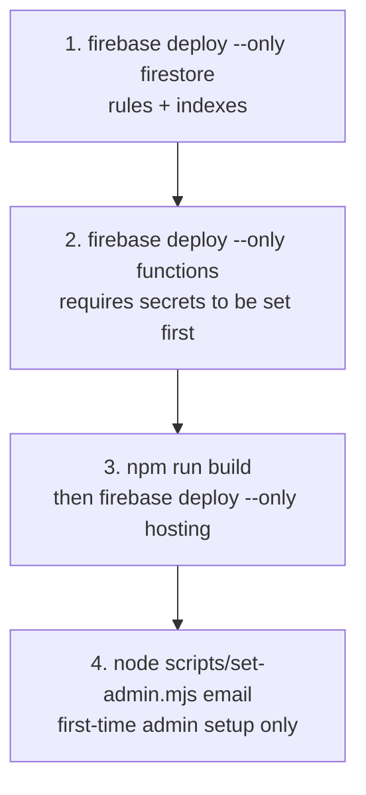
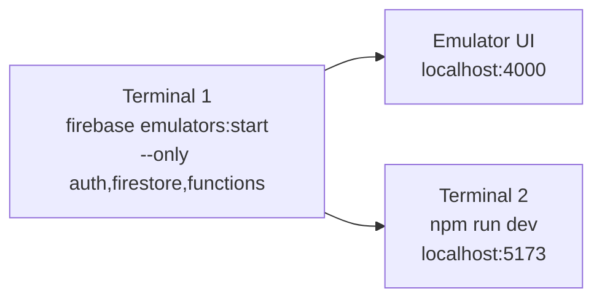

# Deployment

## Prerequisites

- Firebase CLI: `npm install -g firebase-tools`
- Node.js 20+
- A Firebase project with Firestore, Authentication, and Cloud Functions enabled
- A Brevo account for transactional email

---

## 1. Firebase Project Setup

```
firebase login
firebase use --add   # select your project
```

Enable these Firebase services in the console:

- Authentication (Email/Password + Google providers)
- Cloud Firestore
- Cloud Functions

---

## 2. Firestore Database

Create a Firestore database named `openclimbs` (not the default `(default)`).

Deploy security rules and indexes:

```
firebase deploy --only firestore
```

---

## 3. Cloud Functions

### Install dependencies

```
cd functions
npm install
```

### Configure secrets

```
firebase functions:secrets:set BREVO_API_KEY
firebase functions:secrets:set BREVO_FROM_EMAIL
firebase functions:secrets:set APP_URL
```

Set `APP_URL` to your production Firebase Hosting URL, e.g. `https://<project-id>.web.app`.

### Deploy functions

```
firebase deploy --only functions
```

---

## 4. Frontend (Firebase Hosting)

### Build

```bash
npm run build
```

This outputs the static site to the `dist/` folder, which `firebase.json` points Firebase Hosting at.

### Environment variables

Create a `.env` file at the project root (copy from `.env.example`):

```
VITE_FIREBASE_API_KEY=
VITE_FIREBASE_AUTH_DOMAIN=
VITE_FIREBASE_PROJECT_ID=
VITE_FIREBASE_STORAGE_BUCKET=
VITE_FIREBASE_MESSAGING_SENDER_ID=
VITE_FIREBASE_APP_ID=
```

These are baked into the bundle at build time by Vite. Do not commit `.env` to source control.

### Deploy hosting

```bash
firebase deploy --only hosting
```

Or deploy everything at once:

```bash
firebase deploy
```

SPA routing is handled by the catch-all rewrite in `firebase.json`:

```json
"rewrites": [{ "source": "**", "destination": "/index.html" }]
```

---

## 5. Set First Admin

After deploying, create your account via the signup page, then promote it to admin:

```
node scripts/set-admin.mjs <email-or-uid>
```

This requires Application Default Credentials or a service account key.

---

## Deploy Order Summary



---

## Local Development



```bash
# Terminal 1 — Firebase emulators
firebase emulators:start --only auth,firestore,functions

# Terminal 2 — Vite dev server
npm run dev
```

Point your `.env` `VITE_FIREBASE_*` values at the emulator when testing locally. See Firebase emulator docs for emulator connection config.
