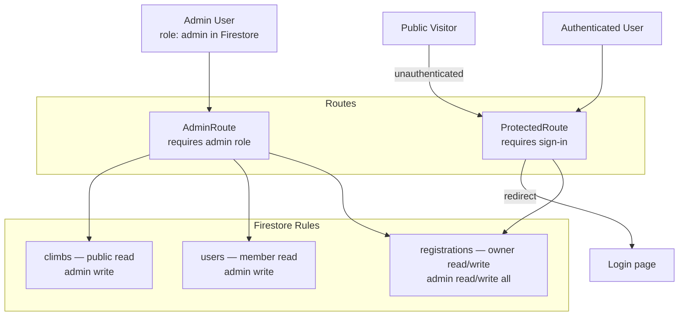

# Security

## Authentication

- Firebase Authentication handles all identity management.
- Supported providers: Email/Password, Google OAuth.
- Passwords are managed entirely by Firebase; the app never stores or transmits them.
- Password reset emails are sent via Firebase's built-in `sendPasswordResetEmail`.

## Authorization Model

## Authorization

Role-based access is enforced at two layers:

### 1. Firestore Security Rules

Located at `firestore.rules`. Key rules:

- `users`: Members can read any profile (needed for display names). Users can only create their own profile with role `member`. Admins can update/delete any user.
- `climbs`: Public read. Admin-only write.
- `registrations`: Users can read and create their own. Admin can read/write all. Creation is gated on the climb being `open`.

### 2. React Route Guards

- `ProtectedRoute` redirects unauthenticated users to `/login`.
- `AdminRoute` redirects non-admins to `/`.
- Admin role is sourced from `users/{uid}.role` in Firestore, fetched on auth state change.

## Secrets Management

- Firebase config keys (API key, project ID, etc.) are scoped to the frontend via `VITE_*` environment variables. These are not secret — Firebase API keys are intended to be public and are protected by Firestore rules and Auth domain restrictions.
- Brevo API key and sender email are stored as Firebase Function secrets, never in source code or the frontend bundle.
- The `.env` file is git-ignored. `.env.example` is committed as a template.

## Data Validation

- Registration form validates required fields client-side before submission.
- Cloud Function `createUser` validates `email` and `displayName` are present and verifies the caller's admin role server-side before creating an account.
- Firestore rules enforce data integrity at the database level.

## Email Security

- Emails are sent server-side only from Cloud Functions.
- No email credentials are exposed to the browser.
- The Brevo `api-key` header is only present in Cloud Function server-side calls.

## OWASP Top 10 Considerations

| Risk                      | Mitigation                                                        |
| ------------------------- | ----------------------------------------------------------------- |
| Injection                 | Firestore SDK uses structured queries; no raw query strings       |
| Broken Authentication     | Firebase Auth handles token lifecycle; JWTs validated server-side |
| Sensitive Data Exposure   | No secrets in client bundle; HTTPS enforced by Vercel + Firebase  |
| Broken Access Control     | Firestore rules + route guards enforce role-based access          |
| Security Misconfiguration | Firestore rules deployed explicitly; no open-write rules          |
| XSS                       | React escapes output by default; no dangerouslySetInnerHTML used  |
| CSRF                      | Firebase Auth uses short-lived ID tokens, not session cookies     |

## Recommended Hardening

- Add Firebase App Check to prevent unauthorized API use.
- Restrict the Firebase API key to your production domain in the Google Cloud Console.
- Enable Google Cloud Armor or rate limiting if abuse is detected.
- Review and tighten Firestore rules before each season.
