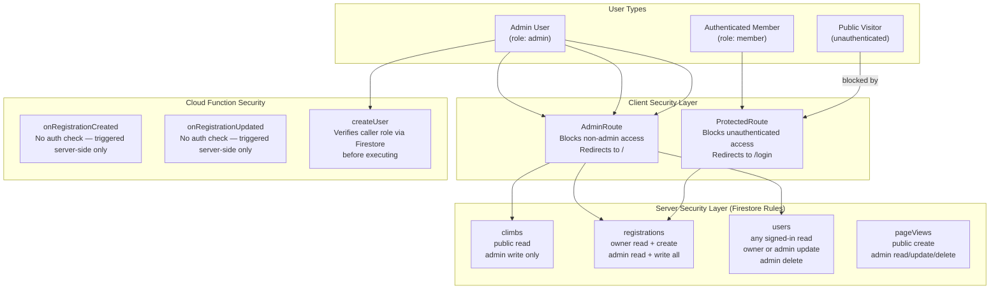
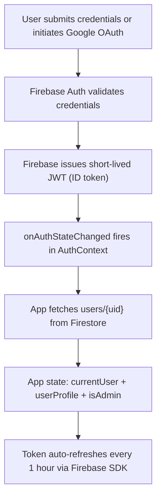
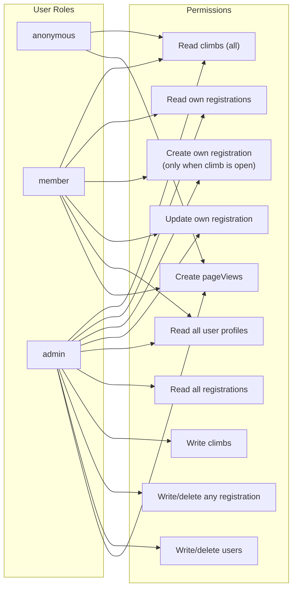
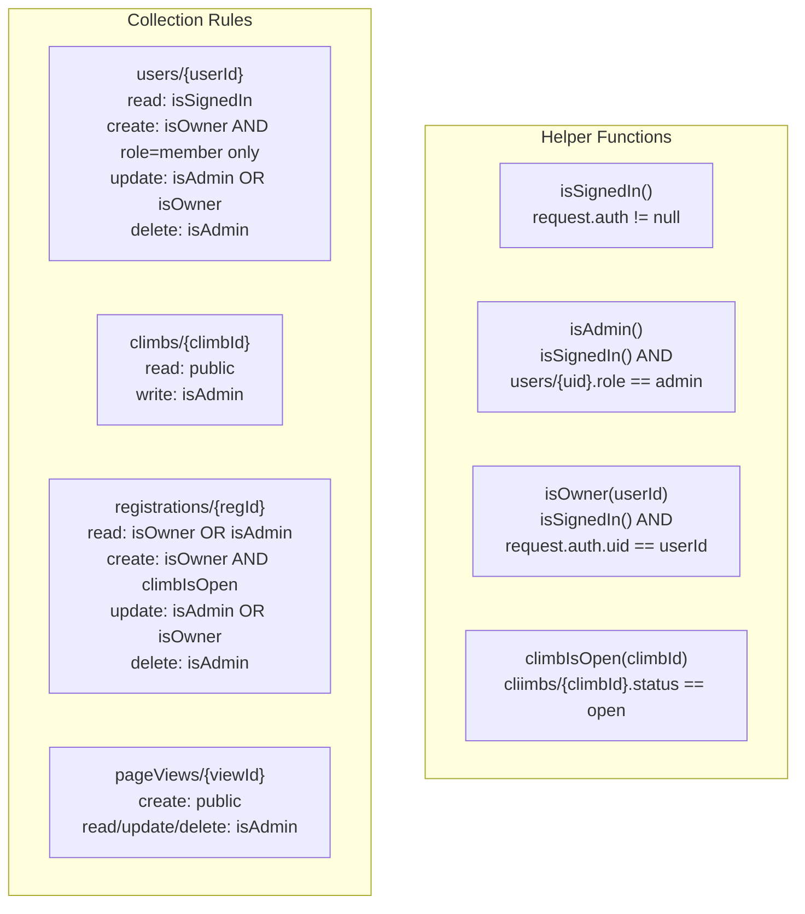
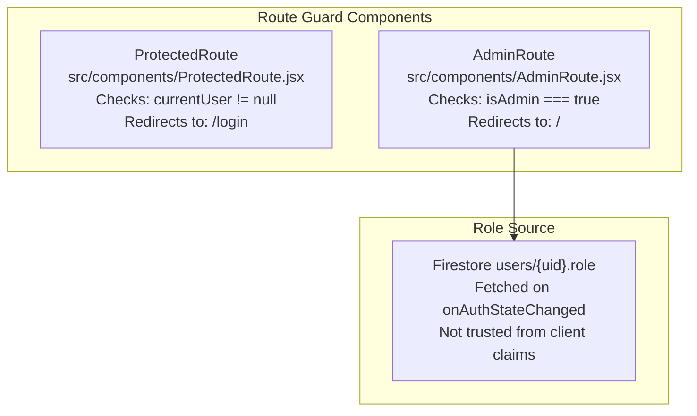
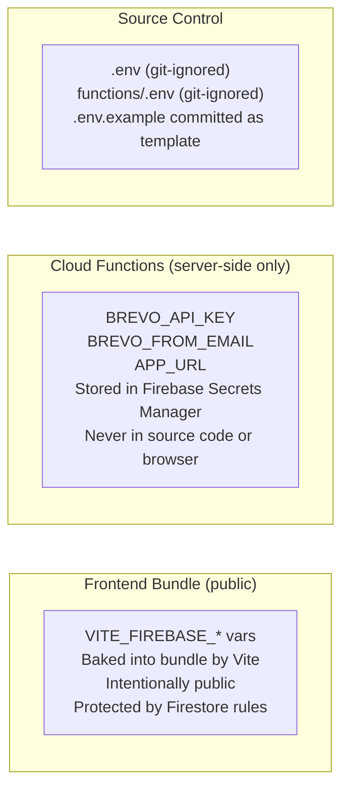
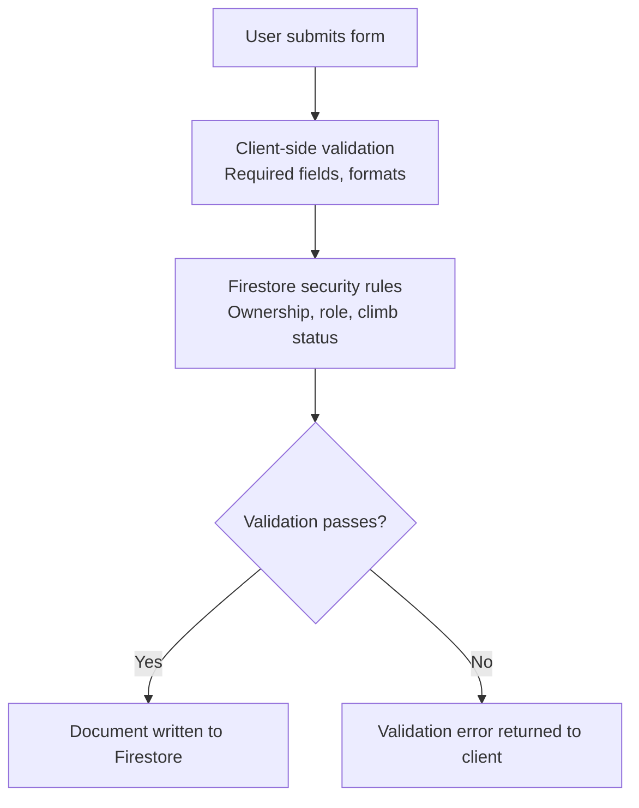

# Security

## Table of Contents

- [Overview](#overview)
- [Security Architecture](#security-architecture)
- [Authentication](#authentication)
- [Authorization Model](#authorization-model)
- [Firestore Security Rules](#firestore-security-rules)
- [Client-Side Route Guards](#client-side-route-guards)
- [Secrets Management](#secrets-management)
- [Data Validation](#data-validation)
- [Email Security](#email-security)
- [File Upload Security](#file-upload-security)
- [OWASP Top 10 Assessment](#owasp-top-10-assessment)
- [Recommended Hardening](#recommended-hardening)

---

## Overview

MMS Open Climbs applies a defense-in-depth approach. Security controls are layered across the client, the Firebase platform, and the Cloud Functions backend. No single layer is treated as sufficient on its own.

Key principles:

- **Zero secrets in the browser** — Brevo credentials and admin tooling credentials never reach the client.
- **Server-side enforcement** — Firestore security rules enforce access control regardless of client behavior.
- **Least privilege** — Members can only read and write their own data. Admins have elevated access only where required.
- **Firebase-managed identity** — Passwords and tokens are handled entirely by Firebase Auth; the application never sees or stores credentials.

---

## Security Architecture


```mermaid
flowchart TB
    subgraph Users["User Types"]
        PU["Public Visitor\n(unauthenticated)"]
        MU["Authenticated Member\n(role: member)"]
        AU["Admin User\n(role: admin)"]
    end

    subgraph ClientLayer["Client Security Layer"]
        PR["ProtectedRoute\nBlocks unauthenticated access\nRedirects to /login"]
        AR["AdminRoute\nBlocks non-admin access\nRedirects to /"]
    end

    subgraph ServerLayer["Server Security Layer (Firestore Rules)"]
        CR["climbs\npublic read\nadmin write only"]
        RR["registrations\nowner read + create\nadmin read + write all"]
        UR["users\nany signed-in read\nowner or admin update\nadmin delete"]
        PV["pageViews\npublic create\nadmin read/update/delete"]
    end

    subgraph FunctionLayer["Cloud Function Security"]
        CF1["onRegistrationCreated\nNo auth check — triggered server-side only"]
        CF2["onRegistrationUpdated\nNo auth check — triggered server-side only"]
        CF3["createUser\nVerifies caller role via Firestore\nbefore executing"]
    end

    PU -->|blocked by| PR
    MU --> PR --> RR
    AU --> AR --> CR
    AU --> AR --> UR
    AU --> AR --> RR
    AU --> CF3
```

---

## Authentication


```mermaid
flowchart TD
    A["User submits credentials or initiates Google OAuth"]
    B["Firebase Auth validates credentials"]
    C["Firebase issues short-lived JWT (ID token)"]
    D["onAuthStateChanged fires in AuthContext"]
    E["App fetches users/{uid} from Firestore"]
    F["App state: currentUser + userProfile + isAdmin"]
    G["Token auto-refreshes every 1 hour via Firebase SDK"]

    A --> B --> C --> D --> E --> F --> G
```

### Supported providers

| Provider | Method | Notes |
| --- | --- | --- |
| Email/Password | `signInWithEmailAndPassword` | Passwords managed entirely by Firebase |
| Google OAuth | `signInWithPopup` | Falls back gracefully when popup is blocked |

### Password handling

- Passwords are never stored, transmitted to, or logged by the application.
- Password resets use Firebase's built-in `sendPasswordResetEmail` — the app only triggers the flow.
- Admin-created accounts use `generatePasswordResetLink` to send a first-time account setup link via Brevo.

---

## Authorization Model

Role-based access is enforced at two independent layers: the React client and the Firestore server. An attacker bypassing the client layer still cannot read or write data beyond what Firestore rules allow.


```mermaid
flowchart LR
    subgraph Roles["User Roles"]
        PUB["anonymous"]
        MEM["member"]
        ADM["admin"]
    end

    subgraph Permissions["Permissions"]
        P1["Read climbs (all)"]
        P2["Read own registrations"]
        P3["Create own registration\n(only when climb is open)"]
        P4["Update own registration"]
        P5["Read all user profiles"]
        P6["Read all registrations"]
        P7["Write climbs"]
        P8["Write/delete any registration"]
        P9["Write/delete users"]
        P10["Create pageViews"]
    end

    PUB --> P1
    PUB --> P10
    MEM --> P1
    MEM --> P2
    MEM --> P3
    MEM --> P4
    MEM --> P5
    MEM --> P10
    ADM --> P1
    ADM --> P2
    ADM --> P3
    ADM --> P4
    ADM --> P5
    ADM --> P6
    ADM --> P7
    ADM --> P8
    ADM --> P9
    ADM --> P10
```

---

## Firestore Security Rules

Rules are defined in `firestore.rules` and deployed with `firebase deploy --only firestore:rules`.


```mermaid
flowchart TD
    subgraph Helper["Helper Functions"]
        H1["isSignedIn()\nrequest.auth != null"]
        H2["isAdmin()\nisSignedIn() AND\nusers/{uid}.role == admin"]
        H3["isOwner(userId)\nisSignedIn() AND\nrequest.auth.uid == userId"]
        H4["climbIsOpen(climbId)\ncliimbs/{climbId}.status == open"]
    end

    subgraph Collections["Collection Rules"]
        C1["users/{userId}\nread: isSignedIn\ncreate: isOwner AND role=member only\nupdate: isAdmin OR isOwner\ndelete: isAdmin"]
        C2["climbs/{climbId}\nread: public\nwrite: isAdmin"]
        C3["registrations/{regId}\nread: isOwner OR isAdmin\ncreate: isOwner AND climbIsOpen\nupdate: isAdmin OR isOwner\ndelete: isAdmin"]
        C4["pageViews/{viewId}\ncreate: public\nread/update/delete: isAdmin"]
    end
```

### Critical rule details

**`users` collection — role escalation prevention**

New user documents can only be created with `role: member`. This prevents a client from self-assigning the `admin` role:

```js
allow create: if isOwner(userId) && request.resource.data.role == 'member';
```

**`registrations` collection — creation gate**

A member can only register for a climb that has `status: open`. Attempting to register for a draft or closed climb is rejected at the database level:

```js
allow create: if isSignedIn() &&
  isOwner(request.resource.data.userId) &&
  climbIsOpen(request.resource.data.climbId);
```

---

## Client-Side Route Guards

React route guards provide a smooth UX by redirecting unauthorized users before rendering protected pages. They are **not** a security boundary — Firestore rules are the security boundary.


```mermaid
flowchart TD
    subgraph Guards["Route Guard Components"]
        PR["ProtectedRoute\nsrc/components/ProtectedRoute.jsx\nChecks: currentUser != null\nRedirects to: /login"]
        AR["AdminRoute\nsrc/components/AdminRoute.jsx\nChecks: isAdmin === true\nRedirects to: /"]
    end

    subgraph Source["Role Source"]
        FS["Firestore users/{uid}.role\nFetched on onAuthStateChanged\nNot trusted from client claims"]
    end

    AR --> FS
```

The admin role is sourced from the Firestore `users/{uid}` document, not from a client-side claim. This means an attacker cannot self-elevate by manipulating local state — the Firestore security rules will still deny the write.

---

## Secrets Management


```mermaid
flowchart LR
    subgraph Frontend["Frontend Bundle (public)"]
        VF["VITE_FIREBASE_* vars\nBaked into bundle by Vite\nIntentionally public\nProtected by Firestore rules"]
    end

    subgraph Functions["Cloud Functions (server-side only)"]
        SF["BREVO_API_KEY\nBREVO_FROM_EMAIL\nAPP_URL\nStored in Firebase Secrets Manager\nNever in source code or browser"]
    end

    subgraph Git["Source Control"]
        GI[".env (git-ignored)\nfunctions/.env (git-ignored)\n.env.example committed as template"]
    end
```

| Secret | Storage | Accessible by |
| --- | --- | --- |
| `VITE_FIREBASE_*` | `.env` / Vite bundle | Browser (intentionally public) |
| `BREVO_API_KEY` | Firebase Secrets Manager | Cloud Functions only |
| `BREVO_FROM_EMAIL` | Firebase Secrets Manager | Cloud Functions only |
| `APP_URL` | Firebase Secrets Manager | Cloud Functions only |

Firebase API keys are designed to be public. They identify the Firebase project, not authenticate the caller. Access control is enforced entirely by Firestore security rules.

---

## Data Validation


```mermaid
flowchart TD
    A["User submits form"]
    B["Client-side validation\nRequired fields, formats"]
    C["Firestore security rules\nOwnership, role, climb status"]
    D{"Validation passes?"}
    E["Document written to Firestore"]
    F["Validation error returned to client"]

    A --> B --> C --> D
    D -- "Yes" --> E
    D -- "No" --> F
```

### Validation layers

| Layer | What is validated |
| --- | --- |
| React form (client) | Required fields, email format, fee selection |
| Firestore security rules (server) | Caller ownership, role, climb open status |
| Cloud Function `createUser` (server) | Email and displayName presence, caller admin role |

---

## Email Security

- All email is dispatched server-side from Cloud Functions only.
- The Brevo `api-key` header is only present in Cloud Function server-side HTTP calls — it never reaches the browser.
- Email HTML is generated from server-side templates. No user-supplied content is rendered as raw HTML.
- Email links use `APP_URL` from a Firebase secret, not a value from the registration document, preventing open redirect injection.

---

## File Upload Security

- Trail photos and GCash payment proof images are uploaded to Firebase Storage.
- Storage security rules restrict writes to authenticated users and reads to the appropriate audience.
- File URLs stored in Firestore are Firebase Storage download URLs or verified CDN URLs — they are not user-controlled redirect targets.
- Uploaded file content is not executed — images are rendered as `` tags only.

---

## OWASP Top 10 Assessment

| Risk | Mitigation |
| --- | --- |
| A01 Broken Access Control | Firestore rules enforce ownership and role-based access server-side. React route guards provide UX-level protection. |
| A02 Cryptographic Failures | HTTPS enforced by Firebase Hosting. Passwords managed by Firebase Auth (bcrypt). No sensitive data stored in plaintext. |
| A03 Injection | Firestore SDK uses structured queries and typed data — no raw query strings or SQL. |
| A04 Insecure Design | Registration count uses atomic server-side increments. Role escalation is blocked at the database rule level. |
| A05 Security Misconfiguration | Firestore rules deployed explicitly via CLI. No open-write rules in production. Storage rules restrict access. |
| A06 Vulnerable Components | Dependencies tracked in `package.json` and `functions/package.json`. Run `npm audit` regularly. |
| A07 Authentication Failures | Firebase Auth handles JWT lifecycle, token refresh, and secure session management. Short-lived tokens (1-hour expiry). |
| A08 Software/Data Integrity | Firestore document triggers run server-side; clients cannot fake trigger events. |
| A09 Logging Failures | Cloud Functions emit structured logs to Google Cloud Logging. Firebase Auth audit logs available in the console. |
| A10 SSRF | No server-side URL fetching from user-supplied input. The only outbound HTTP call is to the Brevo API with a hardcoded endpoint. |

---

## Recommended Hardening

| Recommendation | Priority | Notes |
| --- | --- | --- |
| Enable Firebase App Check | High | Prevents unauthorized API use from non-app clients |
| Restrict Firebase API key to production domain | High | Google Cloud Console — API key restrictions |
| Enable Google Cloud Armor or rate limiting | Medium | Protect against abuse if the platform is publicly promoted |
| Audit Firestore rules before each season | High | Review for any drift from intended access model |
| Enable Firebase Auth multi-factor authentication | Medium | For admin accounts specifically |
| Run `npm audit` and `npm audit --prefix functions` regularly | High | Catch vulnerable dependency versions |
| Review and rotate Brevo API key annually | Medium | Limit blast radius if the key is compromised |
| Set up Firebase Alerting for Auth anomalies | Low | Detect unusual sign-in patterns |
