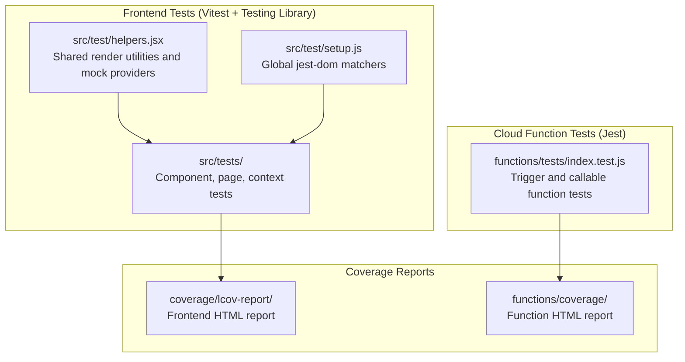
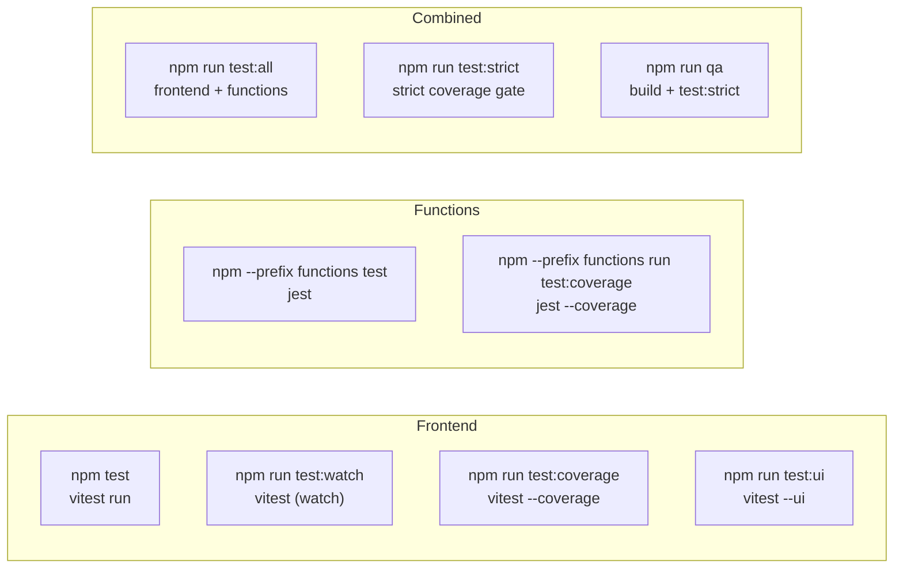
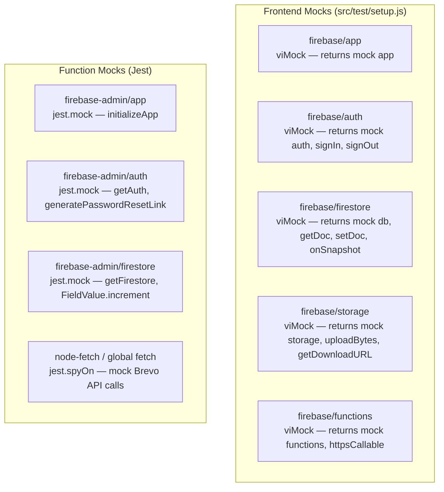
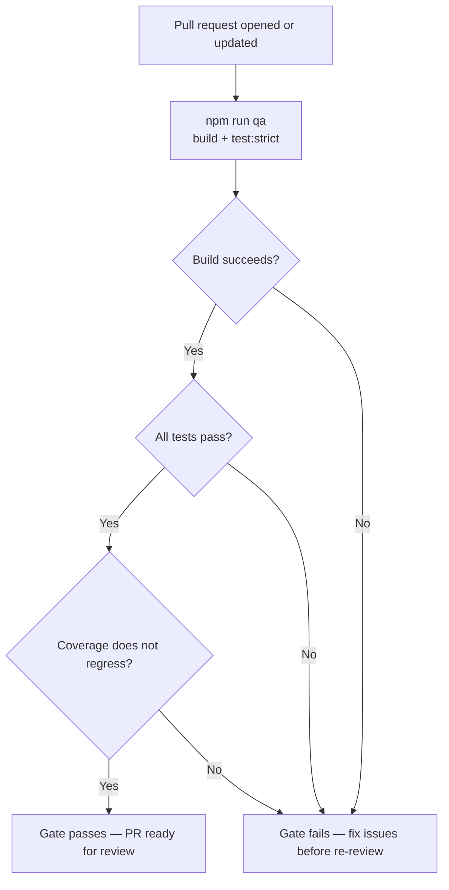

# Testing

## Table of Contents

- [Overview](#overview)
- [Test Architecture](#test-architecture)
- [Test Structure](#test-structure)
- [Running Tests](#running-tests)
- [Test Coverage](#test-coverage)
- [Writing Frontend Tests](#writing-frontend-tests)
- [Writing Cloud Function Tests](#writing-cloud-function-tests)
- [Mocking Strategy](#mocking-strategy)
- [CI Quality Gate](#ci-quality-gate)

---

## Overview

MMS Open Climbs uses two test frameworks in parallel:

- **Vitest** with **Testing Library** for the React frontend (`src/tests/`)
- **Jest** for the Cloud Functions backend (`functions/tests/`)

All tests can be run locally and are designed to run without a live Firebase project by using mocks for Firebase SDK calls.

---

## Test Architecture



---

## Test Structure

```
src/
  test/
    helpers.jsx           -- Shared render helpers with Auth, Guide, and Router providers
    setup.js              -- Global Vitest setup: jest-dom matchers, Firebase SDK mocks

  tests/
    components/
      ClimbCard.test.jsx
      Header.test.jsx
      Misc.test.jsx
      RouteGuards.test.jsx
    contexts/
      AuthContext.test.jsx
    pages/
      Event.test.jsx
      ForgotPassword.test.jsx
      Login.test.jsx
      MyRegistrations.test.jsx
      NotFound.test.jsx
      Register.test.jsx
      Schedule.test.jsx
      Signup.test.jsx
      WaiverPrint.test.jsx
      admin/
        AllRegistrations.test.jsx
        ClimbDetail.test.jsx
        ClimbForm.test.jsx
        ClimbsManage.test.jsx
        Dashboard.test.jsx
        ManagePayments.test.jsx
        UsersManage.test.jsx

functions/
  tests/
    index.test.js         -- Cloud Function trigger and callable logic tests
```

---

## Running Tests

### Frontend tests

```bash
# Run all frontend tests once
npm test

# Watch mode (re-runs on file change during development)
npm run test:watch

# With HTML and LCOV coverage report
npm run test:coverage

# Interactive browser UI (Vitest UI)
npm run test:ui
```

### Cloud Function tests

```bash
# Run function tests once
npm --prefix functions test

# With coverage report
npm --prefix functions run test:coverage
```

### Combined test runs

```bash
# Run frontend + function tests in sequence
npm run test:all

# Run with full strict coverage (used for CI gate)
npm run test:strict

# Full QA: build verification + strict coverage
npm run qa
```

### Command reference



---

## Test Coverage

After running with `--coverage`, reports are written to:

| Area | Report path | Open with |
| --- | --- | --- |
| Frontend | `coverage/lcov-report/index.html` | Any browser |
| Cloud Functions | `functions/coverage/index.html` | Any browser |

Raw LCOV data is at `coverage/lcov.info` and `functions/coverage/lcov.info` for CI integration.

---

## Writing Frontend Tests

### Render helper

All component and page tests use the shared render helper in `src/test/helpers.jsx`. This wraps components with the required React providers (AuthContext, GuideContext, BrowserRouter) and accepts optional mock overrides.

```jsx
import { renderWithProviders } from "../helpers";
import ClimbCard from "../../components/ClimbCard";

const mockClimb = {
  id: "test-climb-1",
  title: "Mt. Test",
  status: "open",
  type: "minor",
  dateLabel: "Jan 1",
  location: "Test Location",
  registrationCount: 5,
  maxParticipants: 20,
};

test("renders climb title", () => {
  const { getByText } = renderWithProviders(<ClimbCard climb={mockClimb} />);
  expect(getByText("Mt. Test")).toBeInTheDocument();
});
```

### Testing authenticated routes

Pass mock user and profile data via the render helper to simulate authenticated states:

```jsx
test("redirects unauthenticated user to /login", () => {
  const { getByText } = renderWithProviders(<ProtectedRoute />, {
    authValue: { currentUser: null, loading: false },
  });
  // Assert redirect occurs
});
```

### Testing admin routes

```jsx
test("renders admin dashboard for admin user", () => {
  const { getByText } = renderWithProviders(<AdminDashboard />, {
    authValue: {
      currentUser: { uid: "admin-uid" },
      userProfile: { role: "admin" },
      isAdmin: true,
      loading: false,
    },
  });
  expect(getByText(/dashboard/i)).toBeInTheDocument();
});
```

### Conventions

- Use `getByRole`, `getByLabelText`, and `getByText` over `getByTestId` where possible (accessibility-first queries).
- Test behavior from a user's perspective, not implementation details.
- Mock Firebase SDK calls in `src/test/setup.js` — do not make real Firestore or Auth calls in tests.
- Each test file corresponds to one source file. Name tests descriptively.

---

## Writing Cloud Function Tests

Function tests live in `functions/tests/index.test.js`. They use Jest and mock the Firebase Admin SDK and Brevo API fetch calls.

### Trigger test pattern

```js
const { onRegistrationCreated } = require("../index");

describe("onRegistrationCreated", () => {
  it("increments registrationCount on the climb", async () => {
    // Arrange: set up mock Firestore snapshot and event
    const mockEvent = {
      params: { regId: "reg-1" },
      data: {
        data: () => ({
          climbId: "climb-1",
          name: "Test User",
          email: "test@example.com",
        }),
      },
    };

    // Mock db.doc().get() and db.doc().update()
    // ...

    // Act
    await onRegistrationCreated(mockEvent);

    // Assert
    expect(mockUpdate).toHaveBeenCalledWith({
      registrationCount: expect.any(Object), // FieldValue.increment(1)
    });
  });
});
```

### Callable function test pattern

```js
describe("createUser callable", () => {
  it("returns permission-denied for non-admin callers", async () => {
    const context = { auth: { uid: "member-uid" } };
    const data = { email: "new@example.com", displayName: "New User" };

    // Mock Firestore to return role: member
    // ...

    await expect(createUser(data, context)).rejects.toThrow("permission-denied");
  });
});
```

---

## Mocking Strategy



All Firebase SDK calls are mocked at the module level so no network requests are made during tests. Mock return values are configured per test or in `beforeEach` hooks.

---

## CI Quality Gate

Before merging any pull request, the following gates must pass:



### Gate checklist

- [ ] `npm run build` succeeds with no errors or unresolved imports
- [ ] `npm run test:all` passes with zero failures
- [ ] Coverage does not drop for files you changed
- [ ] New logic has corresponding test cases
- [ ] No test files are skipped (`test.skip`) without documented justification
