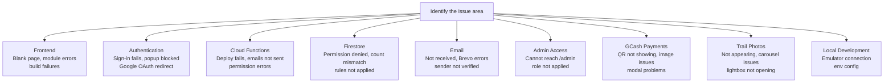
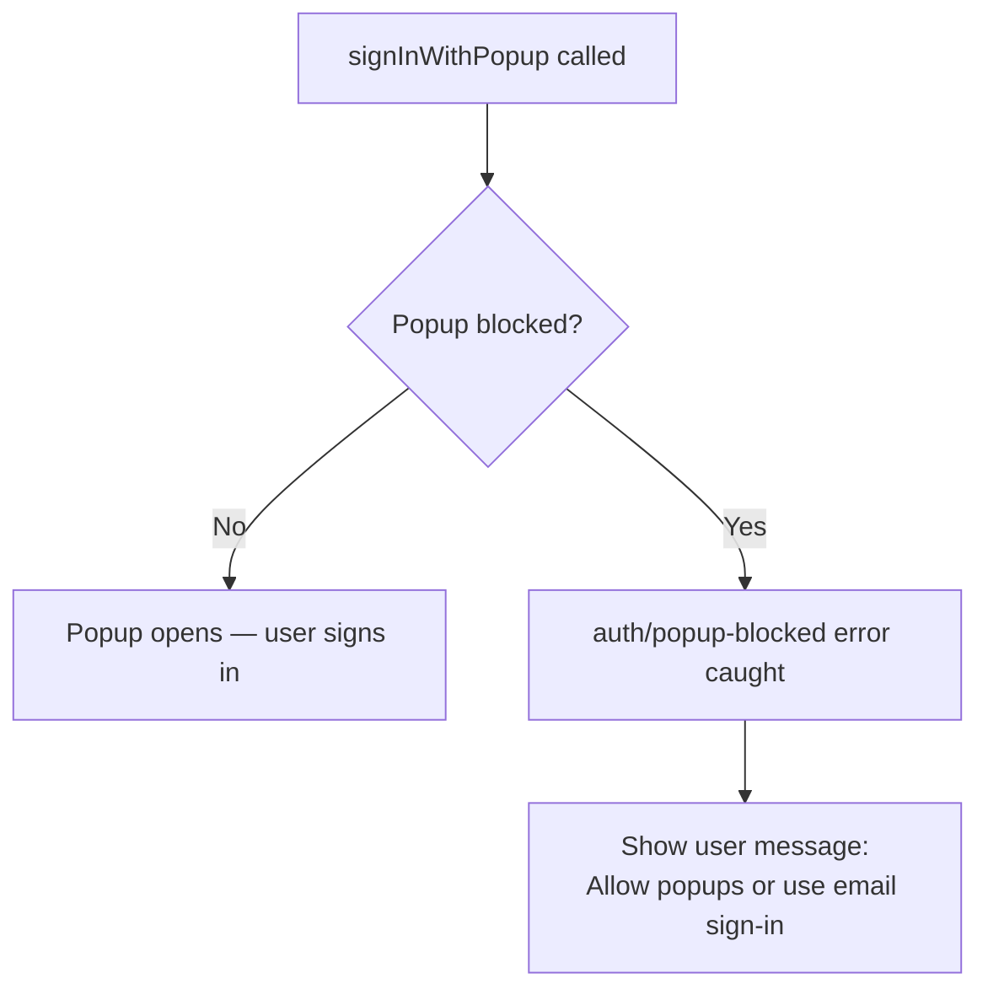
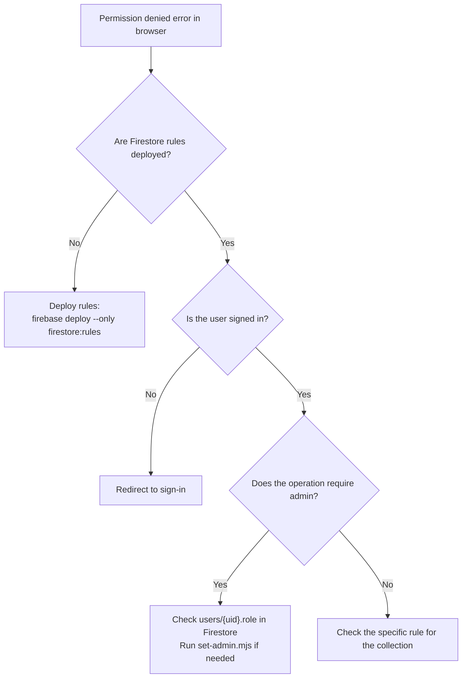
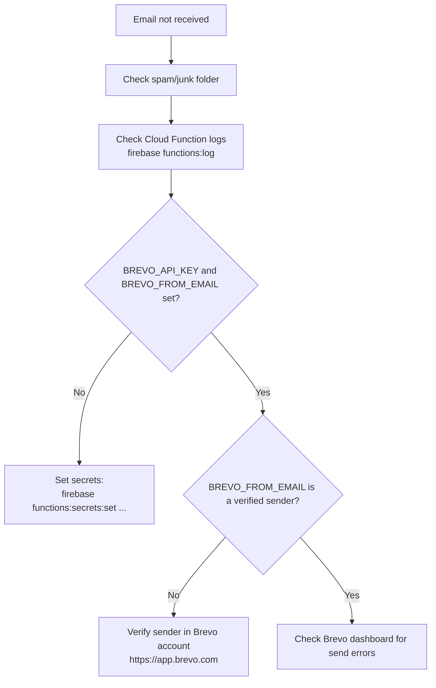
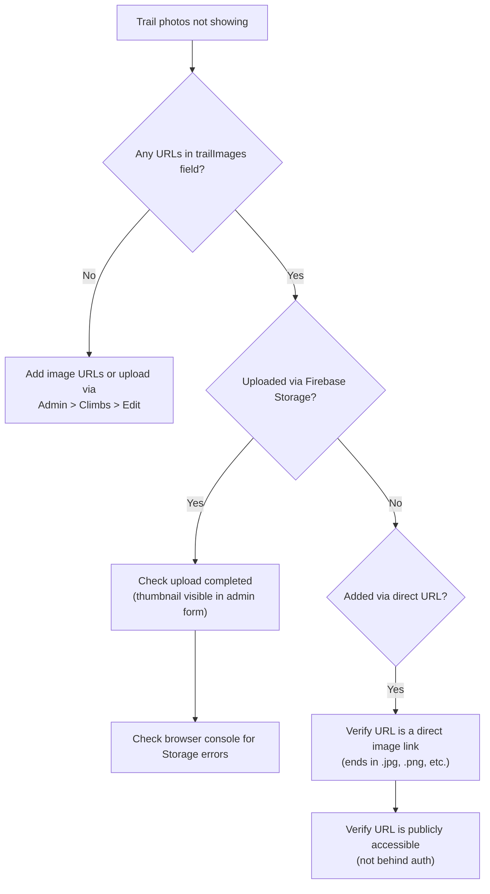

# Troubleshooting

## Table of Contents

- [Diagnostic Overview](#diagnostic-overview)
- [Frontend Issues](#frontend-issues)
- [Authentication Issues](#authentication-issues)
- [Cloud Functions Issues](#cloud-functions-issues)
- [Firestore Issues](#firestore-issues)
- [Email Issues](#email-issues)
- [Admin Access Issues](#admin-access-issues)
- [GCash Payment Issues](#gcash-payment-issues)
- [Trail Photos Issues](#trail-photos-issues)
- [Local Development Issues](#local-development-issues)
- [Useful Commands](#useful-commands)

---

## Diagnostic Overview

Use this map to identify which section applies to your issue.



---

## Frontend Issues

### Blank page after deploying to Firebase Hosting

**Cause:** The SPA rewrite rule is missing from `firebase.json`.

**Fix:** Ensure `firebase.json` contains the following in the `hosting` section:

```json
"rewrites": [{ "source": "**", "destination": "/index.html" }]
```

Then redeploy: `firebase deploy --only hosting`

---

### "Module not found" or `@` alias errors

**Cause:** The `@` path alias is not configured, or `npm install` was not run.

**Fix:**

1. Run `npm install` from the project root.
2. Verify `vite.config.js` contains:

```js
resolve: {
  alias: { "@": path.resolve(__dirname, "./src") }
}
```

---

### Firebase config missing / "No Firebase App" error

**Cause:** `VITE_FIREBASE_*` environment variables are not set or the `.env` file is missing.

**Fix:**

1. Copy `.env.example` to `.env`.
2. Fill in all `VITE_FIREBASE_*` values from your Firebase project settings.
3. Restart the dev server or rebuild: `npm run build`.

These values are baked into the bundle at build time — changing `.env` requires a new build.

---

### Build fails with "cannot find module"

**Cause:** An import references a file that does not exist or uses the wrong casing (case-sensitive on Linux).

**Fix:** Check the import path and file name casing. Vite on macOS may not catch casing errors that Firebase Hosting (Linux) will reject.

---

## Authentication Issues

### Google sign-in popup is blocked

**Cause:** The browser blocked the sign-in popup.

**Fix:** The app catches `auth/popup-blocked` and surfaces a message asking the user to allow popups. Ensure your Firebase project's **Authorized Domains** list includes your deployment domain (`firebase.json` project URL and any custom domain).



---

### User signed in but cannot access authenticated pages

**Cause:** `AuthContext` has not finished loading the user profile, or the Firestore `users/{uid}` document does not exist.

**Fix:**

1. Check the browser console for Firestore permission errors.
2. Verify the user document exists in Firestore under the `users` collection with the correct UID.
3. If missing, the user can sign out and sign back in — the `signup` flow creates the document automatically.

---

### "auth/unauthorized-domain" error

**Cause:** The domain serving the app is not on Firebase Auth's authorized domain list.

**Fix:** In the Firebase Console, go to **Authentication > Settings > Authorized domains** and add your domain.

---

## Cloud Functions Issues

### Functions deploy fails with "secret not found"

**Cause:** Firebase Function secrets were not set before deploying.

**Fix:** Set all required secrets first:

```bash
firebase functions:secrets:set BREVO_API_KEY
firebase functions:secrets:set BREVO_FROM_EMAIL
firebase functions:secrets:set APP_URL
```

Then redeploy: `firebase deploy --only functions`

---

### Functions deploy fails with "Node version not supported"

**Cause:** The Functions runtime requires Node 20.

**Fix:** Install Node.js 20+ locally. Verify with `node --version`.

---

### Function logs show errors

**Fix:** View real-time function logs:

```bash
firebase functions:log
```

Or filter by function name:

```bash
firebase functions:log --only onRegistrationCreated
```

---

## Firestore Issues

### "Missing or insufficient permissions" in the browser console

**Cause:** Firestore security rules have not been deployed, or the user lacks the required role.



**Fix:**

1. Deploy rules: `firebase deploy --only firestore:rules`
2. Verify the Firestore database name is `openclimbs` in `src/firebase/config.js`.
3. For admin operations, confirm the user's `role` field is `admin` in Firestore.

---

### `registrationCount` is incorrect on a climb

**Cause:** The `onRegistrationCreated` or `onRegistrationUpdated` Cloud Function did not fire or failed.

**Fix:**

1. Check functions are deployed: `firebase deploy --only functions`
2. Check function logs for errors: `firebase functions:log --only onRegistrationCreated`
3. Manually correct the count in **Admin > Climbs > [Climb]** if needed (direct Firestore edit via Firebase Console).

---

### Firestore index errors (query requires an index)

**Cause:** A query uses a field combination that requires a composite index that has not been deployed.

**Fix:** Deploy indexes:

```bash
firebase deploy --only firestore:indexes
```

Or click the link in the browser console error — Firebase provides a direct link to create the missing index.

---

## Email Issues

### Emails are not being sent



---

### Emails are sent but waiver links are broken

**Cause:** `APP_URL` secret is set to the wrong URL or is missing.

**Fix:** Update the secret:

```bash
firebase functions:secrets:set APP_URL
# Enter: https://your-project-id.web.app
```

Then redeploy functions: `firebase deploy --only functions`

---

## Admin Access Issues

### Cannot access `/admin` — redirected to home

**Cause:** Your Firestore `users/{uid}` document has `role: member`, not `role: admin`.

**Fix:** Run the admin setup script with admin credentials:

```bash
node scripts/set-admin.mjs your@email.com
```

This requires Firebase Admin SDK credentials. Set up Application Default Credentials:

```bash
gcloud auth application-default login
```

Or set the `GOOGLE_APPLICATION_CREDENTIALS` environment variable to the path of your service account key JSON.

---

### Admin script fails with "permission denied"

**Cause:** The script does not have Firebase Admin SDK access.

**Fix:** Use one of:

1. `gcloud auth application-default login` (recommended for development)
2. Set `GOOGLE_APPLICATION_CREDENTIALS=/path/to/service-account.json`

---

## GCash Payment Issues

### GCash QR modal does not show an image

**Cause:** No QR code has been uploaded for this climb.

**Fix:** Upload the QR code image in one of:

- **Admin > Climbs > Edit** (climb edit form — GCash section)
- **Admin > Payments** (Manage Payments page — QR upload control)

If the QR was uploaded but still not showing, verify the Firebase Storage URL is correctly saved in the climb's `gcashQrUrl` field.

---

### GCash QR image is blurry in the modal

**Cause:** The uploaded image is low resolution.

**Fix:** Re-upload a higher-resolution version of the QR code. The modal renders the image at up to 280px wide at full native resolution.

---

## Trail Photos Issues

### Photos not appearing on the event or registration page



---

### Carousel arrows not appearing

**Cause:** There is only one photo. Carousel navigation controls only appear when there are two or more photos.

---

### Lightbox does not open when clicking a photo

**Cause:** The click target may be the thumbnail strip rather than the main carousel image.

**Fix:** Click directly on the large main carousel image (the cursor changes to a zoom icon). Keyboard shortcuts (arrow keys to navigate, Escape to close) work once the lightbox is open.

---

## Local Development Issues

### Frontend cannot connect to Firebase emulators

**Cause:** The Vite dev server is pointing to production Firebase instead of the local emulators.

**Fix:** Configure emulator connection in `src/firebase/config.js` for local development, or use environment variables to toggle. The emulator connection calls are:

```js
connectFirestoreEmulator(db, 'localhost', 8080);
connectAuthEmulator(auth, 'http://localhost:9099');
connectFunctionsEmulator(functions, 'localhost', 5001);
```

---

### Emulator shows "port already in use"

**Fix:** Stop any existing emulator instances and retry:

```bash
# Find and kill the process on the conflicting port (Windows)
Get-NetTCPConnection -LocalPort 8080 | Select-Object OwningProcess | ForEach-Object { Stop-Process -Id $_.OwningProcess -Force }

# Restart emulators
firebase emulators:start --only auth,firestore,functions
```

---

## Useful Commands

| Task | Command |
| --- | --- |
| View function logs | `firebase functions:log` |
| Deploy Firestore rules | `firebase deploy --only firestore:rules` |
| Deploy Firestore indexes | `firebase deploy --only firestore:indexes` |
| Deploy functions | `firebase deploy --only functions` |
| Deploy hosting | `firebase deploy --only hosting` |
| Set admin role | `node scripts/set-admin.mjs your@email.com` |
| Set a function secret | `firebase functions:secrets:set SECRET_NAME` |
| Run all tests | `npm run test:all` |
| Full QA gate | `npm run qa` |
| Start emulators | `firebase emulators:start --only auth,firestore,functions` |
