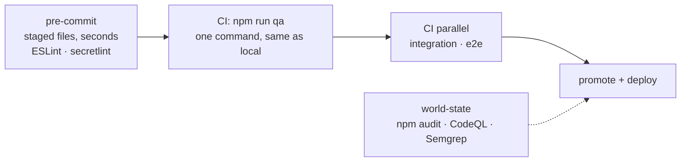

# ADR 0003: Minimum viable quality harness

**Status**: Accepted (implemented)
**Date**: 2026-10-05
**Amends**: [ADR 0002](0002-code-quality-gates.md) — keeps its Gate / Advisory / Reviewed tiers, changes which tool owns each check and where it runs.

## Context

ADR 0002 left gates that blocked little and gaps that blocked nothing:

- Complexity ceilings sat *above* the worst file (complexity 115, 1,950-line
  functions), so no new code could ever fail them.
- `eslint-plugin-boundaries` silently skipped every `@/` import (no alias
  resolver) — most of the graph was never checked.
- `functions/` wasn't linted at all; no secret scan blocked anything; no dead
  code tool; no pre-commit hook; the security-rules tests never ran in CI;
  only unit and component tests existed.
- Layering was enforced twice (boundaries **and** dependency-cruiser), cycles
  twice (`import/no-cycle` **and** dependency-cruiser), orphans as a warning
  nobody read.
- CI carried workflows copied from an unrelated Azure template that ran tests
  that don't exist.

The ask was a harness covering secrets, bad patterns, dead code, cycles,
banned APIs, complexity, duplication, vulnerable packages and SOLID/Clean
Architecture — **without making every change go through fifty steps**.

## Decision

Three stages; every check lives in exactly one tool and runs at the earliest
stage where it's cheap.

| Concern | Owner | Why this one |
|---|---|---|
| Per-file rules: layering, banned imports/APIs, complexity | ESLint | Editor feedback as you type; also runs pre-commit |
| Whole-graph rules: cycles, unresolvable imports, dev-deps/`firebase-admin` in the bundle | dependency-cruiser | Only visible from the graph |
| Dead files, exports, dependencies | knip | Purpose-built; depcruise orphans dropped |
| Duplication | jscpd (≤ 1%) | Was 4%; today 0.32% |
| Secrets | secretlint + custom Brevo/Google patterns | npm-installable on every OS; the recommended preset alone misses Brevo keys, this project's real secret |
| Vulnerable packages | `npm audit` (high+) in its own workflow, also weekly | Depends on the world, not the diff — must not block an unrelated hotfix, must not go unnoticed either |
| Security rules, user journeys | emulator integration + Playwright smoke, gating the deploy | Catch what mocks can't |
| Bundle size, accessibility | budget script, axe-core in Vitest | Cheap, deterministic |
| SOLID / Clean Architecture judgment, naming, reuse | reviewer checklist | Not decidable by a tool — said so explicitly |

Complexity is a **two-tier ratchet**: strict limits for all code (complexity
20, 200-line functions, 600-line files, depth 4) plus a shrink-only `LEGACY`
map pinning each pre-existing offender at its measured worst.

## Alternatives rejected

- **TypeScript / `checkJs`** — the codebase is JavaScript by decision; a type
  layer on 35k lines is a migration, not a harness item. ESLint + layering +
  tests are the safety net. (`typescript` is installed only as knip's parser.)
- **Prettier** — a repo-wide reformat would bury every blame line for little
  gain; `.editorconfig` covers what actually bites.
- **gitleaks** — needs a native binary (blocked on locked-down Windows
  machines) and a licence for org repos; secretlint runs anywhere npm does.
- **commitlint** — the PR-title checker already enforces conventional commits
  where they matter (squash titles drive releases).
- **Azure DevOps pipeline / azd** — the app is Firebase-only and the team uses
  GitHub; a dormant second pipeline would rot.
- **Native-binary tool versions (knip 6, jscpd 5)** — blocked by Windows
  Application Control on contributor machines; pinned to the pure-JS versions.

## Consequences

- `npm run qa` is the single local/CI quality command; the pre-commit hook
  keeps the obvious failures off the branch.
- Integration and e2e need Java 21 (emulators) — CI installs it; locally they
  run only when rules or journeys change.
- 31 frontend files and 5 functions modules sit in `LEGACY`; each split
  lowers the list. New files can't join it.
- Reviewers own the judgment calls, listed in
  [CONTRIBUTING.md](../guides/CONTRIBUTING.md#review-checklist).
- The working reference is [CODE-QUALITY.md](../guides/CODE-QUALITY.md);
  delivery notes in [quality-harness](../solution-plans/quality-harness.md).
