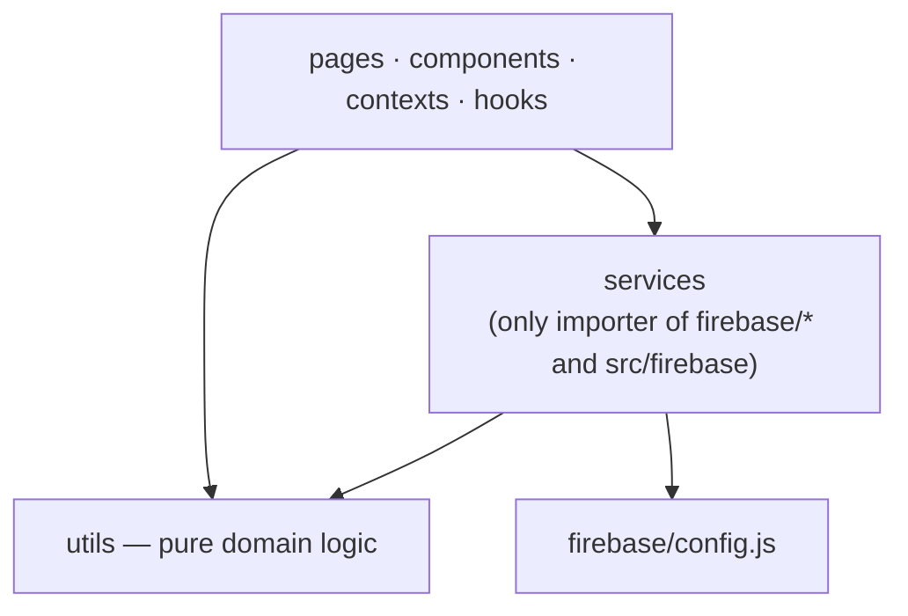

# ADR 0004: Firebase only through `src/services`

**Status**: Accepted (implemented)
**Date**: 2026-10-05

## Context

37 files under `src/` imported the Firebase SDK directly — 19 of them route
pages — building queries, mapping snapshots and uploading files inline.
Consequences seen in the code:

- The same upload sequence (compress → ref → upload → URL) was copied 7 times;
  the same "every climb + private docs + registrations" listeners 3 times.
- Pages were 1,500–2,100-line components mixing rendering, state, queries and
  business rules (the largest had cyclomatic complexity 112).
- Tests had to mock the SDK in the exact shape each page called it.
- Bugs hid in the plumbing: a delete handler shadowing its own import, a form
  that would have written the document id into the climb, listeners with no
  error path leaving pages on a spinner forever.

## Decision

Apply Clean Architecture's dependency rule: dependencies point inward, and
only one layer knows Firestore exists.

- **`src/services/<area>.js`** per bounded area (climbs, registrations, users,
  feedback, notifications, releaseNotes, analytics, auditLog, auth, storage,
  callables, weather) with **intent-named** functions —
  `subscribeToClimbRegistrationsNewestFirst(id, onData, onError)`, not
  `onSnapshot(query(...))`.
- Services return plain `{ id, ...data }` objects, never snapshots.
- Use cases that combine writes and audit logging (`recordPayment`,
  `recordRefund`, `splitPayment`, `donationRecords`) are services; their pure
  patch builders stay in `utils`.
- `utils` is pure: no I/O, no React.
- Page-sized features split into `src/pages/<feature>/`: a page hook owns
  state and effects (SRP), section components render, a `…Model.js` /
  `…Submit.js` holds the pure mapping.
- Enforced by ESLint `no-restricted-imports` (Firebase outside services) and
  `eslint-plugin-boundaries` (layer matrix). No exceptions list.

## Alternatives rejected

- **A generic repository / `db.get(collection, id)` wrapper** — moves the SDK
  one file away but keeps query-building in the pages; intent-named functions
  are what make call sites readable and swappable.
- **Status quo + review discipline** — the 37 files are what review
  discipline produced.
- **A data library (React Query, Redux)** — real-time `onSnapshot` already
  gives caching and freshness; a library would add a second model of server
  state.

## Consequences

- Swapping or mocking the backend touches `src/services` only; page tests can
  mock a service module instead of the SDK.
- +2 kB gzip on the entry chunk: admin-only service functions share modules
  with public pages. Accepted; split a service module if it ever matters.
- Remaining debt is tracked in `LEGACY` (`eslint.config.js`), chiefly
  `ClimbPaymentCard`, `RegistrantRow`, `AllRegistrations`, `Analytics`,
  `ClimbDetail`, `MyRegistrations` and the Cloud Functions trigger handlers
  (complexity up to 77). The same page-hook + sections pattern applies.
- Cloud Functions follow the same idea server-side: `index.js` only
  re-exports; handlers live in `triggers/`, `scheduled/`, `callables/`;
  shared logic in `email/` and `shared/`.
