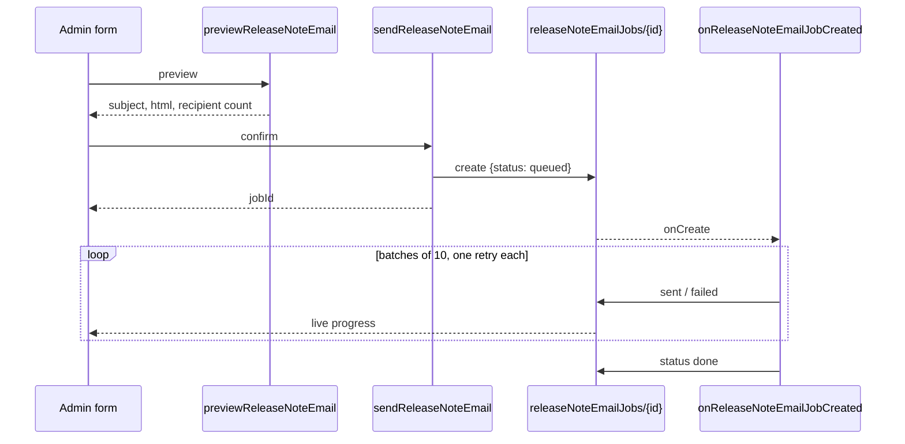

# ADR 0005: All-member email as a job, behind a two-admin permission

**Status**: Accepted (implemented)
**Date**: 2026-10-05

## Context

`sendReleaseNoteEmail` emailed every user one by one inside a single HTTPS
callable. Three problems grew with membership:

- A callable has a bounded run time; a long sequential loop eventually times
  out mid-send, and the admin sees a spinner, then an error, with an unknown
  number of emails already out.
- Brevo rate-limits; a failed send was logged and skipped, never retried.
- Any admin — or anyone holding one admin's session — could email the whole
  membership with one click and no preview.

## Decision

- **Send is a job.** The callable validates and queues a document; a
  Firestore trigger (9-minute budget, one instance) sends in batches with a
  retry and writes progress after each batch. A second send for the same note
  is refused while one is running.
- **Preview first.** The admin sees the rendered email and the recipient
  count before confirming.
- **Two-person permission.** Sending needs `users/{uid}.canEmailMembers` on top
  of the admin role. Firestore rules let an admin set that flag only on
  *another* user, so granting it takes two admins.

## Alternatives rejected

- **Cloud Tasks queue** — more infrastructure (queue, IAM, task handler) for a
  club that sends a handful of these a year; a Firestore job document gives
  the same decoupling and doubles as the progress feed.
- **A separate "release manager" role** — a new role touches every rule and
  guard; one capability flag on admins covers the actual risk.
- **Approval workflow (draft → review → published)** — heavier than the risk
  warrants; preview + the two-person grant address accidental and single-account
  misuse.

## Consequences

- New collection `releaseNoteEmailJobs` (admin read, Functions write) and
  fields `users.canEmailMembers`, `releaseNotes.emailJob`.
- Existing admins can't send until another admin grants the permission —
  a deliberate one-time step after deploy.
- One job covers a few thousand recipients; beyond that the trigger would need
  to continue across invocations.
