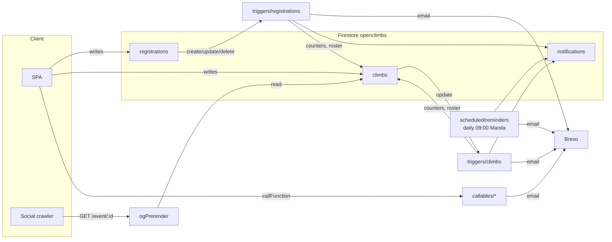

# API — Cloud Functions

There are no REST endpoints: the SPA talks to Firestore/Storage directly
(guarded by the rules) and reaches the backend through Firestore triggers, a
daily schedule, admin-only callables and one HTTP function. Payloads, return
shapes and error codes live in the handlers — read the code for those; this
page records what each function **is for** and the behaviour that isn't
obvious from one file.

`functions/src/index.js` only re-exports. Everything deploys to `us-central1`.



## Inventory

| Function | File | Kind | What it does |
|---|---|---|---|
| `onRegistrationCreated` | `triggers/registrations.js` | trigger | Seat count, auto-waitlist, duplicate drop, roster, reminders, confirmation + officer email |
| `onRegistrationUpdated` | `triggers/registrations.js` | trigger (with auth context) | Forged-payment guard, payment/status notifications, counters, status email |
| `onRegistrationDeleted` | `triggers/registrations.js` | trigger | Keeps roster and `docsCompleteCount` honest on hard delete; no email |
| `onClimbUpdated` | `triggers/climbs.js` | trigger | Requirement flips, cancellation/postponement email, announcements (bell only) |
| `syncAdminClaim` | `triggers/adminClaim.js` | trigger | Mirrors `users/{uid}.role` into the `admin` custom claim Storage rules read |
| `sendReminderNotifications` | `scheduled/reminders.js` | schedule | Daily nags, officer summary, one-time thank-you + feedback request |
| `ensureAdminClaim` | `callables/users.js` | callable | Issues the claim for an admin promoted before `syncAdminClaim` existed |
| `createUser` / `updateUserProfile` / `deleteUserAccount` | `callables/users.js` | callable | Admin user management; Auth and `users/` kept in step |
| `previewReleaseNoteEmail` / `sendReleaseNoteEmail` | `callables/releaseNotes.js` | callable | Render the announcement email; queue a send job (needs `canEmailMembers`) |
| `onReleaseNoteEmailJobCreated` | `triggers/releaseNoteEmailJobs.js` | trigger | Works a send job in batches with a retry, writing progress |
| `getReleaseNoteCommitOptions` / `generateReleaseNoteDraft` | `callables/releaseNotes.js` | callable | Draft a note from conventional commits via GitHub (`GITHUB_TOKEN`) |
| `getEmailStats` / `getStorageUsage` / `getFunctionHealth` / `getBillingCost` | `callables/insights.js` | callable | App Insights dashboard data |
| `ogPrerender` | `ogPrerender.js` | HTTP (hosting rewrite `/event/**`) | Per-climb Open Graph tags for shared links |
| `cspReport` | `cspReport.js` | HTTP (hosting rewrite `/csp-report`) | Logs Content-Security-Policy violation reports; stores nothing |

Every callable is admin-only through `requireAdmin` (`callables/users.js`),
which reads `users/{uid}.role` — a role change applies on the next call, no
token refresh. The client calls them through `callFunction(name, payload)`
in `src/services`.

## Registration triggers

```mermaid
flowchart TD
    A[registration updated] --> S1{non-admin forged a<br/>payments[] status?}
    S1 -- yes --> X[clamp, rewrite, return<br/>the rewrite re-runs the trigger]
    S1 -- no --> S2[paymentStatus changed → notifications]
    S2 --> S3[one instalment newly rejected → tell member]
    S3 --> S4[sync roster + docsCompleteCount, clear doc nags]
    S4 --> S5{status → confirmed /<br/>cancelled / waitlisted?}
    S5 -- yes --> E[email member + officers CC admins;<br/>cancelled also decrements registrationCount]
    S5 -- no --> Z[done]
```

Invariants worth knowing before you touch them:

- **Payment status is admin-only, enforced here.** Rules can't iterate arrays,
  so `onRegistrationUpdated` clamps any non-admin change of a `payments[]`
  entry to something other than `submitted`. Writes with no `authId` (Admin
  SDK) are trusted. See [SECURITY.md](SECURITY.md).
- **On create:** a duplicate live registration (same user + climb) is
  deleted; a full climb auto-waitlists (`autoWaitlisted: true`, "Added to
  waitlist" email instead of "Received"). `registrationCount` increments
  unconditionally; roster and `docsCompleteCount` skip walk-ins with no
  `userId`.
- **Waitlist promotion** runs whenever a seat frees (status leaves the active
  set, seat-holder deleted, `maxParticipants` raised) unless
  `waitlistAutoPromote === false` or the climb is cancelled/postponed/over.
  Oldest first.
- **The admin "payment submitted" notice names the instalment that just
  arrived**, not the running total.
- `climbInternal/{climbId}.registeredUserIds` exists because rules can't query
  registrations by climb + user; it gates the private briefing and feedback.
- `docsCompleteCount` flips only when computed compliance actually changes,
  compared by presence (snapshots never `===`).

## Climb trigger

`onClimbUpdated` returns early unless one of these changed:

| Change | Effect |
|---|---|
| A required-document flag switched off | Marks that document's nags read |
| Any required-document flag flipped | Full recount of `docsCompleteCount` |
| `cancellationStatus` → `cancelled` / `postponed` | Email every non-cancelled registration (walk-ins included), bell for those with an account, officers emailed with admins CC'd |
| New announcement | `climb_announcement` bell per registrant — no email |

## Daily schedule

`sendReminderNotifications` walks every `pending`/`confirmed` registration:

- **Cancelled climbs are skipped entirely.** Postponed climbs keep payment and
  document nags but drop the date-driven countdown and thank-you.
- **The payment nag follows the balance, not the status** —
  `getOutstanding(reg, climb) > 0`, so a partial payer marked `verified`
  still gets chased. An unknowable balance (no fees, no snapshot) is `0`.
- Countdown bells at exactly 7/5/3/1 days (`UPCOMING_REMINDER_DAYS`).
- Officers get a bell + email summary per climb while anything is
  outstanding; admins aren't CC'd here.
- After `endDate`, confirmed registrants get the thank-you email and a
  `feedback_request` bell once; `climbs/{id}.thankYouSentAt` makes it one-time.
- The run logs `[sendReminderNotifications] Done` with its counts.

## Notifications: ids are the design

`createNotification` (`shared/registrationOps.js`) upserts when given an
`id` and always writes `read: false`, so re-issuing a deterministic id
re-opens one row instead of piling up new ones. Anything that needs to clear
a notification must be able to rebuild its id.

| Type | Id | Lifecycle |
|---|---|---|
| `payment_reminder` | `payment_{regId}` | Opened while a balance is owed; re-opened on rejection/reset; read on submit/verify |
| `payment_submitted` | `submitted_{regId}_{adminId}` | One per admin per proof; cleared on review |
| `payment_verified` | auto | On verify |
| `document_reminder` | `{notificationPrefix}_{regId}` | One per missing required doc; cleared on upload or when the requirement is switched off |
| `status_update` | auto | confirmed / cancelled / waitlisted |
| `upcoming{N}` | `upcoming{N}_{regId}` | Countdown |
| `climb_status_change` | `climbstatus_{climbId}_{status}_{regId}` | Cancel/postpone |
| `climb_announcement` | `announcement_{climbId}_{createdAt}_{userId}` | New announcement |
| `officer_outstanding_summary` | `officer_outstanding_{climbId}_{officerUserId}` | Daily |
| `feedback_request` | `feedback_{climbId}_{userId}` | Once after the climb |

## Email

Templates live in `email/templates.js`, all wrapped in `tplBase`; Brevo
sending in `email/sendEmail.js`. "Officers, CC admins" comes from
`getNotifyLists` — officers from `climb.officers[]` (no account needed),
admins from `users` where `role == "admin"`; with no officers the first admin
gets it and the rest are CC'd.

> **Trap:** `sendEmail` with no Brevo credentials logs and returns — it does
> not throw. A function that sends email must declare
> `secrets: ["BREVO_API_KEY", "BREVO_FROM_EMAIL"]` in its options or it will
> deploy, run and silently send nothing.

## Callables: behaviour that isn't in the signature

- `createUser` creates the Auth account and `users/{uid}`, then emails a
  password-setup link. It wraps its body so every failure is a typed
  `HttpsError` — `onCall` turns any other exception into a bare `internal`.
  New callables should do the same.
- `updateUserProfile` changes Auth and `users/{uid}` together.
  `deleteUserAccount` keeps the user's past registrations (they carry their
  own name/email) and refuses to delete the caller.
- Emailing every member needs `canEmailMembers` on top of the admin role;
  no client may write it — the owner grants it with
  `functions/scripts/grant-email-members.mjs` ([ADR 0005](../adr/0005-release-note-email-jobs.md)).
  Members are sent in signup order; a stalled job is resumed after its
  `lastCursor` (carried through any number of retries) rather than restarted,
  and late signups sort last so they are still reached.
  `sendReleaseNoteEmail` only queues `releaseNoteEmailJobs/{id}` and refuses
  while one for the note is still running; the trigger sends 10 at a time,
  retries a failure once, and updates `sent`/`failed` per batch — one job
  covers a few thousand members within its 9-minute limit.
- `getFunctionHealth` and `getBillingCost` return
  `{ configured: false, reason }` instead of throwing when IAM or
  `BILLING_EXPORT_TABLE` is missing — callers branch on `configured`.
  `getFunctionHealth.errorCount` reads a memory metric and is not a real error
  count. `getStorageUsage` lists every file per folder on each call.
- Missing credentials are `failed-precondition`, not `internal`.

| Needs | For |
|---|---|
| Monitoring Viewer on the runtime service account | `getFunctionHealth` |
| BigQuery Data Viewer + Job User, and `BILLING_EXPORT_TABLE` | `getBillingCost` |

## ogPrerender

Serves the built shell (staged by `scripts/stage-app-shell.mjs` at deploy)
with per-climb title, description and OG/Twitter image spliced between the
`<!--og-->` markers. Every failure degrades to the plain shell. Deliberate
choices: the shell `require` is in a try/catch (a module-load throw would take
down every function); only Firestore-id-shaped paths are looked up; values
are attribute-escaped (titles are free text); a missing climb is **200**, not
404 (Messenger renders nothing on a 404); never `Vary: User-Agent`.

## Deliberate duplicates

`functions/` deploys separately and is CommonJS, so it can't import `src/`.
Change both copies together:

| Backend | Frontend |
|---|---|
| `functions/src/requiredDocTypes.js` | `src/data/requiredDocTypes.js` (the four `key`s must match) |
| `functions/src/paymentMath.js` | `src/utils/payments.js`, `src/utils/registrationFees.js` |

## Failures and secrets

`logFailedRequest` writes to `failedRequests` so admins see backend failures
in-app (from the registration, climb and admin-claim triggers and the user and
release-note callables); the rest, including the daily schedule, logs to Cloud
Logging only.

Secrets (`firebase functions:secrets:set …`): `BREVO_API_KEY`,
`BREVO_FROM_EMAIL`, `APP_URL`, `GITHUB_TOKEN`. Optional plain env:
`BILLING_EXPORT_TABLE`. The emulator reads `functions/.env`.
