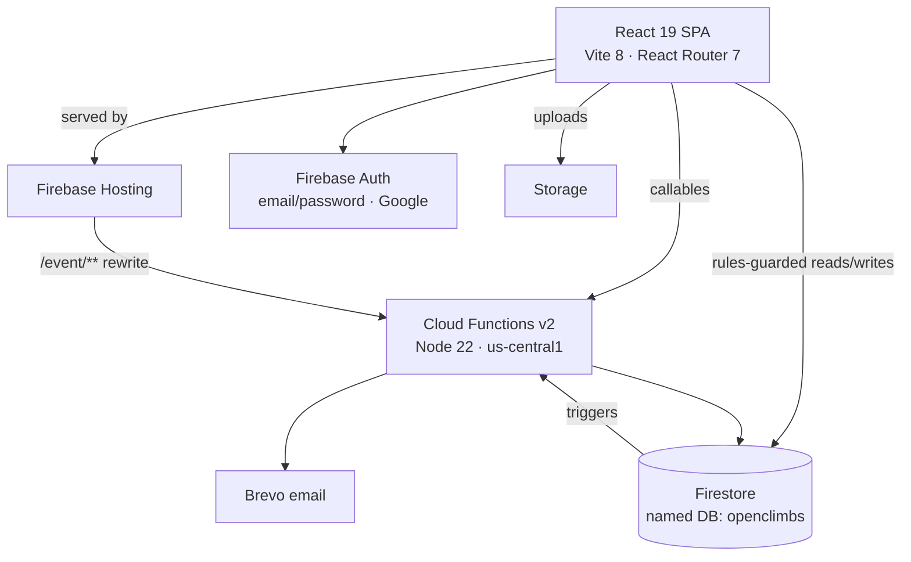
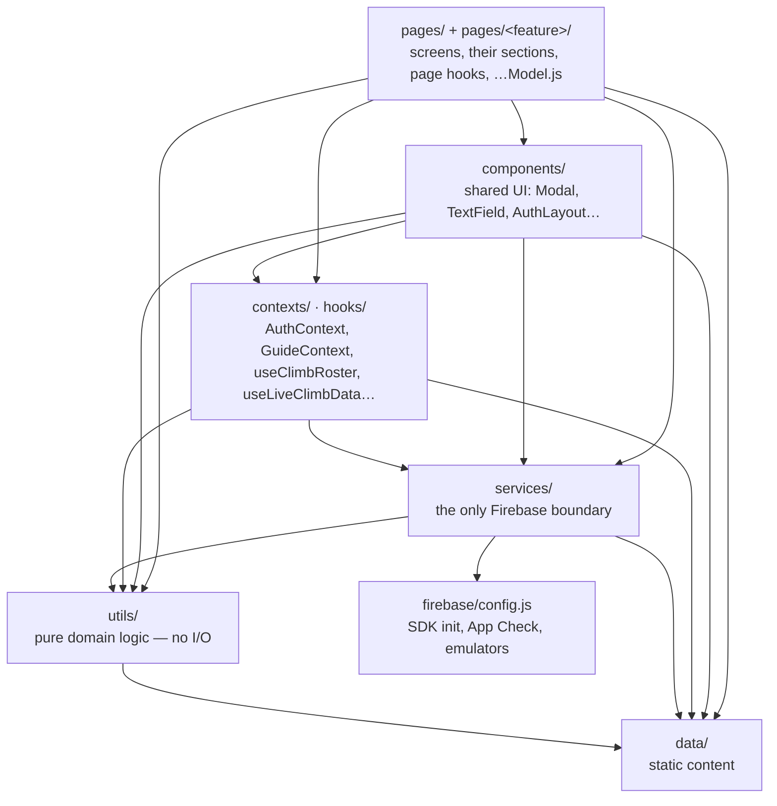
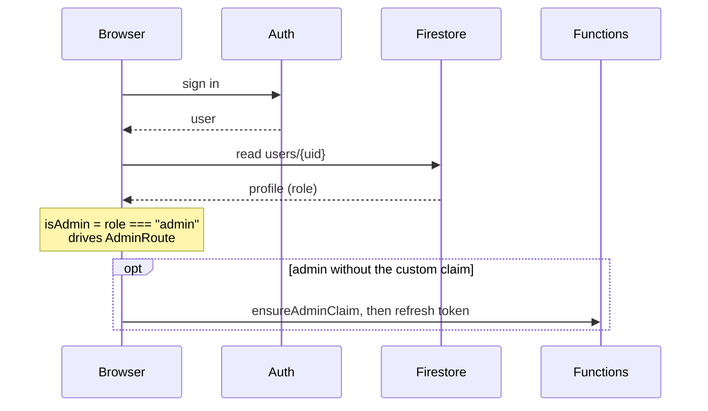

# Architecture

A serverless React SPA on Firebase. No application server: the browser talks
to Firestore, Storage and Auth directly (the security rules are the real
access control), and Cloud Functions react to writes, run a daily schedule
and serve a handful of admin callables. Functions are the only place that
holds third-party secrets.

Details: [DATA.md](DATA.md) (collections), [API.md](API.md) (functions),
[SECURITY.md](SECURITY.md) (rules, secrets, App Check).

## Frontend layers

Dependencies point inward, toward pure domain logic. Only `src/services`
talks to Firebase; everything above it gets plain `{ id, ...data }` objects.
ESLint fails the build on a wrong-way import — [ADR 0004](../adr/0004-services-layer.md).

| Layer | Owns | Never |
|---|---|---|
| `pages/` | composing a screen; big pages split into `pages/<feature>/` (sections + a page hook + a pure `…Model.js`) | Firebase calls |
| `components/` | reusable UI | importing a page |
| `contexts/`, `hooks/` | cross-page state and effects | Firebase calls |
| `services/` | every Firestore, Storage, Auth, callable and external HTTP call; web storage via `browserStorage` | React |
| `utils/` | pure calculations: fees, payments, schedules, weather windows | I/O, React |

`src/App.jsx` and `src/main.jsx` are the composition root: routes, the
`ProtectedRoute` / `AdminRoute` guards and the providers. Shared state is
two React contexts (auth, the guide modal); everything else is live
Firestore data through `subscribeTo…` services, so there is no state library.

## Backend layout

`functions/src/index.js` only re-exports. Handlers live in `triggers/`,
`scheduled/` and `callables/`; Brevo sending and HTML templates in `email/`;
Admin SDK setup and registration operations in `shared/`. `paymentMath.js`
and `requiredDocTypes.js` deliberately mirror frontend logic because
`functions/` is a separate CommonJS package — see [API.md](API.md#deliberate-duplicates).

## Auth and authorization

- **Firestore rules** check `users/{uid}.role` — the source of truth.
- **Storage rules** can't read the named database, so they use an `admin`
  custom claim that `syncAdminClaim` mirrors from the role.
- Route guards are UX only; a write the rules reject fails regardless.

## Decisions not in an ADR

| Decision | Why |
|---|---|
| Serverless only | Nothing to patch or scale for a volunteer-run club |
| Named database `openclimbs` | Keeps app data apart from the project's default DB |
| Counters (`registrationCount`, `docsCompleteCount`) kept by triggers | Atomic increments; no client read-modify-write races |
| GCash proof, not card processing | Fits how the club takes money; the app records, admins verify |
| Brevo instead of a Firebase extension | Full control of HTML, CC rules and officer routing |
| JavaScript, not TypeScript | Small team; ESLint, layering and tests are the safety net ([ADR 0003](../adr/0003-minimum-viable-quality-harness.md)) |
| Release-note email is one synchronous callable | Simplest path at today's membership; async redesign tracked in the [release-notes plan](../solution-plans/release-notes.md) |
