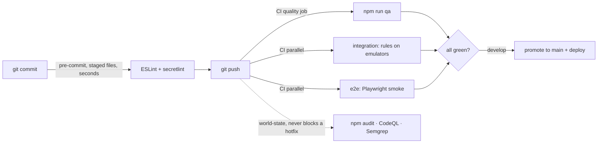

# Code Quality Harness

Every check this repo runs, where it runs, and how to fix it when it fails.
Why it is shaped this way: [ADR 0003](../adr/0003-minimum-viable-quality-harness.md).
The layering it enforces: [ADR 0004](../adr/0004-services-layer.md).

> A rule that isn't enforced isn't a rule. If it can be checked
> deterministically it fails the build; if it needs judgment it's on the
> [review checklist](CONTRIBUTING.md#review-checklist) — never a warning
> nobody reads.

## Three stages, one place per check



| Check | Tool | Stage | Threshold | When it fails |
|---|---|---|---|---|
| Lint errors, banned APIs (`innerHTML`, `document.write`, raw web storage) | ESLint | pre-commit + `qa` | 0 warnings | Fix the line; never `eslint-disable` without a comment saying why |
| Layering (Clean Architecture) | `eslint-plugin-boundaries` | pre-commit + `qa` | see [ADR 0004](../adr/0004-services-layer.md) | Move the code to the right layer, or go through `src/services` |
| Firebase only via services | ESLint `no-restricted-imports` | pre-commit + `qa` | no exceptions | Add or reuse a function in `src/services/` |
| Complexity / size | ESLint `complexity`, `max-lines(-per-function)`, `max-depth`, `max-params` | pre-commit + `qa` | 20 / 600 file / 200 fn / 4 / 6 | Split it. Legacy files are pinned in `LEGACY` (see below) |
| Inline styles in new files | ESLint `react/forbid-dom-props` | pre-commit + `qa` | 0 outside `tools/inline-styles-legacy.json` | Use a class and the tokens in `src/styles/globals.css` |
| Naming: camelCase identifiers, PascalCase components | ESLint `camelcase`, `react/jsx-pascal-case` | pre-commit + `qa` | 0 | Rename. Firestore field names are exempt (properties) |
| Circular deps, unresolvable imports, dev-deps or `firebase-admin` in the bundle | dependency-cruiser (`npm run arch`) | `qa` | 0 | Break the cycle by extracting the shared piece |
| Class name defined in two stylesheets | `npm run css` | `qa` | 0 | Rename the feature's class, or scope it as `.global.feature` |
| Duplication | jscpd (`npm run dupes`) | `qa` | ≤ 1% | Extract a component, hook or util |
| Dead code: unused files, exports, deps | knip (`npm run deadcode`) | `qa` | 0 | Delete it (git keeps history) |
| Secrets | secretlint (+ Brevo / Google key patterns) | pre-commit + `qa` | 0 | Move it to `.env` or a Firebase secret; **rotate it** if it was ever pushed |
| Unit, component, a11y tests + coverage | Vitest (`test:strict`) | `qa` | ratchet, see `vite.config.js` | Add the missing test |
| Functions tests + coverage | Jest (`test:strict`) | `qa` | ratchet, see `functions/jest.config.cjs` | Add the missing test |
| Bundle size | `npm run test:perf` | `qa` | 300 kB initial, 85 kB/chunk (gzip) | Lazy-load it; don't raise the budget to go green |
| Security rules | `npm run test:integration` | CI | all pass | Fix the rule or the test, never both at once |
| User flows | `npm run test:e2e` | CI | all pass | Open the Playwright trace artifact |
| Vulnerable packages | `npm audit --audit-level=moderate --omit=dev` | CI, weekly | 0 moderate+ | Patch, or `overrides` for a transitive dep |
| Injection / XSS taint | CodeQL `security-extended` | CI, weekly | 0 | Fix the flow it reports |
| Broader patterns | Semgrep (pinned image; `p/javascript`, `p/react`, `p/secrets`) | CI, weekly | 0 ERROR-severity; all findings in the Security tab | Fix it, or a `nosemgrep` comment saying why; promote recurring hits to an ESLint rule |
| Format | `.editorconfig` | editor | — | No Prettier, see ADR 0003 |

## Ratchets: legacy can't get worse, new code starts clean

- `eslint.config.js` → `LEGACY` pins each file that predates the strict
  limits at its measured worst. **Numbers only go down**: when you split a
  file, lower or delete its entry in the same commit. New files never go in.
- `tools/inline-styles-legacy.json` lists the files that still use inline
  styles. Remove a file once its last `style={{…}}` is gone; never add one.
- Coverage thresholds sit just under today's actuals. Raise them when
  coverage improves; never lower them.
- The jscpd threshold and bundle budgets work the same way.

Current debt (largest first): `ClimbPaymentCard`, `RegistrantRow`,
`AllRegistrations`, `Analytics`, `ClimbDetail`, `MyRegistrations`, and
the Cloud Functions trigger handlers (complexity up to 77). The full list is
`LEGACY` itself.

## What it costs

Kept cheap on purpose: if a gate is slow, people stop running it.

| Stage | Time (local, warm) |
|---|---|
| pre-commit (lint-staged: ESLint + secretlint on staged files) | ~2–3 s |
| `npm run quality` (6 static checks, 3 at a time) | ~5 s, <1 GB RAM |
| `npm run qa` (quality, build, bundle budget, both test suites with coverage) | ~20 s, <2 GB RAM |
| CI integration / e2e jobs | run in parallel with `qa`; emulator JARs and the Playwright browser are cached |

What keeps it there: static checks run 3 at a time (`run-p`), Vitest
reuses 4 workers across files (`pool: "vmThreads"`, `maxWorkers: 4` — more
only costs RAM), ESLint caches results (pre-commit too),
and each concern has exactly one tool. Before adding a check, time it; a
new gate that adds more than a few seconds to `qa` needs a reason in an ADR.

## Commands

```bash
npm run qa          # everything CI's quality job runs — run before pushing
npm run quality     # just the static checks, in parallel (lint, arch, css, dupes, deadcode, secrets)
npm run lint:fix    # autofix what ESLint can
npm run arch:graph  # SVG dependency graph (needs graphviz)
```

Integration and e2e need Java 21 (the Firebase emulators); see
[TESTING.md](TESTING.md).

## Known limits

- **Windows Application Control** on some machines blocks native `.node`
  binaries. knip is pinned to exactly **5.55.1**: later versions load the
  native `oxc-resolver`, and its WebAssembly fallback can't read Windows paths.
  Dependabot ignores knip for that reason.
- **TypeScript stays on 5.x.** It is installed only as knip's parser, and
  TypeScript 7 (the native compiler) drops the JavaScript API knip uses.
- **Dev-only advisories:** `npm audit` (all deps) reports `braces` /
  `micromatch` via secretlint, boundaries and knip — no patched `braces`
  exists yet. These run only on our own source; the CI gate audits production
  dependencies (`--omit=dev`), which are clean.
- **Type checking** is deliberately absent (JavaScript by decision). ESLint,
  layering and tests are the safety net; `typescript` is installed only as
  knip's parser.

## Adding a rule

1. Decide the stage: deterministic → a gate; needs judgment → the review checklist.
2. Run it over the whole repo first.
3. Clean already → make it an error. Not clean → fix the hits, or ratchet at
   today's count.
4. Record the why in an ADR if it changes the shape of the harness.
