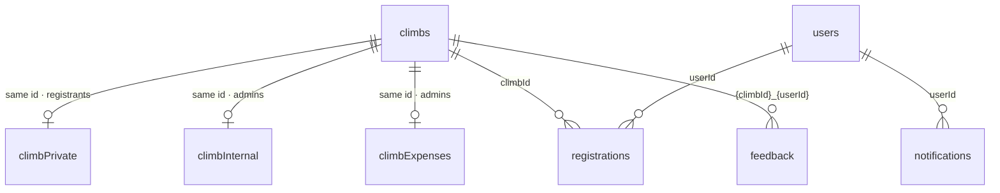
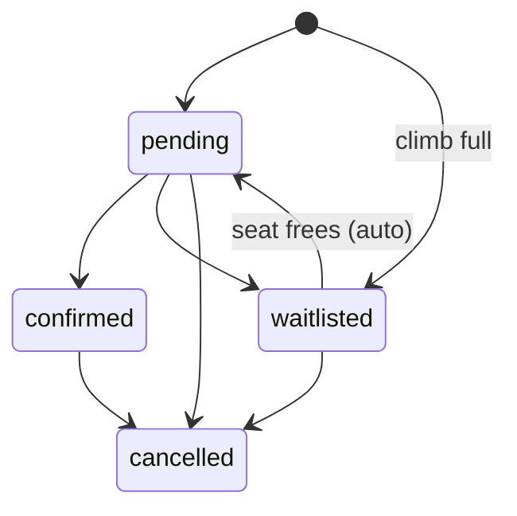

# Data

Cloud Firestore, named database **`openclimbs`** (not `(default)`). Field
lists below cover what isn't obvious from the code — self-describing display
fields (`title`, `location`, `elevation`, …) are left to the forms that write
them. Rules: `firebase/firestore.rules`; how they're tested:
[TESTING.md](TESTING.md).

| Collection | One doc per | Read | Write |
|---|---|---|---|
| `climbs` | climb | **public** | admin |
| `climbPrivate` | climb (same id) | admin + registrants of that climb | admin |
| `climbInternal` | climb (same id) | admin | admin, Functions |
| `climbExpenses` | climb (same id) | admin | admin |
| `registrations` | member × climb | owner, admin | owner (narrow, see rules), admin, Functions |
| `feedback` | member × climb, id `{climbId}_{userId}` | author, admin | author create only — immutable |
| `users` | account, id = Auth uid | owner, admin | owner (never `role`), admin |
| `notifications` | bell item | owner, admin | Functions; owner toggles `read` |
| `pageViews`, `failedRequests` | event | admin | **public create** (logging before sign-in) |
| `auditLog` | admin action | admin | admin create — append-only |
| `releaseNotes` | announcement | signed-in (drafts: admin) | admin |
| `releaseNoteEmailJobs` | all-member email send | admin | Functions only |

The `climbPrivate` / `climbInternal` / `climbExpenses` split exists only
because `climbs` is world-readable: anything private needs its own document.

## climbs

| Field | Meaning |
|---|---|
| `status` | `draft` → `open` ⇄ `closed` → `completed`; `cancelled` from open/closed (reversible to closed) |
| `cancellationStatus` | `cancelled` / `postponed` / empty. **Derived** from `status: "cancelled"` at every write site; `postponed` is set directly. A change fires `onClimbUpdated` emails |
| `registrationCount`, `docsCompleteCount` | Maintained by triggers with atomic increments — **never write from the client** |
| `maxParticipants`, `waitlistAutoPromote` | Capacity; auto-promotion from the waitlist is on unless `false` |
| `fees[]` | `{ label, amount, note, optional, isGuestFee, shareable }`. `isGuestFee` = charged only to `memberType: "joiner"` (flag, not label). `shareable` optional fees can be split via `climbPrivate.serviceGroups` |
| `officers[]` | `{ name, role, contact, userId }` — public. Emails are stripped on save into `climbInternal.officerEmails`; the phone `contact` stays public (the sign-in lock on the event page is cosmetic) |
| `requires{RegistrationForm,MedicalCert,Permit,WaiverDoc}` + `…Url`/`…FileName` | Per-climb required documents and their templates; pairs with `REQUIRED_DOC_TYPES` |
| `announcements[]` | `{ message, pinned, createdAt }`; `createdAt` is epoch ms (no `serverTimestamp()` in arrays). Markdown subset via `src/utils/markdownLite.jsx` — React nodes only |
| `trailMaps[]` | `{ label, googleMapsUrl, allTrailsUrl, komootUrl }`; `googleMapsUrl`/`allTrailsUrl` at top level mirror `trailMaps[0]` |
| `donationDrive`, `donationTotals` | Outreach drive config, and public totals republished on every recorded donation (no donor names) |
| `paymentDueDate` | `YYYY-MM-DD`; drives "Overdue" and reminder wording |
| `thankYouSentAt` | Set once the post-climb thank-you went out; makes it one-time |

## climbPrivate · climbInternal · climbExpenses

| Doc | Field | Meaning |
|---|---|---|
| `climbPrivate` | `preClimbMeetings[]` | `{ date (YYYY-MM-DD), time, location, notes, link, recordingLink }`. Old single-meeting fields are written `null` |
| | `resources[]` | Registrant-only links |
| | `participants[]` | `{ name (first + initial), memberType }` for the public-ish participant list; kept by `syncParticipantList` |
| | `serviceGroups` | `{ [feeLabel]: [{ ids: regId[] }] }` — who shares one unit of a shareable fee (wrapped because Firestore forbids nested arrays) |
| `climbInternal` | `registeredUserIds[]` | Active (`pending`/`confirmed`) registrant uids. Kept by the registration triggers; checked by the `climbPrivate` read and `feedback` create rules |
| | `officerEmails[]` | `{ name, email, userId }`, index-aligned with `climbs.officers` |
| `climbExpenses` | `items[]` | `{ id, label, amount, note }`, written whole; netted against collections by `src/utils/climbExpenses.js` |

`node functions/scripts/backfill-climb-denorm.mjs --apply` rebuilds the
roster and moves stray officer emails off climb docs.

## registrations

Denormalised at creation (not updated later): `climbTitle`, `climbDate`,
`climbLocation`. Personal details (`name`, `email`, `mobile`,
`emergencyContact`, `medicalConditions`, …) are the member's and stay
editable by them.

| Field | Meaning |
|---|---|
| `status` | `pending` / `confirmed` / `waitlisted` / `cancelled` (diagram below) |
| `memberType` | `member` / `joiner` (non-member; pays the guest fee) |
| `payments[]` | `{ amount, proofs[{url,fileName}], submittedAt, status, note?, recordedBy?, reviewedBy?, paidBy?, splitTo? }`, oldest first; each reviewed on its own |
| `paymentStatus` | **Derived** from `payments[].status`: any awaiting review ⇒ `submitted`; else `verified` if one stands; else `rejected`; none ⇒ `unpaid` |
| `amountPaid` | Sum of non-rejected payments — what balance math uses |
| | Write all three only through `buildPaymentPatch` / `setEntryStatus` / `setAllEntryStatuses` (`src/utils/payments.js`). Old docs with only `amountPaid` + `paymentProofs` are normalised by `getPaymentEntries` |
| `feeBreakdown[]` | Fee snapshot at registration; used only when the climb has no fee schedule |
| `…Upload` (`registrationForm`, `medicalCert`, `permit`, `waiverDoc`) | `{ url, fileName }` for each required document |
| `waiverSigned`, `waiverSignedName`, `waiverSignedAt` | Typed e-signature (separate from an uploaded waiver document) |
| `privacyConsentAt`, `privacyNoticeVersion` | Data Privacy Act consent; absent on admin-added walk-ins |
| `noShow`, `attended` (+ `…MarkedBy/At`) | Climb-day flags, not statuses — payments and counters untouched |
| `cancelledByMember`, `cancelledAt`, `cancellationReason` | Members may only cancel their own live registration; reinstating is admin-only |
| `autoWaitlisted`, `promotedFromWaitlistAt` | Set by the triggers |
| `donation`, `donationReceived` | Member pledge (`payWithFees` adds a donation line to what they owe); what leads actually received (admin-only) |
| `adminNotes` | Admin-only |

## Other collections

- **users** — `displayName`, `email`, `role` (`member` default; `admin` via
  `scripts/set-admin.mjs` or `createUser`). Owners can't change `role`.
  `canEmailMembers` allows the all-member release-note email; only another
  admin can set it.
  `syncAdminClaim` mirrors it into an auth claim for Storage rules.
- **feedback** — `rating` integer 1–5 and `comments`. The deterministic id is
  the one-per-member rule: a second submit becomes an update, which the rules
  refuse.
- **notifications** — `userId`, `type`, `title`, `message`, `link`, `read`,
  `createdAt`. Ids and types: [API.md](API.md#notifications-ids-are-the-design).
- **failedRequests** — `type` must be one of the values the rules allow
  (`email`/`upload`/`firestore`/`client`/`payment`); a new type needs a rules
  change or the write is silently dropped.
- **auditLog** — `actorUid`, `actorName`, `action` (e.g.
  `payment_status_verified`), `target{Type,Id,Label}`, `details`. Written by
  `logAuditEvent`; never blocks the action.
- **releaseNotes** — `status` `draft`/`published`; `publishedAt` orders them;
  `emailJob: { id, status }` points at the latest send; `emailSentAt` /
  `emailSentCount` are stamped when it finishes.
- **releaseNoteEmailJobs** — `releaseNoteId`, `status`
  (`queued`/`sending`/`done`/`failed`), `total`, `sent`, `failed`,
  `createdBy`; written only by Functions, watched by the admin form.
- **pageViews** — `path`, `userId`, `createdAt`; admin views can be purged with
  `functions/scripts/purge-admin-pageviews.mjs`.

## Retention

Firestore data is kept indefinitely; member uploads (payment proofs and
required documents) are deleted after two years by
`firebase/storage-lifecycle.json`. Registration CSV export: Admin › All
Registrations. Sample climbs: `node scripts/seed-climbs.mjs`.
