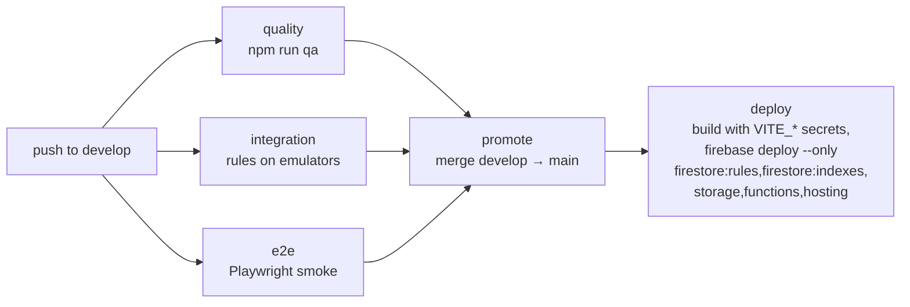

# Deployment

Production runs entirely on Firebase: Hosting (SPA + `ogPrerender` for
event-link previews), Firestore (`openclimbs` database), Auth, Storage and
Cloud Functions v2, with Brevo for email. Local setup is in
[CONTRIBUTING.md](CONTRIBUTING.md).

## Routine deploys: push to `develop`

There is no manual deploy. Every push to `develop` runs the pipeline in
`.github/workflows/firebase-ci-cd.yml`:

- `promote` merges with the default `GITHUB_TOKEN` (auto-merge needs a paid
  plan on private repos); doing it in the same run lets `deploy` follow
  without a second trigger.
- `deploy` authenticates with the `GCP_SA_KEY` service-account secret. That
  account needs, at minimum, Firebase Hosting Admin, Cloud Functions Admin,
  Firebase Rules Admin (Firestore **and** Storage) and Service Account User.
- **Don't deploy from a laptop.** Partial local deploys (`--only hosting` or
  `--only functions`) have shipped a hosting build without the
  `ogPrerender` app shell, and functions without their env config.

Other workflows: `code-quality.yml` (npm audit, weekly too; advisory
Semgrep), `codeql.yml`, `create-release.yml` (GitHub release on `main`),
`pr-title-checker.yml`, `broken-links-checker.yml`, plus Dependabot
(`.github/dependabot.yml`, weekly, into `develop`).

## Configuration

| Where | What | Set with |
|---|---|---|
| GitHub Actions secrets | `VITE_FIREBASE_*`, `VITE_GOOGLE_MAPS_API_KEY`, `VITE_APPCHECK_SITE_KEY`, `GCP_SA_KEY` | repo settings |
| Firebase secrets | `BREVO_API_KEY`, `BREVO_FROM_EMAIL`, `APP_URL`, `GITHUB_TOKEN` (release-note drafts) | `firebase functions:secrets:set NAME` |
| `.env` / `functions/.env` | local only, git-ignored | copy the `.example` files |

`VITE_*` values are baked into the bundle at build time, so they must be
public-safe (the Firebase web key is; restrict it by HTTP referrer in GCP).

## New project or new season from scratch

One-off, in order, for a fresh Firebase project:

1. Enable Auth (Email/Password + Google), Firestore, Storage, Functions;
   App Check with reCAPTCHA Enterprise.
2. Create the Firestore database named **`openclimbs`** (not `(default)`).
3. Set the Firebase secrets above, and the GitHub secrets.
4. Push to `develop` — CI deploys rules, indexes, storage rules, functions and
   hosting.
5. Apply bucket config once (not part of `firebase deploy`):
   `node functions/scripts/set-storage-cors.mjs` (CORS from
   `firebase/cors.json`) and
   `gcloud storage buckets update gs://<bucket> --lifecycle-file=firebase/storage-lifecycle.json`
   (deletes member uploads after two years — a retention decision, confirm it).
6. Sign up in the app, then make yourself admin:
   `node scripts/set-admin.mjs <uid> "<Name>" <email>` (uses your
   `firebase login`). Later admins are promoted from the Users page.

Also once, in the Cloud console: enforce App Check for Firestore and Storage,
a monthly budget alert, and `npx firebase-tools functions:artifacts:setpolicy`
so old function images don't accumulate. Why each exists: [SECURITY.md](SECURITY.md).
