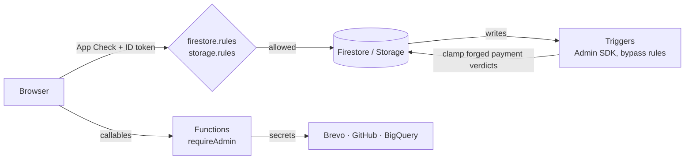

# Security

The browser talks to Firebase directly, so **the security rules are the
access control**; route guards are only UX. Secrets live in Cloud Functions
only. Rules are tested on the emulators (`npm run test:integration`, a CI
gate before every deploy).

## Identity and roles

- Firebase Auth (email/password, Google). The app never handles passwords;
  admin-created accounts get a password-setup link.
- Role = `users/{uid}.role` (`member` | `admin`). Rules read it on every
  admin check, so a demotion is immediate.
- Members can create their profile only as `member` and can never change
  `role` afterwards — both halves block self-promotion.
- `isAdmin()` is `exists()`-guarded: a missing profile doc must deny, not
  error the whole rule.
- **Storage rules can't read the named database**, so they check an `admin`
  custom claim. `syncAdminClaim` mirrors the role into it; an admin whose
  token is behind calls `ensureAdminClaim` and refreshes.

## What the rules enforce

Per-collection read/write is summarised in [DATA.md](DATA.md). The
non-obvious guarantees:

| Guarantee | How |
|---|---|
| Register only for an open climb, only as yourself, with a pinned initial state | `registrations` create checks `climbIsOpen`, owner, `status`/payment fields, `memberType ∈ {member, joiner}`, and `email == request.auth.token.email` |
| Members declare payments; only admins accept them | Owner updates are limited to member-writable fields; a member may append exactly one `submitted` payment, `amountPaid` may grow only by it, `paymentStatus` only to `unpaid`/`submitted`, verification fields only cleared |
| A forged per-payment verdict doesn't stick | Rules can't iterate arrays, so `onRegistrationUpdated` clamps non-admin edits to `payments[].status` and rewrites the doc ([API.md](API.md#registration-triggers)) |
| Private climb data stays private | `climbs` is public, so briefings live in `climbPrivate` (registrants only, via the `climbInternal` roster) and costs/officer emails in admin-only docs |
| One feedback per member per climb | Deterministic id + no update/delete; author must be on the roster |
| Notifications are server-made | Clients may only flip `read` on their own |
| Emailing every member takes two admins | `canEmailMembers` can be set by an admin only on *someone else*; the callable checks it |
| Member uploads are private | Storage: owner-or-admin read; members add files to their own folder only, never overwrite/delete; content types checked; admin-only for QR, images, templates |

## Secrets and keys

| Value | Where | Who sees it |
|---|---|---|
| `VITE_FIREBASE_*`, `VITE_APPCHECK_SITE_KEY` | `.env` → bundle | Public by design: identifies the project, rules do the protecting |
| `BREVO_API_KEY`, `BREVO_FROM_EMAIL`, `APP_URL`, `GITHUB_TOKEN` | Firebase secrets | Functions only |
| `BILLING_EXPORT_TABLE` | `functions/.env` | Functions only |

`.env` files are git-ignored. **secretlint** (with extra Brevo and Google-key
patterns) runs on every commit and in CI; if a secret was ever pushed,
rotate it — removing it from history is not enough.

### Rotation

The club treasurer or tech lead owns these; rotate **every January** (start
of season), when someone with access leaves, or immediately if exposed.

| Secret | Rotate by | Then |
|---|---|---|
| `BREVO_API_KEY` | Brevo › SMTP & API › create a key, `firebase functions:secrets:set BREVO_API_KEY` | Push to `develop` (functions pick up the new version on deploy), check a test email, delete the old key in Brevo |
| `GITHUB_TOKEN` (Functions) | GitHub › fine-grained token, read-only *Contents* on this repo, 1-year expiry | `firebase functions:secrets:set GITHUB_TOKEN`, deploy, try "Generate from commits" |
| `GCP_SA_KEY` (CI) | GCP › IAM › the deploy service account › new JSON key | Update the GitHub secret, run CI, delete the old key |
| `VITE_*` web keys | Not secrets; restrict by HTTP referrer in GCP instead | — |

`firebase functions:secrets:destroy` old versions once the new one is live.

## Platform controls

- **App Check** (reCAPTCHA Enterprise) enforced on Firestore and Storage — the real
  limit on scripted writes to the public-create `pageViews` / `failedRequests`.
- Security headers on Hosting (HSTS, frame-ancestors, nosniff,
  Referrer-Policy, Permissions-Policy) in `firebase.json`.
- A full **Content-Security-Policy in Report-Only mode**: violations are
  posted to `/csp-report` (the `cspReport` function) and logged —
  `firebase functions:log --only cspReport`. After a clean fortnight in
  production, rename the header to `Content-Security-Policy` to enforce it.
  `style-src` keeps `'unsafe-inline'` until the inline styles are gone.
- Email templates escape every argument; links use the `APP_URL` secret,
  never document data. `ogPrerender` attribute-escapes climb text.
- In the app: `dangerouslySetInnerHTML`, `innerHTML`, `eval` and
  `document.write` are lint errors; markdown renders to React nodes only.
- Dependency audit (moderate+) on every push and weekly; CodeQL on every push
  that touches code.
- Deleting an account strips health/contact fields from the member's
  registrations and removes their notifications and uploads.

## Accepted risks

| Risk | Why it stands |
|---|---|
| A forged payment verdict is visible for the moment before the trigger clamps it; the clamp compares entries by position | Moving payment writes behind a callable is the full fix; not worth it yet |
| Unreviewed payments count toward the balance | Intended: members aren't chased for money already sent; admins still review |
| `memberType` (guest fee) is self-declared | No membership list to check against |
| Officer phone numbers are on the public climb doc | No doc every signed-in member can read yet ([DATA.md](DATA.md#climbs)) |
| CSP is Report-Only, not enforced | Origins (Maps, Google sign-in, reCAPTCHA, fonts, Storage) must be confirmed against real traffic first |
| Dev-tool advisories (`braces`) remain | No patched release yet; tools only scan our own code |
