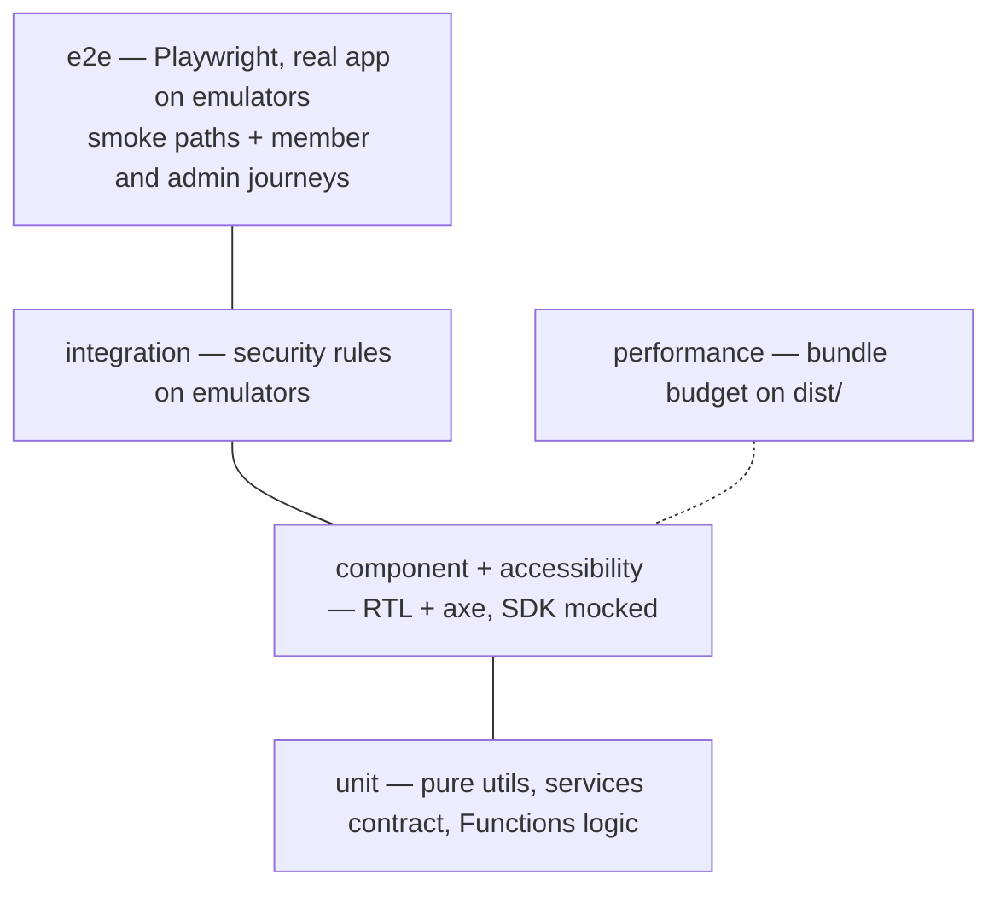

# Testing

Which test goes where, how to run it, and the patterns that keep tests
honest. The gates these feed are in [CODE-QUALITY.md](CODE-QUALITY.md).

## Test types

| Type | Where | Runner | Command | Runs in |
|---|---|---|---|---|
| Unit | `tests/unit/` | Vitest | `npm test` | `qa` |
| Component | `tests/component/{components,contexts,pages}/` | Vitest + Testing Library | `npm test` | `qa` |
| Accessibility | `tests/accessibility/` | Vitest + axe-core | `npm test` | `qa` |
| Cloud Functions | `functions/tests/` (next to the code) | Jest | `npm --prefix functions test` | `qa` |
| Integration | `tests/integration/` | emulators + `@firebase/rules-unit-testing` | `npm run test:integration` | CI job |
| End-to-end | `tests/e2e/` | Playwright on emulators | `npm run test:e2e` | CI job |
| Performance | `tests/performance/` | bundle budget on `dist/` | `npm run test:perf` | `qa` |

`npm run test:strict` runs both unit suites with coverage thresholds;
`npm run qa` runs everything except integration and e2e.

Vitest runs with `pool: "vmThreads"` (each test file gets its own VM
context inside a reused worker — about a third faster, same isolation).

### Emulator-backed tests

Integration and e2e start the Firebase emulators themselves
(`firebase emulators:exec`), which needs **Java 21** on the `PATH`. e2e also
needs a browser once: `npx playwright install chromium`. e2e seeds an open
climb (and, per test, an admin or a registration) over the emulator REST APIs
(`tests/e2e/seed.js`) and runs a single worker — parallel cold loads trip Vite's optimiser into reloads.

## Where a new test goes

- Pure function in `src/utils` or `src/pages/**/…Model.js` → **unit**.
- A service in `src/services` → **unit**, asserting it returns plain objects
  (see `tests/unit/services.test.js`).
- Anything a user sees or clicks → **component**, through
  `renderWithProviders` / `renderAtRoute`.
- A screen worth guarding for labels, names and roles → add it to
  `tests/accessibility/pages.a11y.test.jsx`.
- A change to `firebase/firestore.rules` or `storage.rules` → **integration**.
- A new critical journey a visitor, member or admin takes → one **e2e** test, no more.

## Patterns

- Firebase is mocked once, globally, in `tests/setup.js`; services call the
  same SDK functions, so tests can steer `getDoc`, `onSnapshot` etc. When a
  page test only cares about behaviour, mocking the service module
  (`vi.mock("@/services/…")`) is cleaner — see `tests/component/pages/admin/Analytics.test.jsx`.
- Callables: route `httpsCallable` mocks **by name**, never by creation order.
- Query like a user: `getByRole`, `getByLabelText`, `getByText`; `getByTestId`
  only as a last resort.
- `renderWithProviders(ui, makeMemberAuth())` / `makeAdminAuth()` /
  `makeGuestAuth()` for auth states; `climbFixture` and `registrationFixture`
  for data.
- Functions tests mock `firebase-admin/*` and `fetch` (Brevo) with `jest.mock`
  and drive triggers through the exports of `functions/src/index.js`.

## Coverage reports

`npm run test:coverage` → `coverage/index.html`;
`npm --prefix functions run test:coverage` → `functions/coverage/index.html`.
Thresholds are ratchets — raise them when coverage improves.
