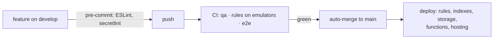

# MMS Open Climbs — web solution plan

How the web app is delivered and run, and what's next. What it is:
[ARCHITECTURE.md](../guides/ARCHITECTURE.md). Why it's shaped this way:
[ADRs](../adr/README.md). Reviewed 2026-10-05.

## Goal

A portal the club reuses every year with a different set of climbs: members
browse, register, sign the waiver and send GCash proof from a phone; admins
verify payments and run each climb. Everything stays **year-neutral** (no
season baked into code or copy) and works on phone, tablet and desktop.

## How it's delivered

- One Firebase project (`mms-open-climbs`, Blaze plan). No staging project:
  the CI gates (coverage ratchets, rules tests, e2e journeys) are what stand
  between a merge and production. Details: [DEPLOYMENT.md](../guides/DEPLOYMENT.md),
  [CODE-QUALITY.md](../guides/CODE-QUALITY.md).
- Cost is pay-per-use and small at club scale. Guards in place: TTL on
  `pageViews`/`failedRequests` (90 days), upload lifecycle (2 years), image
  downscaling in the browser, `maxInstances` on functions, immutable caching
  of hashed assets, Artifact Registry cleanup, a monthly budget alert.
- Security hardening (2026-09): private uploads, roster and officer emails
  off public docs, forged payment verdicts blocked, App Check enforced,
  security headers. Current model and accepted risks:
  [SECURITY.md](../guides/SECURITY.md).

## Open items, cheapest first

| # | Item | Why |
|---|---|---|
| 1 | MFA for admin accounts | Admins verify payments and delete users |
| 2 | Secret-rotation cadence for `BREVO_API_KEY`, `GITHUB_TOKEN` | No owner or schedule today |
| 3 | Confirm Brevo's daily send cap vs. reminders + a release-note blast on the same day | Free tier is ~300/day |
| 4 | Work down `LEGACY` and the inline-style list | Debt is fenced, not gone ([quality-harness](quality-harness.md)) |
| 5 | Release-notes async send | [release-notes plan](release-notes.md) |
| 6 | A staging Firebase project, if the team grows | Today CI is the only pre-prod check |
| 7 | Script/style Content-Security-Policy | Needs testing against Maps, Google sign-in, Storage, fonts |
