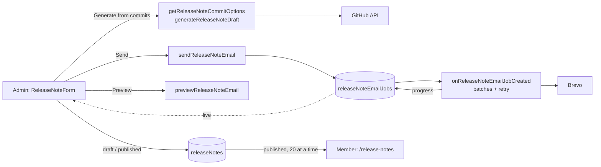

# Release notes — delivery plan

Admins publish "what's new" notes; members read them at `/release-notes` and
can be emailed when one is published. Built on the existing Firestore +
Functions + Brevo pipeline. Why the send works this way:
[ADR 0005](../adr/0005-release-note-email-jobs.md).

## What it does

- Drafts are admin-only; published notes are visible to every signed-in
  user, newest first, with "Show older updates" paging.
- Admins can edit, unpublish or delete a note (delete asks first).
- The commit-based draft groups conventional commits and drops
  `docs`/`test`/`chore`/`ci` noise; `npm run release-notes` does the same in a
  terminal.
- Emailing everyone: preview → confirm → queued job with a progress bar.
  Needs the `canEmailMembers` permission, granted by another admin.

Code: `src/pages/ReleaseNotes.jsx`, `src/pages/admin/ReleaseNote*.jsx` +
`src/pages/admin/releaseNoteForm/`, `src/services/releaseNotes.js`,
`functions/src/callables/releaseNotes.js`,
`functions/src/triggers/releaseNoteEmailJobs.js`,
`functions/src/shared/batchSend.js`.

## After deploy

One admin opens **Users**, picks another admin and ticks **Can email every
member**; repeat in reverse if both should be able to send.

## Open

| Risk | Status |
|---|---|
| More than a few thousand recipients exceeds one job's 9 minutes | Accepted at club scale; the trigger would need to continue across invocations |
| `emailSentCount` counts Brevo acceptances, not deliveries | Accepted |
