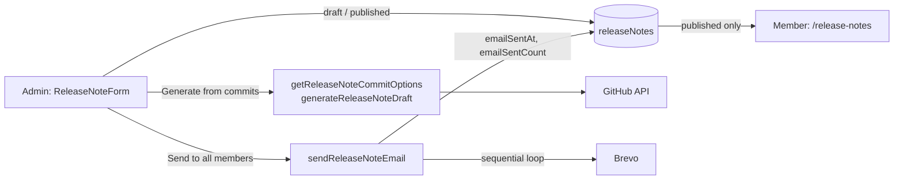

# Release notes — delivery plan

Admins publish "what's new" notes; members read them at `/release-notes` and
can be emailed when one is published. Built on the existing Firestore +
Functions + Brevo pipeline — no new infrastructure.

## What it does today

- Drafts are admin-only; `published` notes are visible to every signed-in
  user (rules), ordered by `publishedAt` (composite index).
- The commit-based draft groups conventional commits into sections and drops
  `docs`/`test`/`chore`/`ci` noise. The same logic powers
  `npm run release-notes` for the terminal.
- Email is opt-in per note and goes to every `users` doc with an email.
- The in-app popup and `users.lastSeenReleaseNoteId` were removed (`0a5d845`).

Code: `src/pages/ReleaseNotes.jsx`, `src/pages/admin/ReleaseNote*.jsx`,
`src/services/releaseNotes.js`, `functions/src/callables/releaseNotes.js`.
Tests: `tests/component/pages/ReleaseNotes.test.jsx`,
`functions/tests/releaseNotes.test.js`.

## Next, in order

| # | Change | Why |
|---|---|---|
| 1 | Delete/unpublish in the admin list | A wrong note can only be edited back to draft |
| 2 | `limit()` + "load more" on `/release-notes` | The query loads the whole history each visit |
| 3 | Preview the email before "Send to all members" | Admins send blind today |
| 4 | Async, batched send: callable writes a job doc, a trigger sends in batches with backoff and reports progress | The sequential loop will hit the callable timeout and Brevo rate limits as membership grows |
| 5 | Narrower permission (or a second approver) for the all-member send | Any admin can email everyone today |

Items 4–5 change the shape of the feature — record them in an ADR when they
start.

## Risks

| Risk | Status |
|---|---|
| Callable timeout / Brevo 429 on a large send; failed sends are logged, not retried | Open until #4 |
| `emailSentCount` counts Brevo acceptances, not deliveries | Accepted |
| Any compromised admin can mass-email members | Open until #5 |
