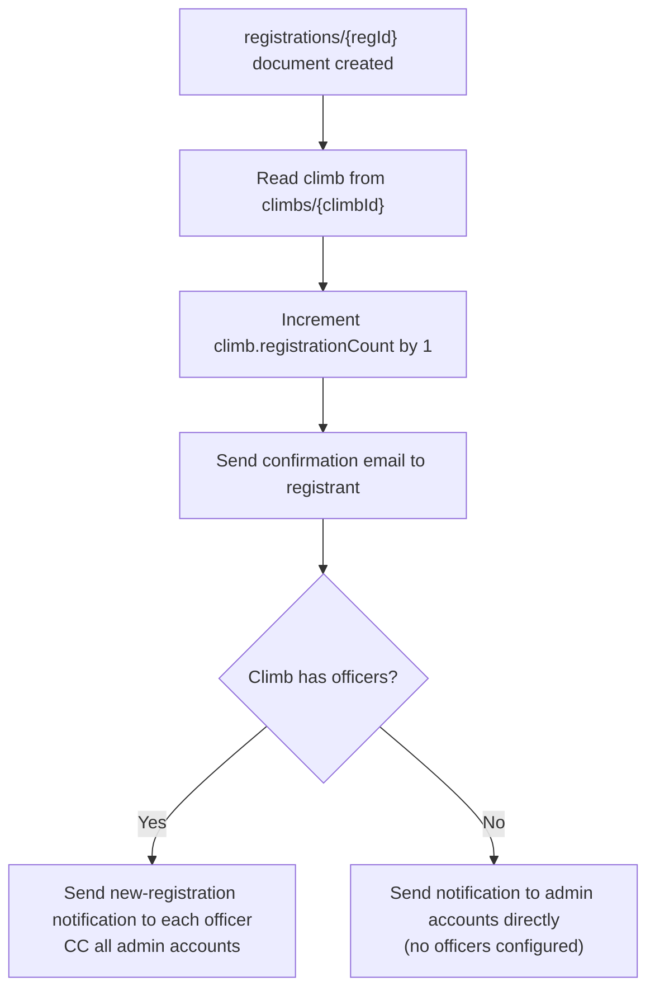
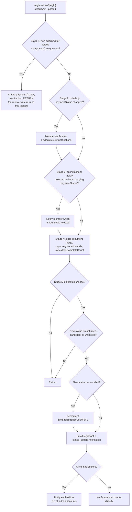
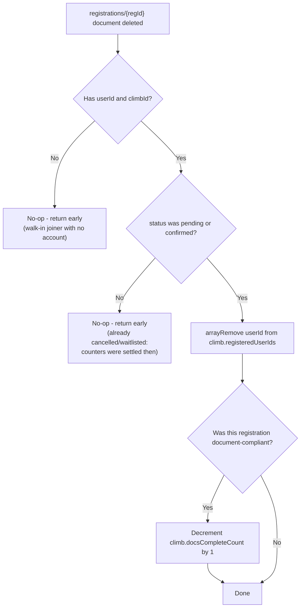
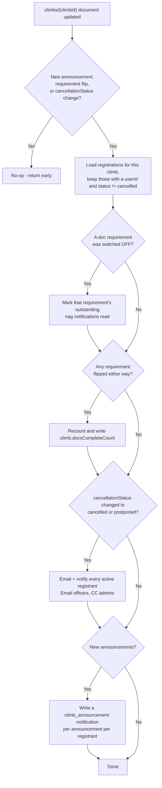
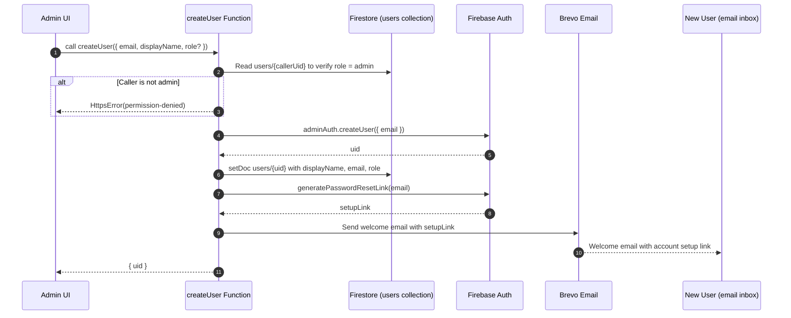
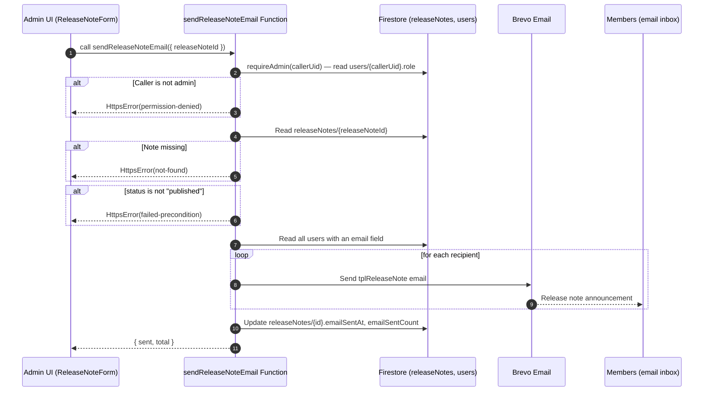
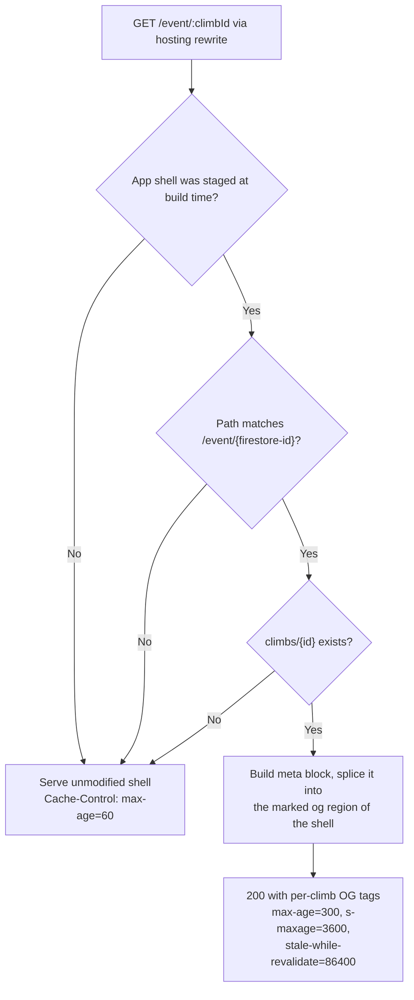
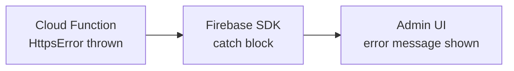

# API Reference

## Table of Contents

- [Overview](#overview)
- [Architecture](#architecture)
- [Firestore Document Triggers](#firestore-document-triggers)
  - [onRegistrationCreated](#onregistrationcreated)
  - [onRegistrationUpdated](#onregistrationupdated)
  - [onRegistrationDeleted](#onregistrationdeleted)
  - [onClimbUpdated](#onclimbupdated)
- [Scheduled Functions](#scheduled-functions)
  - [sendReminderNotifications](#sendremindernotifications)
- [HTTPS Callable Functions](#https-callable-functions)
  - [createUser](#createuser)
  - [updateUserProfile](#updateuserprofile)
  - [deleteUserAccount](#deleteuseraccount)
  - [sendReleaseNoteEmail](#sendreleasenoteemail)
  - [getReleaseNoteCommitOptions](#getreleasenotecommitoptions)
  - [generateReleaseNoteDraft](#generatereleasenotedraft)
  - [getEmailStats](#getemailstats)
  - [getStorageUsage](#getstorageusage)
  - [getFunctionHealth](#getfunctionhealth)
  - [getBillingCost](#getbillingcost)
- [HTTP Request Functions](#http-request-functions)
  - [ogPrerender](#ogprerender)
- [Shared Helpers](#shared-helpers)
  - [requireAdmin](#requireadmin)
  - [getNotifyLists](#getnotifylists)
  - [sendEmail](#sendemail)
  - [createNotification](#createnotification)
  - [REQUIRED_DOC_TYPES and regDocsComplete](#required_doc_types-and-regdocscomplete)
  - [paymentMath](#paymentmath)
- [Failed Request Logging](#failed-request-logging)
- [Environment Variables and Secrets](#environment-variables-and-secrets)
- [Error Codes Reference](#error-codes-reference)
- [Email Templates](#email-templates)

---

## Overview

MMS Open Climbs exposes all backend logic through Firebase Cloud Functions v2. There are no REST endpoints — the frontend communicates with Firebase services directly via the Firebase SDK. The Cloud Functions layer handles:

1. **Firestore document triggers** — automated reactions to database changes (seat counting, email dispatch, compliance counts)
2. **Scheduled functions** — a daily pass that re-surfaces reminders and sends post-climb email
3. **HTTPS callable functions** — admin-initiated operations (user management, release notes, App Insights dashboards)
4. **HTTP request functions** — `ogPrerender`, reached through a Firebase Hosting rewrite rather than the SDK

No function declares a `region`, so every function except `ogPrerender` deploys to the Firebase default region (**`us-central1`**). `ogPrerender` pins `us-central1` explicitly, because the hosting rewrite in `firebase.json` names that region.

---

## Architecture

```mermaid
graph TD
    subgraph Client["Client (React SPA)"]
        UI["Admin UI
or Member Action"]
        SC["Social crawler
(Messenger / Facebook)"]
    end

    subgraph Firestore["Cloud Firestore (openclimbs)"]
        FS_R["registrations collection"]
        FS_C["climbs collection"]
        FS_U["users collection"]
        FS_RN["releaseNotes collection"]
        FS_N["notifications collection"]
    end

    subgraph Triggers["Firestore Triggers"]
        T1["onRegistrationCreated"]
        T2["onRegistrationUpdated"]
        T3["onRegistrationDeleted"]
        T4["onClimbUpdated"]
    end

    subgraph Sched["Scheduled"]
        S1["sendReminderNotifications
daily 09:00 Asia/Manila"]
    end

    subgraph Callables["HTTPS Callables (admin only)"]
        C1["createUser"]
        C1b["updateUserProfile"]
        C1c["deleteUserAccount"]
        C2["sendReleaseNoteEmail"]
        C3["getReleaseNoteCommitOptions"]
        C4["generateReleaseNoteDraft"]
        C5["getEmailStats"]
        C6["getStorageUsage"]
        C7["getFunctionHealth"]
        C8["getBillingCost"]
    end

    subgraph HttpFn["HTTP Request"]
        H1["ogPrerender
via hosting rewrite /event/**"]
    end

    subgraph External["External Services"]
        FA["Firebase Auth"]
        EM["Brevo API"]
        GH["GitHub REST API"]
        ST["Firebase Storage"]
        MON["Cloud Monitoring"]
        BQ["BigQuery billing export"]
    end

    UI -->|write doc| FS_R
    UI -->|httpsCallable| Callables
    SC -->|GET /event/:id| H1

    FS_R -->|onCreate| T1
    FS_R -->|onUpdate| T2
    FS_R -->|onDelete| T3
    FS_C -->|onUpdate| T4

    T1 -->|increment counts| FS_C
    T1 -->|send email| EM
    T1 --> FS_N
    T2 -->|decrement counts| FS_C
    T2 -->|send email| EM
    T2 --> FS_N
    T3 -->|arrayRemove + docsCompleteCount| FS_C
    T4 -->|recount docsCompleteCount| FS_C
    T4 -->|cancellation email| EM
    T4 -->|announcements| FS_N

    S1 --> FS_N
    S1 -->|officer summary + thank-you| EM
    S1 -->|stamp thankYouSentAt| FS_C

    C1 --> FA
    C1 --> FS_U
    C1 -->|welcome email| EM
    C1b --> FA
    C1c --> FA
    C2 --> FS_RN
    C2 -->|blast| EM
    C3 --> GH
    C4 --> GH
    C5 -->|aggregated report| EM
    C6 --> ST
    C7 --> MON
    C8 --> BQ

    H1 -->|read climb| FS_C
```



---

## Firestore Document Triggers

### onRegistrationCreated

**Type:** Firestore document trigger
**Collection path:** `registrations/{regId}`
**Event:** `onDocumentCreated`
**Database:** `openclimbs`
**Secrets required:** `BREVO_API_KEY`, `BREVO_FROM_EMAIL`

#### What it does



#### Side effects

| Effect | Condition | Details |
| --- | --- | --- |
| Increment `registrationCount` | Always | `FieldValue.increment(1)` on `climbs/{climbId}` — atomic, race-condition-safe |
| Add to `registeredUserIds` | `userId` set and `status != cancelled` | `FieldValue.arrayUnion(userId)`. This denormalized array exists because Firestore rules cannot query `registrations` by `climbId` + `userId`; it is what gates member access to the climb's private briefing and resource links |
| Increment `docsCompleteCount` | Registration already satisfies every required doc type (`regDocsComplete`) | Feeds the compliance progress badge on the climb card |
| `payment_reminder` notification | `paymentStatus == "unpaid"` and `userId` set | Id `payment_{regId}`, links to `/my-registrations` |
| `document_reminder` notification | Per `REQUIRED_DOC_TYPES` entry the climb requires and the registration lacks | Id `{docType.notificationPrefix}_{regId}`, one per missing document |
| Send confirmation email | Registrant has an `email` | Climb title, date, location, and the waiver print link |
| Send new-registration notification | Always | Each officer, CC all admins; admins directly when no officers are configured |

#### Confirmation email content

- Climb title, date, location
- Link to printable waiver: `{APP_URL}/waiver/{regId}`

Note the asymmetry between the two denormalized counters: `registrationCount` is incremented unconditionally, while `registeredUserIds` and `docsCompleteCount` are skipped for walk-in registrations with no `userId`.

---

### onRegistrationUpdated

**Type:** Firestore document trigger
**Collection path:** `registrations/{regId}`
**Event:** `onDocumentUpdatedWithAuthContext` — the auth-context variant, so the handler can tell an admin-initiated edit from a member's own edit
**Database:** `openclimbs`
**Secrets required:** `BREVO_API_KEY`, `BREVO_FROM_EMAIL`

#### What it does



This handler runs top to bottom on **every** registration write, not only status changes. The status-email flow above is the last stage; four earlier stages run first and have their own conditions.

#### Stage 1 — forged payment status guard (security)

Firestore rules cannot iterate arrays, so they cannot stop a crafted client write from marking an individual entry inside `payments[]` as `verified`. This trigger is the enforcement point instead.

| Step | Behavior |
| --- | --- |
| Identify the writer | `event.authId` — the reason this trigger uses `onDocumentUpdatedWithAuthContext`; the plain variant does not populate it |
| Skip when unknown | An absent `authId` means an Admin SDK or backfill write, never a client — left alone |
| Check the writer's role | `users/{writerUid}.role == "admin"` |
| Clamp for non-admins | Any entry whose `status` is neither `submitted` nor its own prior value is reverted to the prior value (or `submitted`) |
| Rewrite and stop | On tampering, logs `Clamped forged payment status`, writes the clamped array back, and **returns** — the corrective write re-runs this trigger against clean data |

A member can therefore submit a payment, but only an admin can move one to `verified` or `rejected`. See [SECURITY.md](SECURITY.md) for how this pairs with the rules layer.

#### Stage 2 — payment status notifications

When the rolled-up `paymentStatus` changes and `userId` is set:

| New `paymentStatus` | Notifications |
| --- | --- |
| `verified` | Marks `payment_{regId}` read, clears every admin's `submitted_{regId}_{adminId}`, creates a `payment_verified` notification |
| `rejected` | Clears the admin submitted-notifications, re-opens `payment_{regId}` with the rejection reason from `adminNotes` |
| `unpaid` | Same as rejected, worded as an admin reset of a previously submitted/verified payment |
| `submitted` | Marks `payment_{regId}` read, then notifies **every admin** (`payment_submitted`, id `submitted_{regId}_{adminId}`, linking to `/admin/payments`) |

The admin notification names **the instalment that just arrived**, not the running total — computed by slicing `getPaymentEntries(after)` past the previous `payments.length`, so ₱300 on top of ₱500 reads as ₱300, not ₱800.

#### Stage 3 — single rejected instalment

A member paying in instalments can have one entry rejected while the rolled-up `paymentStatus` stays unchanged — the downpayment stands but the balance receipt was unreadable. Stage 2 stays silent in that case, so a separate check looks for entries newly flipped to `rejected` and raises a `payment_reminder` naming the rejected amounts, making clear the other payments still stand.

#### Stage 4 — counter and nag maintenance

| Effect | Condition |
| --- | --- |
| Mark `{prefix}_{regId}` read | A required document went from absent to present — clears the nag |
| `registeredUserIds` arrayUnion/arrayRemove | `status` moved into or out of the active set (`pending`/`confirmed`). Runs even for transitions that send no email, e.g. `waitlisted` → `pending` |
| `docsCompleteCount` increment/decrement | Active-set membership or any required-document field changed, **and** the registration's computed compliance actually flipped. Compared by presence, not reference — before/after come from separate snapshots, so upload objects are never `===` even when unchanged |

#### Stage 5 — status change email

Everything below this point is skipped unless `before.status !== after.status` **and** the new status is `confirmed`, `cancelled`, or `waitlisted`.

| Effect | Condition | Details |
| --- | --- | --- |
| Decrement `registrationCount` | `status` changed to `cancelled` | `FieldValue.increment(-1)` — atomic |
| Send status update email | Registration has an `email` | Includes the cancellation reason when `cancellationReason` is set; walk-ins with no email on file are skipped |
| `status_update` notification | `userId` set | Titled "You're confirmed!", "Registration cancelled", or "Added to waitlist" |
| Send officer notification | Always at this point | CC all admin accounts |

#### Watched status transitions

| New status | Email sent | Count decremented |
| --- | --- | --- |
| `confirmed` | Yes | No |
| `cancelled` | Yes | Yes |
| `waitlisted` | Yes | No |
| `pending` | No | No |

A `pending` transition still runs stages 1–4 — it just sends no email. `registeredUserIds` and `docsCompleteCount` are kept in sync for it.

#### Notification types written by these triggers

Both registration triggers write to the `notifications` collection backing the in-app bell (see [DATA.md — notifications](DATA.md#notifications)). Deterministic ids are what make a notification re-openable and clearable rather than duplicated:

| Type | Id | Written by |
| --- | --- | --- |
| `payment_reminder` | `payment_{regId}` | Created on unpaid registration; re-opened on rejection, reset, or a rejected instalment; marked read on verify/submit |
| `payment_verified` | auto | `paymentStatus` → `verified` |
| `payment_submitted` | `submitted_{regId}_{adminId}` | One per admin when a proof arrives; cleared once reviewed |
| `document_reminder` | `{docType.notificationPrefix}_{regId}` | One per missing required document; cleared on upload or when the requirement is switched off |
| `status_update` | auto | Any watched status change |

---

### onRegistrationDeleted

**Type:** Firestore document trigger
**Collection path:** `registrations/{regId}`
**Event:** `onDocumentDeleted`
**Database:** `openclimbs`
**Secrets required:** None (no email is sent)

Keeps the denormalized counters on the climb honest when a registration is hard-deleted rather than cancelled. Cancellation goes through `onRegistrationUpdated`; this covers an admin removing the document outright.

#### What it does



#### Side effects

| Effect | Condition | Details |
| --- | --- | --- |
| Remove from `registeredUserIds` | `status` was `pending`/`confirmed` and `userId` is set | `FieldValue.arrayRemove(userId)` on `climbs/{climbId}` |
| Decrement `docsCompleteCount` | The deleted registration satisfied every required doc type for that climb (`regDocsComplete`) | `FieldValue.increment(-1)` |

Compliance is evaluated against `REQUIRED_DOC_TYPES` (`functions/src/requiredDocTypes.js`) - for each doc type the climb has switched on via its `requiresField`, the registration must carry the matching `uploadField`.

Failures are logged (`[onRegistrationDeleted] Failed to sync registeredUserIds`) and swallowed - a delete is never blocked by a counter write.

---

### onClimbUpdated

**Type:** Firestore document trigger
**Collection path:** `climbs/{climbId}`
**Event:** `onDocumentUpdated`
**Database:** `openclimbs`
**Secrets required:** `BREVO_API_KEY`, `BREVO_FROM_EMAIL`

Handles three unrelated climb edits in one trigger, because they all need the same "load every active registration for this climb" query. It returns early unless at least one of them applies.

#### What it does



#### Trigger conditions

| Change detected | How it is detected |
| --- | --- |
| New announcement | An entry in `after.announcements` whose `createdAt` is absent from `before.announcements` |
| Requirement flipped | Any `REQUIRED_DOC_TYPES[].requiresField` differs in truthiness between before and after |
| Climb cancelled/postponed | `cancellationStatus` changed **and** the new value is `cancelled` or `postponed` (any other value, including clearing it, is ignored) |

#### Side effects

| Effect | Condition | Details |
| --- | --- | --- |
| Clear stale nags | A requirement switched **off** | Sets `read: true` (merge) on `notifications/{prefix}_{regId}` for each active registration, so a no-longer-required document does not sit unread forever |
| Recount `docsCompleteCount` | A requirement flipped in **either** direction | Full recount over active registrations - a flip changes who counts as compliant either way, so an increment/decrement would not be enough |
| Registrant cancellation email | `cancellationStatus` becomes `cancelled`/`postponed` | `tplClimbCancellation`, subject `Climb {Cancelled or Postponed} - {title}`; sent per registration that has an `email` |
| Registrant bell notification | Same | Type `climb_status_change`, id `climbstatus_{climbId}_{status}_{regId}`, links to `/event/{climbId}` |
| Officer/admin cancellation email | Same | `tplOfficerClimbCancellation`, subject `[Climb {Cancelled or Postponed}] {title}`, includes the count of registrants already notified. Sent to each officer with all admins CC'd; if the climb has no officers, sent to the first admin with the rest CC'd |
| Announcement notifications | New announcement entries | Type `climb_announcement`, id `announcement_{climbId}_{createdAt}_{userId}`. A `pinned` announcement is titled "New reminder - ...", otherwise "New announcement - ..." |

Announcements are **bell-only** - no email is sent for them.

#### Known limitations (onClimbUpdated)

- Per-registrant email and notification writes are issued without concurrency limiting; a very large climb makes one long invocation.

Errors are caught, logged as `[onClimbUpdated] Failed`, and recorded via `logFailedRequest({ type: "firestore", source: "onClimbUpdated" })`.

---

## Scheduled Functions

### sendReminderNotifications

**Type:** Scheduled (Firebase Functions v2 `onSchedule`)
**Schedule:** Daily at 09:00, `Asia/Manila`
**Access:** N/A (runs on Cloud Scheduler, not user-invoked)
**Secrets required:** `BREVO_API_KEY`, `BREVO_FROM_EMAIL`

One daily pass over every `pending`/`confirmed` registration that does four things: member reminders, an officer summary, post-climb thank-you email, and post-climb feedback requests.

#### Member reminders (bell only)

| Condition | Action |
| --- | --- |
| `paymentStatus` is `unpaid` or `rejected`, **or** `getOutstanding(reg, climb) > 0` | Upserts `payment_{regId}` as unread — re-nags every run until settled |
| The climb requires a document the registration lacks | Upserts `{docType.notificationPrefix}_{regId}` as unread, one per missing document — also re-nags every run |
| `status = confirmed` and the climb starts in exactly 7, 5, 3, or 1 days | Creates `upcoming{days}_{regId}` (once per threshold). Titled "Your climb is tomorrow!" at 1 day, "Your climb is in N days" otherwise |

**The payment rule is a balance check, not a status check.** Members are told they can settle in instalments, so someone who paid ₱500 of ₱800 rolls up as `submitted` or even `verified` while still owing ₱300. Chasing the status alone would let them go silent, so the outstanding amount is what drives the nag — see [`paymentMath`](#paymentmath) for how the balance is computed. The wording follows suit: a partial payer gets "Balance still outstanding" naming both figures, while someone who has paid nothing gets "Payment still pending".

The upcoming-climb thresholds come from `UPCOMING_REMINDER_DAYS` (`functions/src/index.js:1042`) and match on an *exact* whole-day distance, so a climb only ever produces one notification per threshold it passes through. That message is assembled from more than the climb: it appends the **next** pre-climb meeting from the climb's `climbPrivate` document (future meetings only, earliest first) when one exists, and a "you haven't submitted payment yet" line when the registration is `unpaid`/`rejected`.

Registrations with no `userId` (e.g. walk-in participants added manually by an admin — see `AddJoinerModal` in `ClimbDetail.jsx`) are skipped, since there's no account to notify.

#### Officer outstanding-items summary

For each climb in the batch that has `officers`, the run counts registrations that still need chasing and, if either count is non-zero, nudges every officer:

| Counted as outstanding | Rule |
| --- | --- |
| Unpaid | `paymentStatus` is `unpaid` or `rejected` |
| Missing documents | The climb requires a doc type (`REQUIRED_DOC_TYPES[].requiresField`) that the registration's matching `uploadField` doesn't have |

| Channel | Detail |
| --- | --- |
| Bell | Type `officer_outstanding_summary`, id `officer_outstanding_{climbId}_{officerUserId}`, links to `/admin/climbs/{climbId}` — sent only to officers that carry a `userId` |
| Email | `tplOfficerOutstandingSummary`, subject `[Action Needed] {title} — Outstanding Registrant Items` — sent to officers that carry an `email` |

This re-sends daily, per climb, until nothing is outstanding. Admins are **not** CC'd here, unlike the registration triggers.

#### Post-climb thank-you and feedback (one-time per climb)

In the same run, the function also looks for climbs whose `endDate` has already passed and that haven't been thanked yet:

| Condition | Action |
| --- | --- |
| `climb.endDate` is in the past **and** `climb.thankYouSentAt` is unset | For every `confirmed` registrant: sends the `tplThankYou` email (to those with an email address) and creates a `feedback_request` notification (for those with a `userId`), then stamps `climbs/{climbId}.thankYouSentAt` with `FieldValue.serverTimestamp()` |

The thank-you email carries two buttons: **Share Your Feedback**, pointing at `{APP_URL}/feedback/{climbId}`, and **See Upcoming Climbs**. The matching bell notification uses id `feedback_{climbId}_{userId}` and the same `/feedback/{climbId}` link.

The `thankYouSentAt` stamp is what makes this one-time per climb — once set, the climb is skipped on every subsequent daily run regardless of how many more days pass. A failed send to an individual registrant is logged (`err.message`) and does not stop the loop or prevent the `thankYouSentAt` stamp from being written.

#### Run summary

Each invocation logs `[sendReminderNotifications] Done` with `totalRegs`, `paymentReminders`, `upcomingReminders`, `thankYouEmails`, `feedbackNotifications`, and `officerSummariesSent` — the quickest way to confirm a nightly run did what you expect.

See [DATA.md — climbs](DATA.md#climbs) for the `thankYouSentAt` field, and [ARCHITECTURE.md — Email Notification Architecture](ARCHITECTURE.md#email-notification-architecture) for how these flows sit alongside the trigger-driven email.

---

## HTTPS Callable Functions

### createUser

**Type:** HTTPS Callable (Firebase Functions v2)
**SDK invocation:** `httpsCallable(functions, 'createUser')`
**Access:** Admin users only
**Secrets required:** None (uses Firebase Admin SDK with service account)

#### Full flow



#### Request payload

| Field | Type | Required | Validation | Notes |
| --- | --- | --- | --- | --- |
| `email` | string | Yes | Must be present | New user's email address |
| `displayName` | string | Yes | Must be present | Full name for display |
| `role` | string | No | Defaults to `member` | Set to `admin` to create an admin account |

#### Response

```json
{ "uid": "firebase-auth-uid-string" }
```

#### Error codes

| Code | HTTP equivalent | Trigger |
| --- | --- | --- |
| `unauthenticated` | 401 | Caller is not signed in |
| `permission-denied` | 403 | Caller is not an admin (role check fails) |
| `invalid-argument` | 400 | `email` or `displayName` missing or empty |
| `already-exists` | 409 | Email already has a Firebase Auth account |
| `internal` | 500 | Unexpected Firebase or Brevo error |

---

### updateUserProfile

**Type:** HTTPS Callable (Firebase Functions v2)
**SDK invocation:** `httpsCallable(functions, 'updateUserProfile')`
**Access:** Admin users only

Corrects a user's name and/or email. Updates the Firebase Auth account (the actual login credential) and the Firestore `users/{uid}` profile document together, so they can't drift out of sync.

#### Request payload

| Field | Type | Required | Notes |
| --- | --- | --- | --- |
| `uid` | string | Yes | Target user's Firebase Auth UID |
| `displayName` | string | No | New full name — at least one of `displayName`/`email` required |
| `email` | string | No | New login email — at least one of `displayName`/`email` required |

#### Response

```json
{ "success": true }
```

#### Error codes

| Code | Trigger |
| --- | --- |
| `unauthenticated` | Caller is not signed in |
| `permission-denied` | Caller is not an admin |
| `invalid-argument` | `uid` missing, or neither `email` nor `displayName` provided |
| `already-exists` | Another Auth account already uses the requested email |
| `not-found` | The target user's Auth account no longer exists |
| `internal` | Unexpected Firebase error |

---

### deleteUserAccount

**Type:** HTTPS Callable (Firebase Functions v2)
**SDK invocation:** `httpsCallable(functions, 'deleteUserAccount')`
**Access:** Admin users only

Permanently deletes a user's Firebase Auth login and their Firestore `users/{uid}` profile. Does not touch their past `registrations` — those keep their denormalized name/email so historical records stay intact. If the Auth account is already gone (e.g. previously deleted out-of-band), the Firestore profile is still cleaned up rather than erroring out.

#### Request payload

| Field | Type | Required | Notes |
| --- | --- | --- | --- |
| `uid` | string | Yes | Target user's Firebase Auth UID |

#### Response

```json
{ "success": true }
```

#### Error codes

| Code | Trigger |
| --- | --- |
| `unauthenticated` | Caller is not signed in |
| `permission-denied` | Caller is not an admin |
| `invalid-argument` | `uid` missing |
| `failed-precondition` | Caller tried to delete their own account |
| `internal` | Unexpected Firebase error |

---

### sendReleaseNoteEmail

**Type:** HTTPS Callable (Firebase Functions v2)
**SDK invocation:** `httpsCallable(functions, 'sendReleaseNoteEmail')`
**Access:** Admin users only
**Secrets required:** `BREVO_API_KEY`, `BREVO_FROM_EMAIL`

Emails every document in the `users` collection about a published release note. See [RELEASE_NOTES_FEATURE.md](RELEASE_NOTES_FEATURE.md) for the full feature design, and [DATA.md — releaseNotes](DATA.md#releasenotes) for the source document schema.

#### Full flow



#### Request payload

| Field | Type | Required | Notes |
| --- | --- | --- | --- |
| `releaseNoteId` | string | Yes | Document ID of the `releaseNotes` doc to announce |

#### Response

```json
{ "sent": 42, "total": 45 }
```

`sent` counts recipients whose Brevo send succeeded; `total` is the number of `users` documents with an `email` field. A gap between the two means individual sends failed (logged server-side) without aborting the rest of the batch.

#### Error codes

| Code | Trigger |
| --- | --- |
| `unauthenticated` | Caller is not signed in |
| `permission-denied` | Caller is not an admin |
| `invalid-argument` | `releaseNoteId` missing |
| `not-found` | No `releaseNotes` document exists with that ID |
| `failed-precondition` | The note's `status` is not `published` |
| `internal` | Unexpected Firebase or Brevo error |

#### Known limitations

- Recipients are emailed sequentially in a single function invocation — no batching, concurrency limiting, or retry/backoff on individual failures. See [RELEASE_NOTES_FEATURE.md — Risks and Challenges](RELEASE_NOTES_FEATURE.md#risks-and-challenges) for the scaling concern and the proposed asynchronous redesign.
- Targets every document in `users` — there is no audience segmentation (e.g. climb officers only, or a specific climb's registrants).
- Not yet covered by a Cloud Function test (see [RELEASE_NOTES_FEATURE.md — Dead Code and Gap Audit](RELEASE_NOTES_FEATURE.md#dead-code-and-gap-audit)).

---

### getReleaseNoteCommitOptions

**Type:** HTTPS Callable (Firebase Functions v2)
**SDK invocation:** `httpsCallable(functions, 'getReleaseNoteCommitOptions')`
**Access:** Admin users only
**Secrets required:** `GITHUB_TOKEN`

Both this and `generateReleaseNoteDraft` reach GitHub through the shared `githubApi` helper (`functions/src/index.js:1628`), which is what raises `failed-precondition` on a missing token and `internal` on a non-2xx response.

Powers the "Generate from commits" picker in `ReleaseNoteForm.jsx`. Calls the GitHub REST API to list the most recent 30 commits on the default branch, and reports the last commit that was already turned into a release note (its "checkpoint"), so the admin can pick a range instead of re-summarizing history that's already been announced.

#### Request payload

None.

#### Response

```json
{ "since": "abc1234" /* or null on first use */, "commits": [ /* shaped commit objects */ ] }
```

#### Error codes

| Code | Trigger |
| --- | --- |
| `unauthenticated` | Caller is not signed in |
| `permission-denied` | Caller is not an admin |
| `failed-precondition` | `GITHUB_TOKEN` is not configured |
| `internal` | GitHub returned a non-2xx response |

---

### generateReleaseNoteDraft

**Type:** HTTPS Callable (Firebase Functions v2)
**SDK invocation:** `httpsCallable(functions, 'generateReleaseNoteDraft')`
**Access:** Admin users only
**Secrets required:** `GITHUB_TOKEN`

Builds a draft title and body for a release note from the commits between the last checkpoint and the commit SHA the admin selected in `ReleaseNoteForm.jsx`. Commits are grouped by conventional-commit prefix (`feat`, `fix`, `perf`, `refactor`, etc.) into changelog sections; noise commits (`docs`, `style`, `test`, `chore`, `ci`, anything mentioning "coverage") are dropped rather than listed. This is the same commit-grouping approach used by the standalone `scripts/generate-release-notes.mjs` CLI script, applied here inside a callable so it can back the in-app "Generate" button instead of requiring a terminal.

#### Request payload

| Field | Type | Required | Notes |
| --- | --- | --- | --- |
| `until` | string | Yes | Commit SHA to generate the draft up to (usually the latest commit from `getReleaseNoteCommitOptions`) |

#### Response

```json
{
  "title": "What's New — July 23, 2026",
  "body": "Improvements\n- ...",
  "sourceCommit": "def5678",
  "commitCount": 12,
  "droppedCount": 3
}
```

#### Error codes

| Code | Trigger |
| --- | --- |
| `unauthenticated` | Caller is not signed in |
| `permission-denied` | Caller is not an admin |
| `invalid-argument` | `until` missing |
| `failed-precondition` | `GITHUB_TOKEN` is not configured |
| `internal` | GitHub returned a non-2xx response |

### getEmailStats

**Type:** HTTPS Callable (Firebase Functions v2)
**SDK invocation:** `httpsCallable(functions, 'getEmailStats')`
**Access:** Admin users only
**Secrets required:** `BREVO_API_KEY`

Backs the email panel of the App Insights admin dashboard. Proxies Brevo's aggregated transactional-email report for a trailing window, so the key never reaches the browser.

#### Request payload

| Field | Type | Required | Notes |
| --- | --- | --- | --- |
| `days` | number | No | Trailing window in days. Defaults to `30`. The window is `[today - days, today]`, formatted as `YYYY-MM-DD` |

#### Response

```json
{
  "requests": 812,
  "delivered": 795,
  "hardBounces": 4,
  "softBounces": 6,
  "blocked": 1,
  "opens": 540,
  "uniqueOpens": 310,
  "clicks": 96,
  "spamReports": 0,
  "rangeDays": 30
}
```

Every counter defaults to `0` when Brevo omits it, so the dashboard never has to null-check.

#### Error codes

| Code | Trigger |
| --- | --- |
| `unauthenticated` | Caller is not signed in |
| `permission-denied` | Caller is not an admin |
| `failed-precondition` | `BREVO_API_KEY` is not configured |
| `internal` | Brevo returned a non-2xx response, or the request threw |

---

### getStorageUsage

**Type:** HTTPS Callable (Firebase Functions v2)
**SDK invocation:** `httpsCallable(functions, 'getStorageUsage')`
**Access:** Admin users only
**Secrets required:** None (uses the Admin SDK service account)

Reports Firebase Storage consumption per known folder, for the App Insights dashboard. Only the folders the app actually writes to are listed — `STORAGE_FOLDERS` in `functions/src/index.js`:

`payment-proofs`, `registration-form-uploads`, `medical-cert-uploads`, `registration-form-templates`, `medical-cert-samples`, `gcash-qr`, `trail-images`

#### Request payload

None.

#### Response

```json
{
  "folders": [
    { "folder": "payment-proofs", "fileCount": 340, "bytes": 128472913 }
  ],
  "totalBytes": 214880011,
  "totalFiles": 512
}
```

#### Error codes

| Code | Trigger |
| --- | --- |
| `unauthenticated` | Caller is not signed in |
| `permission-denied` | Caller is not an admin |
| `internal` | Storage listing failed |

#### Known limitations

Each folder is listed in full (`bucket.getFiles({ prefix })`) and summed in memory on every call — no pagination cap and no caching. Cost and latency grow linearly with the number of stored files.

---

### getFunctionHealth

**Type:** HTTPS Callable (Firebase Functions v2)
**SDK invocation:** `httpsCallable(functions, 'getFunctionHealth')`
**Access:** Admin users only
**Secrets required:** None
**Extra IAM required:** the runtime service account needs **Monitoring Viewer** (`roles/monitoring.viewer`)

Best-effort Cloud Functions health for the last 24 hours, read from Cloud Monitoring time series.

#### Request payload

None.

#### Response

```json
{ "configured": true, "windowHours": 24, "executionCount": 1284, "errorCount": 0 }
```

When Cloud Monitoring isn't reachable, it does **not** throw — it returns a shaped "not configured" result so one missing IAM role doesn't break the whole insights page:

```json
{
  "configured": false,
  "reason": "Cloud Monitoring is not accessible from this function yet. Grant the runtime service account the \"Monitoring Viewer\" role in IAM, then retry."
}
```

Callers must branch on `configured` rather than assuming the counters exist.

#### Error codes

| Code | Trigger |
| --- | --- |
| `unauthenticated` | Caller is not signed in |
| `permission-denied` | Caller is not an admin |

Any other failure is caught, logged as `[getFunctionHealth] Not available`, and returned as `configured: false`.

#### Known limitations

`errorCount` is currently derived from the `function/user_memory_bytes` metric, not an error metric, so the number it reports is not a count of failed executions. Treat `executionCount` as the only trustworthy field until this is pointed at a real error metric.

---

### getBillingCost

**Type:** HTTPS Callable (Firebase Functions v2)
**SDK invocation:** `httpsCallable(functions, 'getBillingCost')`
**Access:** Admin users only
**Env required:** `BILLING_EXPORT_TABLE`
**Extra IAM required:** the runtime service account needs **BigQuery Data Viewer** and **BigQuery Job User**

Reports month-to-date GCP spend, grouped by service. Google has no general "current spend" REST API — the supported path is exporting detailed billing data to BigQuery, which this function then queries.

#### One-time setup (project/billing admin only — the function cannot do this itself)

1. Cloud Billing Console → **Billing → Billing export → Detailed usage cost**, exporting into a dataset in this project.
2. Set `BILLING_EXPORT_TABLE` in `functions/.env` to the fully-qualified table, e.g. `project.dataset.gcp_billing_export_v1_XXXXXX_XXXXXX_XXXXXX`.
3. Grant the runtime service account **BigQuery Data Viewer** + **BigQuery Job User**.

#### Request payload

None.

#### Response

```json
{
  "configured": true,
  "currency": "USD",
  "month": "August 2026",
  "totalCost": 12.47,
  "byService": [{ "service": "Cloud Functions", "cost": 7.21 }]
}
```

Costs are net of credits (`SUM(cost) + SUM(credits.amount)`), filtered to the current invoice month, and only services with a positive net cost are returned. Like `getFunctionHealth`, misconfiguration returns `{ "configured": false, "reason": "..." }` rather than throwing.

#### Error codes

| Code | Trigger |
| --- | --- |
| `unauthenticated` | Caller is not signed in |
| `permission-denied` | Caller is not an admin |

A missing `BILLING_EXPORT_TABLE` or a failed query is returned as `configured: false` with a `reason`, logged as `[getBillingCost] Not available`.

---

## HTTP Request Functions

### ogPrerender

**Type:** HTTPS request (Firebase Functions v2 `onRequest`)
**Source:** `functions/src/ogPrerender.js`
**Region:** `us-central1` (pinned — must match the hosting rewrite)
**Access:** `invoker: "public"` — unauthenticated by design; social crawlers can't sign in
**Runtime options:** `memory: 256MiB`, `maxInstances: 10`, `concurrency: 80`

Serves the built SPA shell with per-climb Open Graph tags injected, so a `/event/:climbId` link shared to Messenger or Facebook renders a real card instead of a bare URL. Reached through a Firebase Hosting rewrite, not the Firebase SDK:

```json
{
  "source": "/event/**",
  "function": { "functionId": "ogPrerender", "region": "us-central1" }
}
```

#### Request flow



#### Injected tags

`<title>`, `description`, `canonical`, `og:type`, `og:site_name`, `og:title`, `og:description`, `og:url`, `og:image`, and the `twitter:*` equivalents. The title reads `{title} — {dateLabel} | MMS Open Climbs 2026`; the description is built from the climb and capped at 200 characters. A climb with a trail photo gets that photo plus `twitter:card = summary_large_image`; without one it falls back to `/MMS.png` and `summary`, because a square logo letterboxes badly in a large card.

#### Design constraints worth knowing

| Constraint | Why |
| --- | --- |
| The app shell is `require`d inside a `try/catch` at module load | A throw at module load would take down **every** function in the deployment, including the email triggers |
| The shell is staged by a predeploy hook | `firebase.json` runs `node scripts/stage-app-shell.mjs` before deploy to produce `functions/appShell.generated` |
| Paths are matched against `/^\/event\/([A-Za-z0-9_-]{1,64})\/?$/` | Only the Firestore auto-id shape is accepted; anything else falls through to the plain shell instead of becoming a document path |
| Title/description values are attribute-escaped | Climb titles are admin-entered free text — an unescaped quote closes `content="…"` early and an unescaped `<` injects markup |
| The `<!--og-->` / `<!--/og-->` markers are matched by index, not regex | A shell without the markers fails visibly (generic card) instead of producing half-replaced duplicate tags |
| Never `Vary` on `User-Agent` | It would destroy CDN cacheability |
| Missing climbs return **200**, not 404 | Messenger renders nothing at all on a 404, and the SPA already handles a missing climb client-side |

Every failure path degrades to the plain shell. `makeMetaBlock` and `buildHtml` are exported separately for unit tests — the interesting logic is pure.

---

## Shared Helpers

These helpers in `functions/src/index.js` account for behavior the per-function sections above assume. Read them before adding a function — several fail quietly rather than loudly when misused.

### requireAdmin

`functions/src/index.js:1437`

```js
async function requireAdmin(callerUid) {
  if (!callerUid) throw new HttpsError("unauthenticated", "You must be signed in.");
  const callerSnap = await db.doc(`users/${callerUid}`).get();
  if (!callerSnap.exists || callerSnap.data().role !== "admin") {
    throw new HttpsError("permission-denied", "Only admins can do this.");
  }
}
```

The single gate behind every `unauthenticated` / `permission-denied` row in the tables above. Authorization is the Firestore `users/{callerUid}.role` field — **not** a custom auth claim — so a role change takes effect on the next call with no token refresh.

Every callable starts with `await requireAdmin(request.auth?.uid)`, except `createUser` (`functions/src/index.js:1310`), which inlines the same two checks so it can wrap everything after them in its own try/catch. Behaviorally identical; a cleanup opportunity, not a bug.

### getNotifyLists

`functions/src/index.js:279`

```js
const { officerEmails, adminEmails } = await getNotifyLists(climb);
```

Resolves the two audiences behind the recurring "email officers, CC all admins" pattern:

| List | Source | Filter |
| --- | --- | --- |
| `officerEmails` | `climb.officers[]` on the climb document itself | Entry has an `email` containing `@` |
| `adminEmails` | Query of `users` where `role == "admin"` | Document has an `email` |

Both come back as `{ email, name }` objects, ready to hand to `sendEmail`. Officer addresses are denormalized onto the climb, so an officer needs no user account to be notified — but their address also won't follow an edit to their `users` document.

The consuming pattern is the same everywhere: send to each officer with `adminEmails` as CC; when the climb has no officers, send to the first admin with the rest as CC, so a climb with no officers configured still reaches someone.

### sendEmail

`functions/src/index.js:29`

Thin wrapper over Brevo's `POST /v3/smtp/email`. Two behaviors matter to callers:

| Situation | Behavior |
| --- | --- |
| `BREVO_API_KEY` or `BREVO_FROM_EMAIL` missing from the environment | **Logs and returns `undefined` — does not throw.** Nothing is sent and the caller proceeds as though it succeeded |
| Brevo responds non-2xx | Throws `Brevo API error {status}: {body}` |

That first row is a real trap: a function that sends email but forgets `secrets: ["BREVO_API_KEY", "BREVO_FROM_EMAIL"]` in its trigger options deploys cleanly, runs cleanly, logs `Brevo credentials not configured`, and silently sends nothing. `onClimbUpdated` shipped with exactly that defect. **Any new email-sending function must declare both secrets**, and the emulator needs them in `functions/.env`.

Note that the secrets are declared per function, not globally — there is no `setGlobalOptions` call in this codebase.

### createNotification

`functions/src/index.js:297`

```js
await createNotification({ userId, type, title, message, link, id });
```

Writes one document to `notifications`. The optional `id` is the whole design:

| `id` | Write | Consequence |
| --- | --- | --- |
| Provided | `.doc(id).set(payload, { merge: true })` | **Upsert.** The payload always carries `read: false`, so re-issuing an existing notification re-opens it as unread and refreshes `createdAt` |
| Omitted | `.add(payload)` | A new document every call — can duplicate |

That upsert is the entire re-nag mechanism. `sendReminderNotifications` re-issuing `payment_{regId}` daily doesn't pile up four hundred rows; it keeps flipping one row back to unread until the payment lands. It is also why the deterministic ids in the tables above matter: a notification is only clearable (`set({ read: true }, { merge: true })`) by something that can reconstruct its id.

Ids that embed a recipient — `submitted_{regId}_{adminId}`, `announcement_{climbId}_{createdAt}_{userId}` — do so because the same event fans out to many people and each recipient needs their own row.

### REQUIRED_DOC_TYPES and regDocsComplete

`functions/src/requiredDocTypes.js`, and `regDocsComplete` at `functions/src/index.js:346`

The single source of truth for per-climb document compliance. Each entry pairs a flag on the climb with an upload field on the registration:

| `key` | `requiresField` (climb) | `uploadField` (registration) | `notificationPrefix` |
| --- | --- | --- | --- |
| `registrationForm` | `requiresRegistrationForm` | `registrationFormUpload` | `regform` |
| `medicalCert` | `requiresMedicalCert` | `medicalCertUpload` | `medcert` |
| `permit` | `requiresPermit` | `permitUpload` | `permit` |
| `waiverDoc` | `requiresWaiverDoc` | `waiverDocUpload` | `waiverdoc` |

```js
function regDocsComplete(climb, reg) {
  return REQUIRED_DOC_TYPES.every(
    (docType) => !climb?.[docType.requiresField] || !!reg?.[docType.uploadField],
  );
}
```

A registration is compliant when, for every doc type the climb switched on, the matching upload is present — so a climb requiring nothing makes every registration trivially compliant. This predicate drives `docsCompleteCount` in all four registration/climb triggers, and the admin compliance filter.

**This file is a deliberate duplicate of `src/data/requiredDocTypes.js`**, because `functions/` is a separately-deployed package and cannot import from `src/`. Adding a document type means editing both copies; they can silently drift, and only the backend copy affects counters and notifications. The frontend copy carries extra presentation fields (sample-file URLs and names); the four `key` values must stay identical.

### paymentMath

`functions/src/paymentMath.js`

Fee and balance math for the backend. Three of its exports are used by `functions/src/index.js`:

| Export | Used by | Purpose |
| --- | --- | --- |
| `getPaymentEntries(reg)` | `onRegistrationUpdated` | Normalizes `payments[]` into `{ amount, status }` entries. Falls back to a single synthetic entry from `amountPaid` + `paymentStatus` for registrations predating instalments |
| `getCountedTotal(reg)` | `sendReminderNotifications` | Sum of entries **excluding** `rejected` ones — what actually counts toward the balance |
| `getOutstanding(reg, climb)` | `sendReminderNotifications` | `getExpectedTotal - getCountedTotal`, floored at zero |

Two behaviors are worth knowing before relying on them:

- **Fees are priced at the climb's *current* amounts.** `getFeeItems` reads `climb.fees`, falling back to the registration's `feeBreakdown` snapshot only when the climb carries no fee schedule. Required fees always count; optional ones count only when the registrant selected them, with the guest fee auto-applying to `memberType === "joiner"`.
- **An unknowable balance is reported as zero, not as unpaid.** When `getExpectedTotal` is `0` — no fee schedule and no snapshot — `getOutstanding` returns `0` so the daily reminder stays quiet rather than chasing a number it cannot compute.

**This is the third deliberate duplicate in the codebase**, mirroring `src/utils/payments.js` and `src/utils/registrationFees.js`. The frontend is ESM built by Vite and Functions is CommonJS on Node, so they cannot share a module. Keep them in step: a registrant's balance must mean the same thing in the admin table and in the reminder that chases them for it.

| Backend copy | Frontend original |
| --- | --- |
| `functions/src/requiredDocTypes.js` | `src/data/requiredDocTypes.js` |
| `functions/src/paymentMath.js` | `src/utils/payments.js`, `src/utils/registrationFees.js` |

---

## Failed Request Logging

`logFailedRequest` (`functions/src/index.js:316`) appends a document to the `failedRequests` collection so admins can see backend failures in-app rather than in Cloud Logging. See [DATA.md — failedRequests](DATA.md#failedrequests) for the schema and [SECURITY.md](SECURITY.md) for who can read it.

| Field | Value written |
| --- | --- |
| `type` | `"firestore"` for triggers, `"callable"` for callables |
| `source` | The function name |
| `message` | Error message, truncated to 500 characters |
| `userId` / `climbId` / `registrationId` | Whichever the caller had in hand, else `null` |
| `path` / `userRole` | Always `null` from this path — populated only by the client-side logger |
| `createdAt` | `FieldValue.serverTimestamp()` |

The write is wrapped in its own try/catch: a logging failure never escalates into a function failure.

### Which functions log there

| Logs to `failedRequests` | Does not |
| --- | --- |
| `onRegistrationCreated`, `onRegistrationUpdated`, `onClimbUpdated`, `createUser`, `sendReleaseNoteEmail` | `onRegistrationDeleted`, `sendReminderNotifications`, `updateUserProfile`, `deleteUserAccount`, `getReleaseNoteCommitOptions`, `generateReleaseNoteDraft`, `getEmailStats`, `getStorageUsage`, `getFunctionHealth`, `getBillingCost`, `ogPrerender` |

The split is historical rather than principled — the right-hand column logs to Cloud Logging only, so failures there are invisible in the admin UI. The scheduled `sendReminderNotifications` is the most consequential omission: it runs unattended at 09:00 with nobody watching, and a per-registrant email failure only ever surfaces as a `logger.error` line.

---

## Environment Variables and Secrets

### Cloud Functions (`functions/.env` for emulator, Firebase secrets for production)

| Variable | Type | Required | Description |
| --- | --- | --- | --- |
| `BREVO_API_KEY` | Secret | Yes | Brevo REST API key for sending emails |
| `BREVO_FROM_EMAIL` | Secret | Yes | Verified sender email address in Brevo |
| `APP_URL` | Secret | Yes | Base URL for generating waiver links in emails |
| `GITHUB_TOKEN` | Secret | Yes (for `getReleaseNoteCommitOptions`/`generateReleaseNoteDraft`) | GitHub personal access token with read access to the repo, used to list/compare commits for release note draft generation |
| `BILLING_EXPORT_TABLE` | Plain env var (`functions/.env`) | No | Fully-qualified BigQuery billing export table for `getBillingCost`. Unset — the default — makes that function return `configured: false` instead of failing |

Two App Insights callables also need IAM grants on the Cloud Functions runtime service account, which cannot be set through `.env` or Firebase secrets:

| Function | Required role |
| --- | --- |
| `getFunctionHealth` | Monitoring Viewer (`roles/monitoring.viewer`) |
| `getBillingCost` | BigQuery Data Viewer + BigQuery Job User |

### Frontend (`VITE_*` in `.env`)

These values are baked into the frontend bundle at build time by Vite. Firebase API keys are intentionally public — they are protected by Firestore security rules and Auth domain restrictions.

| Variable | Description |
| --- | --- |
| `VITE_FIREBASE_API_KEY` | Firebase project API key |
| `VITE_FIREBASE_AUTH_DOMAIN` | Firebase Auth domain |
| `VITE_FIREBASE_PROJECT_ID` | Firebase project ID |
| `VITE_FIREBASE_STORAGE_BUCKET` | Firebase Storage bucket |
| `VITE_FIREBASE_MESSAGING_SENDER_ID` | Firebase Cloud Messaging sender ID |
| `VITE_FIREBASE_APP_ID` | Firebase app ID |

### Setting production secrets

```bash
firebase functions:secrets:set BREVO_API_KEY
firebase functions:secrets:set BREVO_FROM_EMAIL
firebase functions:secrets:set APP_URL
firebase functions:secrets:set GITHUB_TOKEN
```

---

## Error Codes Reference

All callable function errors follow the Firebase `HttpsError` convention and are surfaced to the client via the Firebase SDK.



| Error Code | Client receives | Typical cause | Thrown by |
| --- | --- | --- | --- |
| `unauthenticated` | `functions/unauthenticated` | Calling a protected function without being signed in | `requireAdmin`, and the inline check in `createUser` |
| `permission-denied` | `functions/permission-denied` | Signed in but not an admin | `requireAdmin`, and the inline check in `createUser` |
| `invalid-argument` | `functions/invalid-argument` | Missing or empty required payload fields | `createUser`, `updateUserProfile`, `deleteUserAccount`, `sendReleaseNoteEmail`, `generateReleaseNoteDraft` |
| `already-exists` | `functions/already-exists` | Email already has a Firebase Auth account | `createUser`, `updateUserProfile` |
| `not-found` | `functions/not-found` | The target document or Auth account does not exist | `sendReleaseNoteEmail` (no such release note), `updateUserProfile` (Auth account gone) |
| `failed-precondition` | `functions/failed-precondition` | The request is well-formed but the system is in the wrong state for it | `sendReleaseNoteEmail` (note not `published`), `deleteUserAccount` (caller targeting themselves), `getEmailStats` (no Brevo key), `getReleaseNoteCommitOptions` / `generateReleaseNoteDraft` (no `GITHUB_TOKEN`) |
| `internal` | `functions/internal` | Unhandled exception, or an upstream API (Brevo, GitHub, BigQuery) returned an error | Any function |

A missing credential is consistently `failed-precondition`, not `internal` — `getEmailStats` for Brevo, both release-note callables for GitHub. The exception is `getBillingCost`, which returns `configured: false` instead of throwing.

#### Codes translated from Firebase Auth

`already-exists` and `not-found` are never thrown directly — they are mapped from Firebase Auth error codes so the client sees a stable `HttpsError` instead of a raw SDK code:

| Firebase Auth code | Becomes | Where |
| --- | --- | --- |
| `auth/email-already-exists` | `already-exists` | `functions/src/index.js:1341`, `:1466` |
| `auth/user-not-found` | `not-found` | `functions/src/index.js:1472` |

#### A note on non-HttpsError exceptions

`onCall` discards the message of any non-`HttpsError` it catches, leaving the client with a bare, undiagnosable `internal`. `createUser` guards against this by wrapping its whole body in a try/catch that re-throws as a typed `HttpsError` (see the comment at `functions/src/index.js:1314`). Any new callable that touches Firestore or Auth should do the same.

#### Functions that report failure without throwing

Three functions deliberately return a shaped result instead of raising, so one missing IAM role or unset variable cannot break a whole dashboard. Clients must branch on the flag rather than relying on a catch block:

| Function | Success shape | Failure shape |
| --- | --- | --- |
| `getFunctionHealth` | `{ configured: true, ... }` | `{ configured: false, reason }` |
| `getBillingCost` | `{ configured: true, ... }` | `{ configured: false, reason }` |
| `sendReleaseNoteEmail` | `{ sent, total }` | Partial success — `sent < total` means individual sends failed |

---

## Email Templates

All email templates are rendered server-side inside Cloud Functions and sent via Brevo. Templates are defined in `functions/src/index.js`.

```mermaid
graph TD
    subgraph Templates["Email Templates"]
        T1["tplRegistrationConfirmation\nSent to registrant on new registration"]
        T2["tplStatusUpdate\nSent to registrant on status change"]
        T3["tplOfficerNewRegistration\nSent to climb officers on new registration"]
        T4["tplOfficerStatusUpdate\nSent to climb officers on status change"]
        T5["tplWelcome\nSent to new user created by admin"]
        T6["tplReleaseNote\nSent to all members on admin-triggered blast"]
        T7["tplThankYou\nSent once per climb after it ends"]
        T8["tplClimbCancellation\nSent to registrants when a climb is\ncancelled or postponed"]
        T9["tplOfficerClimbCancellation\nSent to officers on the same change"]
        T10["tplOfficerOutstandingSummary\nDaily officer nag for unpaid /\nmissing-document registrants"]
    end

    subgraph Trigger["Triggered by"]
        TR1["onRegistrationCreated"]
        TR2["onRegistrationUpdated"]
        TR3["createUser callable"]
        TR4["sendReleaseNoteEmail callable"]
        TR5["sendReminderNotifications (scheduled)"]
        TR6["onClimbUpdated"]
    end

    TR1 --> T1
    TR1 --> T3
    TR2 --> T2
    TR2 --> T4
    TR3 --> T5
    TR4 --> T6
    TR5 --> T7
    TR5 --> T10
    TR6 --> T8
    TR6 --> T9
```



All templates wrap their body in the shared `tplBase` chrome.

| Template | Recipient | Trigger | Key content |
| --- | --- | --- | --- |
| `tplRegistrationConfirmation` | Registrant | `onRegistrationCreated` | Climb title, date, location, waiver link |
| `tplStatusUpdate` | Registrant | `onRegistrationUpdated` | New status, cancellation reason (if applicable) |
| `tplOfficerNewRegistration` | Climb officers | `onRegistrationCreated` | Registrant name, email, climb details, link to admin |
| `tplOfficerStatusUpdate` | Climb officers | `onRegistrationUpdated` | Registrant name, new status, reason, link to admin |
| `tplWelcome` | New user | `createUser` | Welcome message, account setup link (password reset URL) |
| `tplReleaseNote` | Every user in `users` | `sendReleaseNoteEmail` | Release note title and body, link to `/release-notes` |
| `tplThankYou` | Confirmed registrants | `sendReminderNotifications` (once per climb, gated by `climb.thankYouSentAt`) | Thanks the member for completing the climb; "Share Your Feedback" button to `/feedback/{climbId}` plus a link to upcoming climbs |
| `tplClimbCancellation` | Active registrants | `onClimbUpdated` when `cancellationStatus` becomes `cancelled`/`postponed` | Climb title, date, location and the reason; red styling for cancelled, orange for postponed |
| `tplOfficerClimbCancellation` | Climb officers (CC admins; admins directly if no officers) | Same change | Which climb was cancelled/postponed, the reason, how many registrants were already notified, and an "Open Admin Panel" button |
| `tplOfficerOutstandingSummary` | Climb officers | `sendReminderNotifications` (daily, per climb, while anything is outstanding) | Counts of unpaid/rejected and missing-document registrants, with a "Review Registrants" button to `/admin/climbs/{climbId}` |
