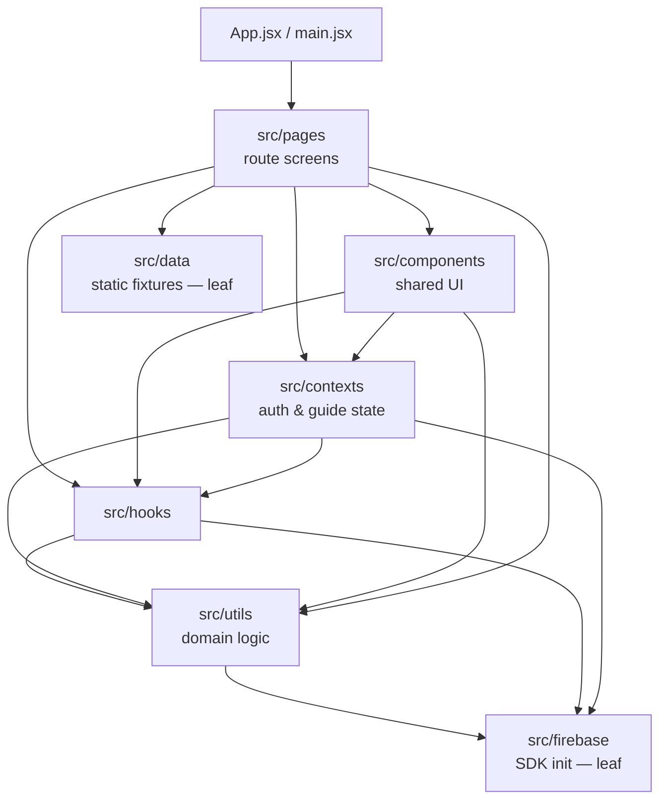

# Code Quality

How this repo decides what "good code" means, and which of those decisions a
machine enforces rather than a reviewer.

The governing principle: **a rule that isn't enforced isn't a rule, it's a
wish.** Anything that can be checked deterministically is a gate that fails the
build. Anything that genuinely needs judgment is a review checklist item, and we
say so explicitly instead of pretending a linter covers it.

The architectural rationale is in
[ADR 0002 — Code quality gates](../adr/0002-code-quality-gates.md).

---

## Enforcement tiers

| Tier | Meaning | Consequence |
|---|---|---|
| **Gate** | Deterministic. Machine-checkable. | Fails `npm run qa` and CI. |
| **Advisory** | Real signal, but needs a human to judge or a refactor to clear. | Reported, never blocks. |
| **Reviewed** | Judgment. No tool can decide it. | PR checklist item. |

## What is enforced, and with what

| Decision type | Tier | Enforced with |
|---|---|---|
| Layering / dependency direction (domain ⊥ infrastructure) | **Gate** | `eslint-plugin-boundaries` + `dependency-cruiser` |
| No circular dependencies | **Gate** | `dependency-cruiser` (`no-circular`) + `import/no-cycle` |
| Forbidden imports / banned APIs | **Gate** | `no-restricted-imports`, `dependency-cruiser` forbidden rules |
| What a module may expose or reach into | **Gate** | `dependency-cruiser` (orphan/reach rules) |
| Cyclomatic complexity / file size / function length ceilings | **Gate** (ratcheted) | ESLint `complexity`, `max-lines`, `max-lines-per-function` |
| Code duplication threshold | **Gate** | `jscpd` (≤ 4%) |
| Test coverage floor | **Gate** | Vitest/V8 + Jest thresholds |
| Dangerous / insecure patterns | **Gate** (ESLint subset) + **Advisory** (Semgrep) | ESLint `no-eval`/`react/no-danger`/…, Semgrep, CodeQL |
| Dependency vulnerabilities | **Gate** (high+) | `npm audit --audit-level=high --omit=dev` |
| React purity / effect correctness | **Advisory** (ratcheted) | `eslint-plugin-react-hooks` v6 rules |
| Naming conventions | **Reviewed** | PR checklist — no ESLint equivalent without TypeScript |
| "Right abstraction" / cohesion / pattern choice | **Reviewed** | PR checklist |

Two rows from the general playbook are deliberately **not** adopted here:

- **ArchUnitTS / API Extractor** — both require TypeScript. This codebase is
  JavaScript by decision (see `.claude/CLAUDE.md`), so layering is enforced by
  `eslint-plugin-boundaries` and `dependency-cruiser` instead.
- **Stryker Mutator** — mutation testing is the right tool for "do the tests
  actually assert anything?", but at ~64% line coverage the mutation score would
  largely re-measure the coverage gap rather than test quality. Revisit once
  coverage is meaningfully higher.

---

## Commands

```bash
npm run lint          # ESLint: correctness, layering, banned imports, ceilings
npm run lint:fix      # …with autofix
npm run arch          # dependency-cruiser: cycles, layering, reachability
npm run arch:graph    # SVG dependency graph → docs/dependency-graph.svg (needs graphviz)
npm run dupes         # jscpd duplication threshold
npm run audit:deps    # npm audit, production deps only, high+

npm run quality       # lint + arch + dupes
npm run qa            # quality + build + strict coverage  ← the pre-deploy gate
```

`npm run qa` is what the deploy pipeline runs before promoting `develop` →
`main`, so anything green locally is green there. `audit:deps` is deliberately
*not* in `qa` — it needs network access and its result depends on when you run
it, not on your diff. It runs as its own blocking CI job instead.

---

## The layering rule

Dependencies flow one way. `src/utils` is the domain layer and may never reach
up into UI or React state; `src/firebase` and `src/data` are leaves.



Enforced twice on purpose:

- **`eslint-plugin-boundaries`** catches it per-file, in your editor, as you
  type the bad import.
- **`dependency-cruiser`** catches what is only visible from the whole graph —
  cycles of arbitrary length, orphaned modules, unresolvable `@/` aliases.

### `src/utils` and Firestore

`utils/auditLog.js` and `utils/logFailedRequest.js` import Firestore directly.
This is a deliberate carve-out, not an accident: they are write-only telemetry
sinks with no return value to test around. The rule that matters — utils never
imports UI or state — still holds, and is enforced.

---

## Ceilings are ratchets, not targets

The size and complexity numbers in `eslint.config.js` are set **just above
today's worst offender**. They exist so the codebase cannot get worse, and they
get lowered as files are split.

| Rule | Ceiling | Worst today |
|---|---|---|
| `max-lines` (per file) | 2100 | `pages/Event.jsx` — 2096 |
| `max-lines-per-function` | 1950 | `Event()` — 1938 |
| `complexity` | 115 | `Event()` — 112 |
| `max-params` | 6 | comfortably under |
| `max-depth` | 5 | comfortably under |
| duplication (`jscpd`) | 4% | 3.5% |
| ESLint warnings (`--max-warnings`) | 19 | 19 |
| frontend coverage (lines/stmts/fns/branches) | 63 / 62 / 56 / 52 | 63.6 / 62.6 / 57 / 52.5 |
| functions coverage (lines/stmts/fns/branches) | 67 / 67 / 56 / 64 | 67.9 / 67.7 / 56.3 / 64.9 |

Coverage floors are ratchets too: they were raised from 45/45/35/34 (frontend)
and 30/30/25/20 (functions) — where they had drifted far below actual — to just
under today's real numbers. Raise them again when coverage improves.

A ceiling of 2100 lines is not an endorsement of 2100-line files. It is a
statement that the next one cannot be 2101. **When you split a large file, lower
the ceiling in the same PR.**

The realistic long-run targets: 500 lines/file, 150 lines/function, complexity
20. Getting there is refactoring work, tracked separately —
`Event.jsx`, `ClimbForm.jsx`, `MyRegistrations.jsx`, `Register.jsx`, and
`Analytics.jsx` are the five files standing between the current ceilings and
those targets.

---

## Not yet blocking

Honest accounting of what is configured but running advisory, and what it would
take to flip each one to a gate.

| Check | Why advisory | To make it block |
|---|---|---|
| Semgrep (`patterns` job) | Broad community rulesets produce noise on first adoption; CodeQL is already the blocking security analysis. | Triage one clean run, pin a ruleset, then drop `continue-on-error`. |
| `react-hooks` purity/effect rules | 19 existing hits, each needing a behavioural refactor (`set-state-in-effect`, `exhaustive-deps`, `purity`, `immutability`, `globals`, `static-components`). | Fix hits, lower `--max-warnings` toward 0. `rules-of-hooks` is **already** an error. |
| `no-console` | Warns rather than errors; some admin pages log intentionally. | Route deliberate logging through a helper, then flip to error. |
| `dependency-cruiser` `no-orphans` | Warns rather than errors — a legitimately-unused module is occasionally staged ahead of the code that uses it. | Clear any standing orphans, then set `severity: "error"`. |

`--max-warnings 19` is itself a ratchet: fixing a warning without lowering the
number just banks slack for the next one. Lower it.

### Dependency advisories

`npm audit` **is** a gate, at `--audit-level=high` on production dependencies
only, for both the frontend and `functions/`. Both are clean at that level.

Two moderate advisories remain, each pinned open by a major upgrade rather than
by neglect:

| Advisory | Package | Blocked on |
|---|---|---|
| Open redirect via backslash in `<Link>`; constructor injection in `deserializeErrors()` | `react-router` / `react-router-dom` 6.30.4 | Fixed only in `>= 7.18.0`. React Router v7 is a breaking migration and needs its own PR. |
| Name shadowing; DoS via infinite loop in `.proto` parsing | `protobufjs` 7.6.2, transitive via `firebase` → `@grpc/proto-loader` | Fixed in 8.x. Forcing a major on a Firestore-internal dependency risks breaking the SDK; wait for `firebase` to bump it. |

Two vulnerabilities *were* cleared, via targeted `overrides` rather than a
blanket `npm audit fix --force`:

- **`websocket-driver` 0.7.4 → 0.7.5** (critical — resource-limit bypass and
  message corruption), transitive via `firebase` → `@firebase/database`. Patch
  release, and this app uses Firestore rather than Realtime Database.
- **`form-data` 2.5.5 → 2.5.6** (high — CRLF injection) in `functions/`,
  transitive via `@google-cloud/bigquery` → `@types/request`. Scoped to the
  `@types/request` path so nothing else is pinned to the 2.x line.

Lower `--audit-level` to `moderate` once the two majors land.

---

## Reviewed, not gated

These are on the PR checklist because no tool can decide them. Don't pretend
otherwise.

- **Is this the right abstraction?** Does the new module have one reason to
  change, or is it a bag of unrelated helpers?
- **Cohesion.** Does everything in this file belong together?
- **Naming.** `eslint-plugin-boundaries` can tell you a file is in the wrong
  layer; nothing can tell you `handleThing2` is a bad name.
- **Test meaningfulness.** Coverage says a line ran. It does not say an
  assertion would fail if the line were wrong.
- **Does this belong in `utils`?** The gate enforces the direction of the
  dependency, not whether the extraction was worth doing.

---

## Adding or changing a rule

1. Decide the tier first. If it needs judgment, it goes on the review
   checklist — not into ESLint as a warning nobody reads.
2. Run it against the whole repo before turning it on.
3. If it's already clean, make it an error. If not, either fix the hits in the
   same PR or set a ratchet at the current count and record it in
   "Not yet blocking" above.
4. Note the reasoning in an ADR under [`docs/adr/`](../adr/).

## Files

| File | Purpose |
|---|---|
| `eslint.config.js` | Flat config: correctness, React, layering, banned imports, ceilings |
| `.dependency-cruiser.cjs` | Graph rules: cycles, layering, orphans, resolvability |
| `.jscpd.json` | Duplication detection and threshold |
| `vite.config.js` | Frontend coverage thresholds |
| `functions/jest.config.cjs` | Cloud Functions coverage thresholds |
| `.github/workflows/code-quality.yml` | Gates + advisory jobs on PR/push |
| `.github/workflows/firebase-ci-cd.yml` | Runs `npm run qa` before promote/deploy |

## Related

- [CONTRIBUTING.md](CONTRIBUTING.md) — git workflow and PR process
- [TESTING.md](TESTING.md) — test patterns and coverage
- [ARCHITECTURE.md](ARCHITECTURE.md) — system design
- [SECURITY.md](SECURITY.md) — security model
- [ADR 0002](../adr/0002-code-quality-gates.md) — why these gates
