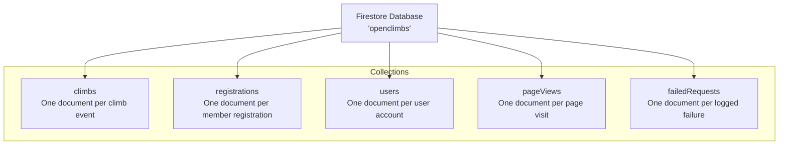
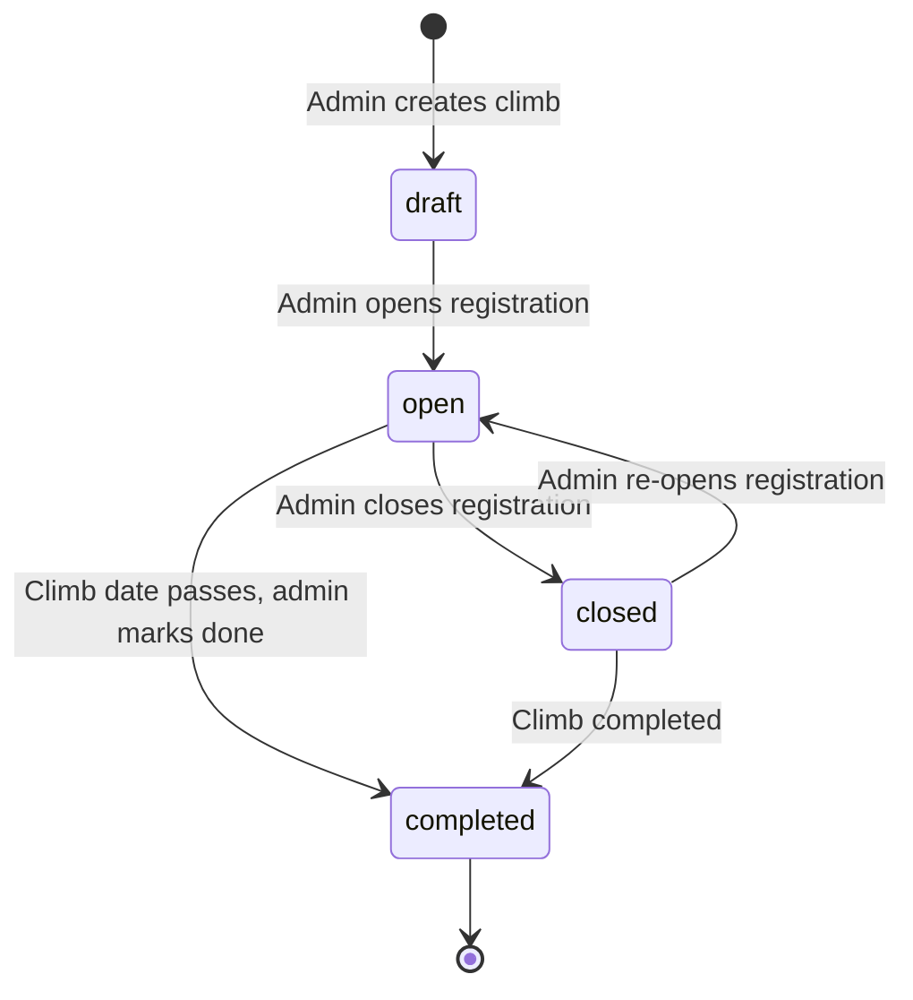
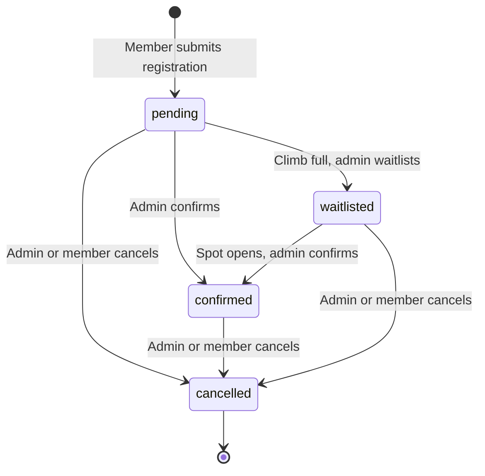
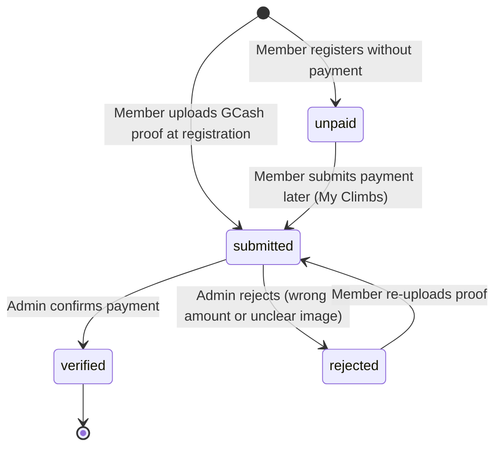
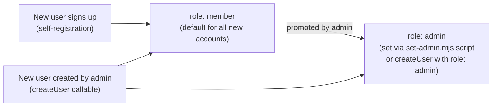
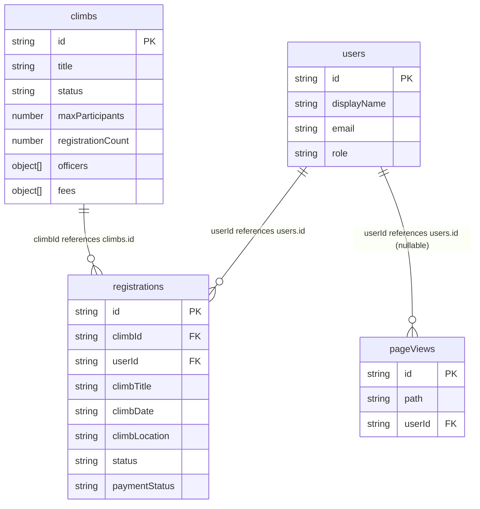
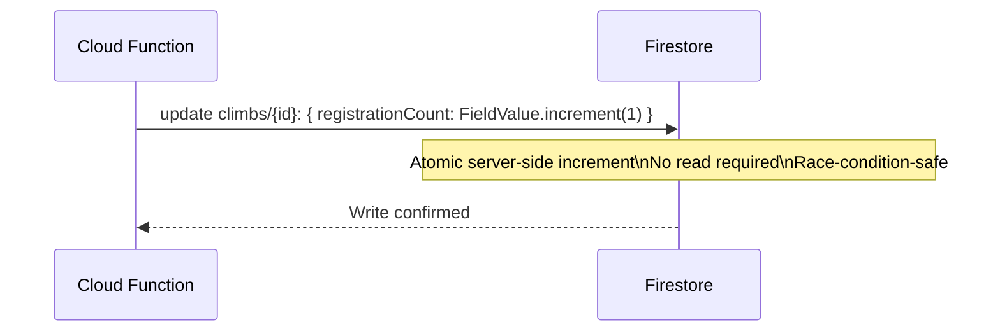

# Data

## Table of Contents

- [Overview](#overview)
- [Firestore Database](#firestore-database)
- [Collections Reference](#collections-reference)
  - [climbs](#climbs)
  - [registrations](#registrations)
  - [users](#users)
  - [pageViews](#pageviews)
  - [failedRequests](#failedrequests)
  - [notifications](#notifications)
  - [releaseNotes](#releasenotes)
- [Data Relationships](#data-relationships)
- [Status Enumerations](#status-enumerations)
- [Denormalization Strategy](#denormalization-strategy)
- [Atomic Counters](#atomic-counters)
- [Data Seeding](#data-seeding)
- [Data Export](#data-export)
- [Data Retention](#data-retention)

---

## Overview

MMS Open Climbs uses Cloud Firestore as its sole database. Firestore is a NoSQL document store. All data is organized in the named database `openclimbs` under top-level collections including `climbs`, `registrations`, `users`, `pageViews`, and `failedRequests`.

There is no SQL schema. Documents in the same collection can have varying fields, though the application follows a consistent structure as documented here.

---

## Firestore Database



---

## Collections Reference

### climbs

Each document represents a single climb event in the schedule. Documents are identified by an auto-generated Firestore document ID.

| Field | Type | Required | Notes |
| --- | --- | --- | --- |
| `title` | string | Yes | Climb name, e.g. "Mt. Pulag" |
| `dateLabel` | string | Yes | Display date, e.g. "July 19-20" |
| `month` | string | Yes | Lowercase month key: `jan`, `feb`, ... `dec` |
| `startDate` | timestamp | Yes | Used for sorting the schedule |
| `endDate` | timestamp | No | End date for multi-day climbs |
| `location` | string | Yes | Location description |
| `type` | string | Yes | `minor` / `major` / `special` |
| `status` | string | Yes | `draft` / `open` / `closed` / `completed` |
| `color` | string | No | Card color token, e.g. `c-slate` |
| `maxParticipants` | number | Yes | Maximum allowed registrations |
| `registrationCount` | number | Yes | Maintained by Cloud Functions — do not edit client-side |
| `isWide` | boolean | No | Card spans 2 columns on the schedule grid |
| `itineraryReady` | boolean | No | Shows itinerary section on event page when `true` |
| `description` | string | No | Mountain description for the event page |
| `elevation` | string | No | Summit elevation in MASL |
| `difficulty` | string | No | Difficulty rating, e.g. "Moderate", "Difficult" |
| `trailClass` | string | No | `"1"`–`"6"`, YDS-style technical difficulty scale (1 = easy walking, 6 = requires artificial climbing gear) — see `src/utils/trailClass.js` for the label/description per class; drives the "Beginner/Moderate/Advanced" badge on `ClimbCard` |
| `jumpOff` | string | No | Jump-off point name |
| `jumpOffElevation` | string | No | Jump-off elevation in meters |
| `elevationGain` | string | No | Total elevation gain |
| `distanceToSummit` | string | No | Jump-off to peak distance |
| `roundTripDistance` | string | No | Total round trip distance |
| `recommendedDays` | string | No | Recommended number of days |
| `features` | string | No | Terrain features description |
| `googleMapsUrl` | string | No | Google Maps URL for the embedded map; kept in sync with `trailMaps[0]` on save for backward compatibility (e.g. the weather forecast location lookup) |
| `allTrailsUrl` | string | No | AllTrails link; kept in sync with `trailMaps[0]` on save |
| `trailMaps` | object[] | No | `[{ label, googleMapsUrl, allTrailsUrl }]` — one or more alternate trail/route options; registrants see a tab per entry on the event page when there's more than one |
| `trailImages` | string[] | No | Firebase Storage or CDN image URLs for the photo carousel |
| `waterSourceNote` | string | No | Water source information |
| `weatherNote` | string | No | Seasonal weather notes |
| `thingsToBring` | string[] | No | Recommended gear and supplies |
| `fees` | object[] | No | `[{ label, amount, note, optional, isGuestFee }]` — `isGuestFee: true` marks the one fee charged only to non-member registrants (`memberType: "joiner"`), never to members; identified by this flag, not by label text |
| `officers` | object[] | No | `[{ name, role, mobile, email }]` — used for email notifications |
| `itinerary` | object[] | No | `[{ day, entries: [{ time, activity }] }]` |
| `announcements` | object[] | No | `[{ message, pinned, createdAt }]` — shown on the public climb page under Mountain Profile; `createdAt` is a client-set epoch ms number (not a Firestore timestamp, since `serverTimestamp()` isn't valid inside array elements); `pinned` entries sort first and render as a highlighted reminder |
| `gcashName` | string | No | GCash account holder name |
| `gcashNumber` | string | No | GCash mobile number |
| `gcashQrUrl` | string | No | Firebase Storage URL for the GCash QR code image |
| `requiresRegistrationForm` | boolean | No | When `true`, registrants must download `registrationFormUrl`, fill it out, and upload their own copy to register |
| `registrationFormUrl` | string | No | Firebase Storage URL for the admin-uploaded registration form template |
| `registrationFormFileName` | string | No | Original filename of the uploaded template |
| `requiresMedicalCert` | boolean | No | When `true`, registrants must upload their own medical certificate to register |
| `medicalCertSampleUrl` | string | No | Firebase Storage URL for the admin-uploaded sample medical certificate (for reference only) |
| `medicalCertSampleFileName` | string | No | Original filename of the uploaded sample |
| `requiresPermit` | boolean | No | When `true`, registrants must upload their own mountaineering / trekking permit to register |
| `permitSampleUrl` | string | No | Firebase Storage URL for the admin-uploaded sample permit (for reference only) |
| `permitSampleFileName` | string | No | Original filename of the uploaded sample |
| `requiresWaiverDoc` | boolean | No | When `true`, registrants must download `waiverDocSampleUrl`, sign it, and upload their own copy of the Waiver of Responsibility to register (distinct from the `waiverSigned` e-signature on the registration doc) |
| `waiverDocSampleUrl` | string | No | Firebase Storage URL for the admin-uploaded Waiver of Responsibility template |
| `waiverDocSampleFileName` | string | No | Original filename of the uploaded template |
| `thankYouSentAt` | timestamp | No | Set by `sendReminderNotifications` once the one-time post-climb thank-you email (`tplThankYou`) has been sent to all confirmed registrants; gates the email so it only sends once per climb — see [API.md — sendReminderNotifications](API.md#sendremindernotifications) |
| `cancellationStatus` | string | No | `cancelled` / `postponed`, or unset/`""` for a climb that's proceeding as scheduled. Independent of `status` (registration-open lifecycle) — a climb can be `status: closed` and `cancellationStatus: cancelled` at once. Changing this triggers `onClimbUpdated`, which emails and notifies every active registrant plus officers/admins |
| `cancellationReason` | string | No | Admin-entered reason shown to participants when `cancellationStatus` is set |

#### Climb status lifecycle



---

### registrations

Each document represents a single member's registration for a single climb.

| Field | Type | Required | Notes |
| --- | --- | --- | --- |
| `climbId` | string | Yes | Document ID of the referenced climb |
| `climbTitle` | string | Yes | Denormalized climb name (for display without extra reads) |
| `climbDate` | string | Yes | Denormalized `dateLabel` |
| `climbLocation` | string | Yes | Denormalized location |
| `userId` | string | Yes | Firebase Auth UID of the registrant |
| `status` | string | Yes | `pending` / `confirmed` / `waitlisted` / `cancelled` |
| `memberType` | string | Yes | `member` / `guest` |
| `name` | string | Yes | Full name |
| `email` | string | Yes | Email address |
| `mobile` | string | Yes | Mobile number |
| `dateOfBirth` | string | No | Date of birth (YYYY-MM-DD) |
| `address` | string | No | Home address |
| `emergencyContact` | object | Yes | `{ name, mobile, relationship }` |
| `medicalConditions` | string | No | Disclosed medical conditions |
| `experienceLevel` | string | Yes | `beginner` / `intermediate` / `experienced` |
| `waiverSigned` | boolean | Yes | `true` when member typed their signature |
| `waiverSignedAt` | timestamp | No | Timestamp of digital signature |
| `waiverSignedName` | string | No | Typed full name as digital signature |
| `paymentStatus` | string | No | `unpaid` / `submitted` / `verified` / `rejected` — **derived**, never set on its own: it rolls up `payments[].status` (any payment awaiting review ⇒ `submitted`; otherwise `verified` if at least one stands, else `rejected`; no payments ⇒ `unpaid`). Members can register without paying |
| `amountPaid` | number | No | Running total of the non-rejected payments — the source of truth for balance math; an admin can still override it from the edit modal, which the admin views flag |
| `payments` | object[] | No | `[{ amount, proofs: [{ url, fileName }], submittedAt, status, note?, recordedBy? }]` — one entry per submission, oldest first. Members can pay in instalments (downpayment then balance, or an optional fee added later), and each submission appends an entry. `status` is `submitted`/`verified`/`rejected` and is reviewed per payment, so one instalment can be rejected while the others stand. Registrations created before this field exists carry only `amountPaid` + `paymentProofs`; `src/utils/payments.js` normalizes both shapes. Write through `buildPaymentPatch` / `setEntryStatus` / `setAllEntryStatuses` so `payments`, `amountPaid` and `paymentStatus` can't drift apart |
| `paymentProofs` | object[] | No | `[{ url, fileName }]` — flat list of every uploaded receipt across all payments |
| `paymentSubmittedAt` | timestamp | No | Set when the member submits (or resubmits) a GCash proof — reflects the most recent submission |
| `verifiedAt` | timestamp | No | Set when an admin marks the payment `verified`; cleared on resubmission |
| `verifiedBy` | object | No | `{ uid, name }` of the admin who verified the payment; cleared on resubmission |
| `feeBreakdown` | object[] | No | `[{ label, amount, optional, selected }]` |
| `registrationFormUpload` | object | No | `{ url, fileName }` — the member's uploaded copy, required when the climb's `requiresRegistrationForm` is `true` |
| `medicalCertUpload` | object | No | `{ url, fileName }` — the member's uploaded copy, required when the climb's `requiresMedicalCert` is `true` |
| `permitUpload` | object | No | `{ url, fileName }` — the member's uploaded copy, required when the climb's `requiresPermit` is `true` |
| `waiverDocUpload` | object | No | `{ url, fileName }` — the member's uploaded copy, required when the climb's `requiresWaiverDoc` is `true` |
| `adminNotes` | string | No | Admin-only internal notes |
| `cancellationReason` | string | No | Reason provided when `status = cancelled` |
| `confirmedAt` | timestamp | No | Set when status changes to `confirmed` |
| `createdAt` | timestamp | Yes | Firestore server timestamp on creation |
| `updatedAt` | timestamp | Yes | Firestore server timestamp on last update |

#### Registration status lifecycle



#### Payment status lifecycle



---

### users

Each document represents one user account. The document ID equals the Firebase Auth UID.

| Field | Type | Required | Notes |
| --- | --- | --- | --- |
| `displayName` | string | Yes | User's full name |
| `email` | string | Yes | User's email address |
| `role` | string | Yes | `member` (default) or `admin` |
| `photoURL` | string | No | Google profile photo URL (Google sign-in accounts only) |
| `createdAt` | timestamp | Yes | Firestore server timestamp on creation |
| `addedBy` | string | Yes | Firebase Auth UID of the creating admin, or `"self"` for self-registration |
| `lastSeenReleaseNoteId` | string | No | ID of the most recent `releaseNotes` document the user has dismissed in the "what's new" popup |

#### User role model



---

### pageViews

Each document records one page view event. Used by the Admin Analytics page.

| Field | Type | Required | Notes |
| --- | --- | --- | --- |
| `path` | string | Yes | URL path, e.g. `/event/abc123` |
| `userId` | string | No | Firebase Auth UID if signed in, otherwise `null` |
| `createdAt` | timestamp | Yes | Firestore server timestamp of the page view |

Write access is public (any visitor can write). Read, update, and delete are restricted to admins only.

---

### failedRequests

Each document records one failure the admin "Failed Requests" analytics section surfaces — a failed Brevo email send, a failed Storage upload, a failed Firestore write/read, or an uncaught client-side error. Written both by clients (fire-and-forget, mirroring `pageViews`) and by Cloud Functions (via the Admin SDK).

| Field | Type | Required | Notes |
| --- | --- | --- | --- |
| `type` | string | Yes | `email` / `upload` / `firestore` / `client` |
| `source` | string | Yes | Origin of the failure, e.g. `onRegistrationCreated`, `Register.jsx:paymentUpload`, `window.onerror` |
| `message` | string | Yes | Error message, truncated to 500 characters |
| `path` | string | No | Route path, client-side failures only; `null` for Cloud Functions |
| `userId` | string | No | Firebase Auth UID if known, otherwise `null` |
| `userRole` | string | No | `guest` / `member` / `admin` if known, otherwise `null` |
| `climbId` | string | No | Related climb document ID, if applicable |
| `registrationId` | string | No | Related registration document ID, if applicable |
| `createdAt` | timestamp | Yes | Firestore server timestamp of the failure |

Write access is public (any visitor's browser can log a client-side failure, same as `pageViews`). Read, update, and delete are restricted to admins only.

---

### notifications

Each document is one in-app reminder shown in the notification bell. Written only by Cloud Functions (Admin SDK bypasses security rules) — clients cannot create or delete them, only toggle `read`.

| Field | Type | Required | Notes |
| --- | --- | --- | --- |
| `userId` | string | Yes | Firebase Auth UID of the recipient |
| `type` | string | Yes | `payment_reminder` / `payment_verified` / `payment_submitted` / `document_reminder` / `climb_announcement` / `status_update` / `upcoming_climb` / `climb_status_change` |
| `title` | string | Yes | Short headline shown in the bell dropdown |
| `message` | string | No | Supporting detail text |
| `link` | string | No | In-app path to navigate to on click (e.g. `/my-registrations`) |
| `read` | boolean | Yes | Toggled by the owning member when they open/dismiss it |
| `createdAt` | timestamp | Yes | Firestore server timestamp — reminders may bump this to resurface as unread |

Some notification IDs are deterministic (e.g. `payment_{regId}`, `upcoming3_{regId}`, `upcoming1_{regId}`) so recurring reminders upsert the same document instead of piling up duplicates. A daily scheduled function (`sendReminderNotifications`) re-flags unpaid/rejected registrations as unread and notifies confirmed registrants 3 days and 1 day before their climb's `startDate`.

---

### auditLog

Each document records one admin action, surfaced in the "Recent Admin Activity" table on the App Insights page (`/admin/insights`). Written client-side by admin pages (`ManagePayments.jsx`, `ClimbDetail.jsx`, `ClimbForm.jsx`, `AllRegistrations.jsx`) via the `logAuditEvent` helper (`src/utils/auditLog.js`); never fails the action it describes.

| Field | Type | Required | Notes |
| --- | --- | --- | --- |
| `actorUid` | string | No | Firebase Auth UID of the admin who performed the action |
| `actorName` | string | Yes | Display name or email of the admin |
| `action` | string | Yes | e.g. `payment_status_verified`, `registration_status_confirmed`, `registration_edited`, `climb_created`, `climb_updated`, `transportation_toggled` |
| `targetType` | string | No | `registration` / `climb` |
| `targetId` | string | No | Document ID of the affected record |
| `targetLabel` | string | No | Human-readable label (participant name or climb title) for display |
| `details` | string | No | Optional extra context |
| `createdAt` | timestamp | Yes | Firestore server timestamp |

Read and create are admin-only; update and delete are disabled — it's an append-only log.

---

### releaseNotes

Each document is one "what's new" announcement, authored by an admin. Members see the newest published note as a one-time popup after login (dismissal is tracked via `users.lastSeenReleaseNoteId`) and can browse the full published history at `/release-notes`.

| Field | Type | Required | Notes |
| --- | --- | --- | --- |
| `title` | string | Yes | Headline shown in the popup, history page, and email subject |
| `body` | string | Yes | Free-text content; blank lines separate paragraphs |
| `status` | string | Yes | `draft` or `published` — only `published` notes are visible to members or emailable |
| `createdAt` | timestamp | Yes | Firestore server timestamp on creation |
| `updatedAt` | timestamp | No | Firestore server timestamp on last edit |
| `publishedAt` | timestamp | No | Set the first time `status` transitions to `published`; drives the "newest note" ordering |
| `createdBy` | string | Yes | Firebase Auth UID of the authoring admin |
| `emailSentAt` | timestamp | No | Set by the `sendReleaseNoteEmail` callable after a successful email blast |
| `emailSentCount` | number | No | Count of members successfully emailed on the last send |

Reads are restricted to signed-in users, and only admins may see `draft` notes. All writes are admin-only. The `sendReleaseNoteEmail` callable (admin-only) emails every document in `users` with an `email` field via the existing Brevo pipeline.

---

## Data Relationships

Firestore is a document database with no native joins. Relationships are expressed through document ID references and selective denormalization.



---

## Status Enumerations

### Climb status

| Value | Meaning |
| --- | --- |
| `draft` | Climb created but not yet visible for registration |
| `open` | Registration is open — members can submit registrations |
| `closed` | Registration is closed — no new registrations accepted |
| `completed` | Climb has taken place |

### Registration status

| Value | Meaning |
| --- | --- |
| `pending` | Submitted, awaiting admin confirmation |
| `confirmed` | Admin-confirmed — member has a guaranteed spot |
| `waitlisted` | Climb full — member is on the waitlist |
| `cancelled` | Registration cancelled by admin or member |

### Payment status

| Value | Meaning |
| --- | --- |
| `unpaid` | Member registered without submitting a GCash proof yet |
| `submitted` | Member uploaded a GCash proof — awaiting admin review |
| `verified` | Admin confirmed payment matches the expected amount |
| `rejected` | Admin rejected the proof — member must resubmit |

### Member type

| Value | Meaning |
| --- | --- |
| `member` | MMS club member |
| `guest` | Non-member guest registering with a member |

### Experience level

| Value | Meaning |
| --- | --- |
| `beginner` | Little or no mountaineering experience |
| `intermediate` | Some climb experience, completed minor climbs |
| `experienced` | Regular climber with major climb experience |

---

## Denormalization Strategy

Some fields from the `climbs` collection are copied (denormalized) into each `registrations` document at creation time. This allows the admin registrations views to display climb context without issuing extra Firestore reads per registration.

| Field in registrations | Source | Notes |
| --- | --- | --- |
| `climbTitle` | `climbs.title` | Set at registration time — not updated if the climb title changes |
| `climbDate` | `climbs.dateLabel` | Set at registration time |
| `climbLocation` | `climbs.location` | Set at registration time |

---

## Atomic Counters

`climbs.registrationCount` is maintained exclusively by Cloud Functions using Firestore's `FieldValue.increment()`. This is an atomic server-side operation that prevents the race condition that would arise from client-side read-increment-write sequences.



**Do not modify `registrationCount` from the client.** If the count becomes incorrect due to a failed function execution, it can be manually corrected in the Firebase Console.

---

## Data Seeding

A seed script is provided for populating the local Firebase emulator with sample climb data:

```bash
node scripts/seed-climbs.mjs
```

This script targets the local emulator. Ensure the emulator is running before executing it.

---

## Data Export

Admins can export registration data to CSV from **Admin > All Registrations**. The export includes all visible fields from the filtered registrations table.

For a full Firestore export, use the Firebase Console or the `gcloud firestore export` command (requires project Owner or Firestore Admin role).

---

## Data Retention

There is no automated data retention or purge policy currently implemented. All registrations, users, and climb data persist indefinitely.

A utility script is provided for purging admin page view data if the `pageViews` collection grows large:

```bash
node scripts/purge-admin-pageviews.mjs
```

This removes `pageViews` documents generated by admin users, which can inflate analytics data.
