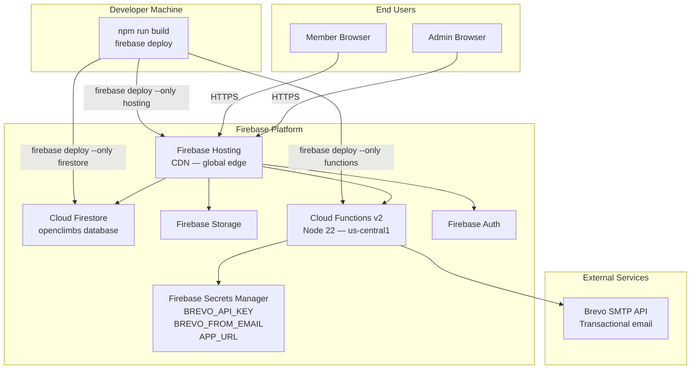
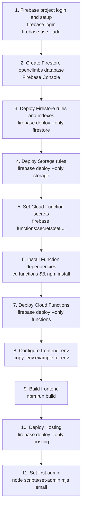
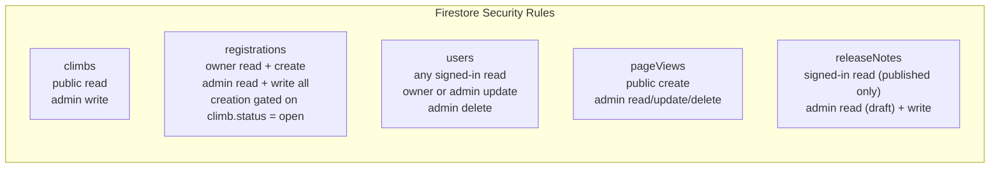
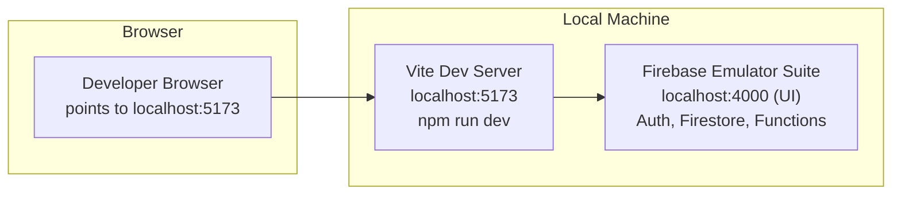
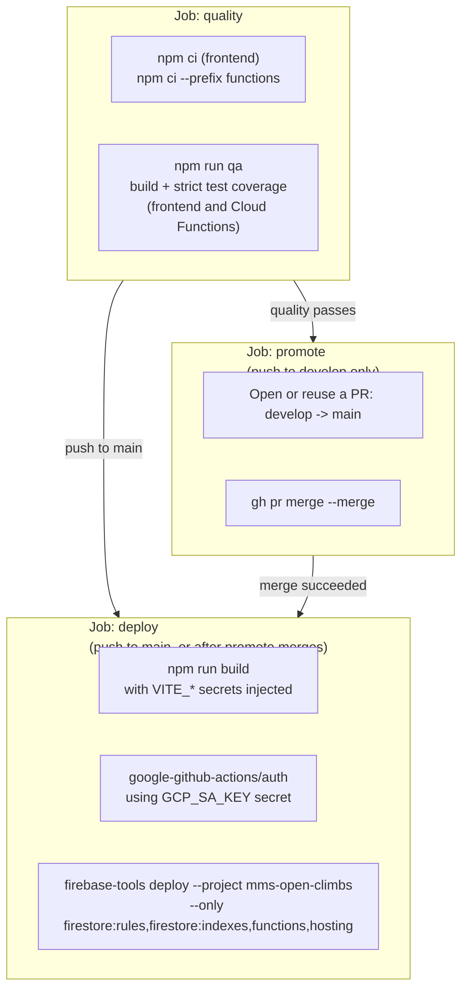

# Deployment

## Table of Contents

- [Overview](#overview)
- [Infrastructure Diagram](#infrastructure-diagram)
- [Prerequisites](#prerequisites)
- [Deployment Order](#deployment-order)
- [Step 1 — Firebase Project Setup](#step-1--firebase-project-setup)
- [Step 2 — Firestore Database and Rules](#step-2--firestore-database-and-rules)
- [Step 3 — Firebase Storage Rules](#step-3--firebase-storage-rules)
- [Step 4 — Cloud Functions](#step-4--cloud-functions)
- [Step 5 — Frontend Build and Hosting](#step-5--frontend-build-and-hosting)
- [Step 6 — First Admin Setup](#step-6--first-admin-setup)
- [Deploy Everything at Once](#deploy-everything-at-once)
- [Local Development](#local-development)
- [Environment Reference](#environment-reference)
- [CI/CD Considerations](#cicd-considerations)

---

## Overview

MMS Open Climbs is deployed entirely on Firebase. There is no custom server to provision or manage. The deployment pipeline covers:

- **Firebase Hosting** — serves the React SPA from Firebase's global CDN
- **Cloud Firestore** — stores climbs, registrations, and users data
- **Firebase Storage** — stores trail photos and GCash payment proof images
- **Cloud Functions v2** — runs automated triggers and the `createUser` callable
- **Brevo** — handles all transactional email delivery

---

## Infrastructure Diagram



---

## Prerequisites

Before starting, ensure you have:

| Requirement | Version | Notes |
| --- | --- | --- |
| Node.js | 20+ | LTS recommended |
| npm | 10+ | Bundled with Node 20 |
| Firebase CLI | Latest | `npm install -g firebase-tools` |
| Firebase project | — | With Firestore, Auth, Functions, and Storage enabled |
| Brevo account | — | For transactional email — verified sender required |

---

## Deployment Order

Follow this order strictly. Steps have dependencies: Functions require secrets; Hosting requires a successful build.



---

## Step 1 — Firebase Project Setup

```bash
# Authenticate with Firebase
firebase login

# Link this directory to your Firebase project
firebase use --add
```

Enable the following services in the Firebase Console:

- **Authentication** — Email/Password and Google providers
- **Cloud Firestore**
- **Cloud Functions**
- **Firebase Storage**

---

## Step 2 — Firestore Database and Rules

Create a Firestore database named **`openclimbs`** — not the default `(default)` database. This is required because the application code and Cloud Functions target this named database explicitly.

Deploy security rules and composite indexes:

```bash
firebase deploy --only firestore
```

This deploys both `firestore.rules` and `firestore.indexes.json`. The `releaseNotes` collection queries (`status == "published"` combined with `orderBy(publishedAt)`) require the composite index already defined in `firestore.indexes.json` — skipping this step leaves the member-facing popup and `/release-notes` history page throwing `failed-precondition` errors in production even though the rules deploy succeeds.

### Firestore rules summary



---

## Step 3 — Firebase Storage Rules

```bash
firebase deploy --only storage
```

This deploys `storage.rules`. Ensure your Storage rules allow authenticated uploads for payment proofs and trail photos.

---

## Step 4 — Cloud Functions

### Install dependencies

```bash
cd functions
npm install
cd ..
```

### Configure secrets

Set these secrets before deploying. Firebase will prompt for the values interactively.

```bash
firebase functions:secrets:set BREVO_API_KEY
firebase functions:secrets:set BREVO_FROM_EMAIL
firebase functions:secrets:set APP_URL
```

| Secret | Value |
| --- | --- |
| `BREVO_API_KEY` | Your Brevo account API key |
| `BREVO_FROM_EMAIL` | A verified sender email address in your Brevo account |
| `APP_URL` | Your production URL, e.g. `https://<project-id>.web.app` |

### Deploy functions

```bash
firebase deploy --only functions
```

---

## Step 5 — Frontend Build and Hosting

### Configure environment variables

Copy the example environment file and fill in your Firebase project values:

```bash
cp .env.example .env
```

`.env` contents:

```
VITE_FIREBASE_API_KEY=
VITE_FIREBASE_AUTH_DOMAIN=
VITE_FIREBASE_PROJECT_ID=
VITE_FIREBASE_STORAGE_BUCKET=
VITE_FIREBASE_MESSAGING_SENDER_ID=
VITE_FIREBASE_APP_ID=
```

These values are baked into the browser bundle at build time by Vite. Do not commit `.env` to source control.

### Build the frontend

```bash
npm run build
```

Output is written to the `dist/` folder. The `firebase.json` `hosting.public` setting points to `dist`.

### Deploy to Firebase Hosting

```bash
firebase deploy --only hosting
```

The SPA catch-all rewrite in `firebase.json` ensures all routes resolve to `index.html` for React Router:

```json
"rewrites": [{ "source": "**", "destination": "/index.html" }]
```

---

## Step 6 — First Admin Setup

After deploying, create your user account via the sign-up page, then promote it to admin:

```bash
node scripts/set-admin.mjs your@email.com
```

This script uses the Firebase Admin SDK and requires Application Default Credentials (ADC) or a service account key configured in your environment.

---

## Deploy Everything at Once

To deploy Firestore rules, Functions, and Hosting in one command (after secrets are set and the frontend is built):

```bash
npm run build && firebase deploy
```

---

## Local Development

### Architecture



### Start the emulators

```bash
firebase emulators:start --only auth,firestore,functions
```

The Emulator UI is available at `http://localhost:4000`.

### Start the Vite dev server

In a second terminal:

```bash
npm run dev
```

The app is available at `http://localhost:5173`.

### Emulator connection

When connecting the frontend to local emulators, set `VITE_USE_EMULATORS=true` in your `.env` (if the app is wired to respect this flag), or configure `connectFirestoreEmulator`, `connectAuthEmulator`, and `connectFunctionsEmulator` in `src/firebase/config.js` during local development.

### Local Functions environment

Create `functions/.env` (based on `functions/.env.example`) for local secret values:

```
BREVO_API_KEY=your-brevo-key
BREVO_FROM_EMAIL=your-sender@email.com
APP_URL=http://localhost:5173
```

---

## Environment Reference

### Files

| File | Purpose | Committed? |
| --- | --- | --- |
| `.env` | Frontend Vite env vars | No (git-ignored) |
| `.env.example` | Template for `.env` | Yes |
| `functions/.env` | Functions env vars for emulator | No (git-ignored) |
| `functions/.env.example` | Template for `functions/.env` | Yes |

### Production secrets

Managed via Firebase Secrets Manager. Set with `firebase functions:secrets:set`. Never stored in files or source code.

---

## CI/CD Considerations

Deployment is automated via GitHub Actions in `.github/workflows/firebase-ci-cd.yml`, triggered on every push to `develop`/`main` and on pull requests targeting `main`. It runs as three sequential jobs:



1. **`quality`** — installs frontend and Cloud Functions dependencies (Node 22, matching `functions/package.json` `engines.node`) and runs `npm run qa` (build + strict coverage) for both.
2. **`promote`** (only on a push to `develop` that passes `quality`) — opens (or reuses) a PR from `develop` into `main` and merges it immediately with `gh pr merge --merge`. This merges directly, using the default `GITHUB_TOKEN`, instead of GitHub's "auto-merge" UI feature — auto-merge requires a paid plan on private repos, which this repo does not have. Merging directly in this job (rather than waiting for a separate merge event) also lets `deploy` run in the same workflow run, since a merge performed by `GITHUB_TOKEN` would not otherwise trigger a fresh push-triggered run on `main`.
3. **`deploy`** (runs on a direct push to `main`, or after `promote` successfully merges) — checks out `main`, builds the frontend with `VITE_*` values injected from GitHub Actions secrets, authenticates to Google Cloud via `google-github-actions/auth` using a `GCP_SA_KEY` secret (a service account key, not a long-lived Firebase CLI token), then runs `firebase-tools deploy --project mms-open-climbs --only firestore:rules,firestore:indexes,functions,hosting --non-interactive`.

### Other workflows

Several other GitHub Actions workflows run independently of the deploy pipeline:

| Workflow | Purpose |
| --- | --- |
| `codeql.yml` | CodeQL static analysis security scanning |
| `create-release.yml` | Creates a GitHub Release on push to `main` |
| `pr-title-checker.yml` | Enforces a PR title convention |
| `broken-links-checker.yml` | Checks for broken links (including in `docs/`) |
| `scheduled-Dependabot-PRs-Auto-Merge.yml` | Auto-merges passing Dependabot PRs on a schedule |
| `stale-bot.yml` | Marks/closes stale issues and PRs |

See [CONTRIBUTING.md — Git Workflow](CONTRIBUTING.md#git-workflow) for how `develop` and `main` fit into day-to-day contribution flow.
