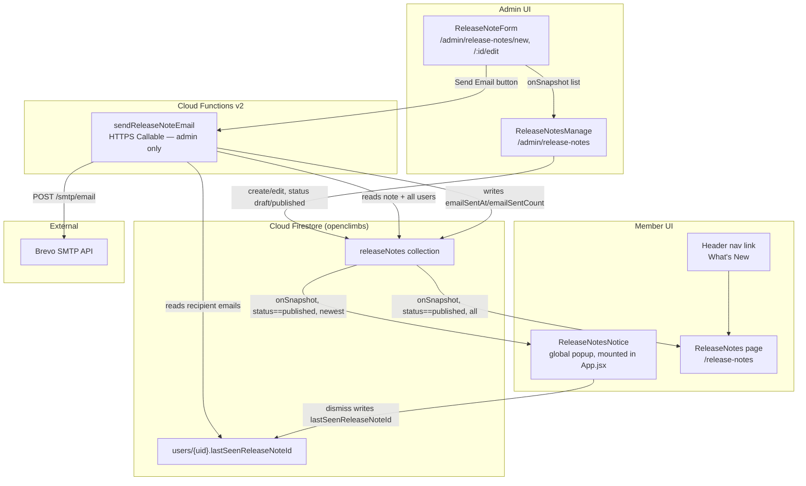
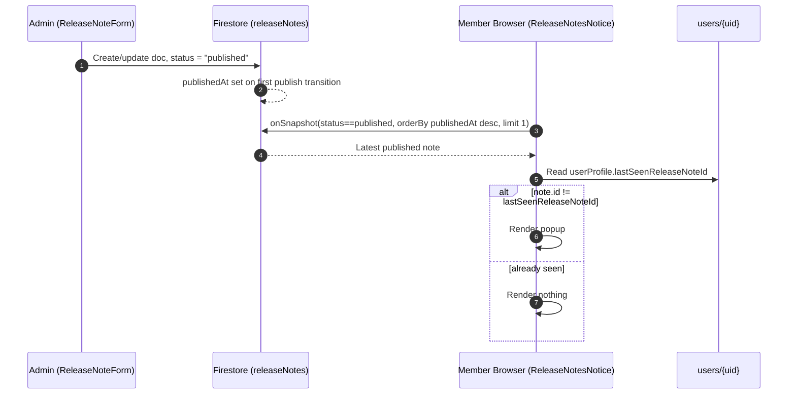
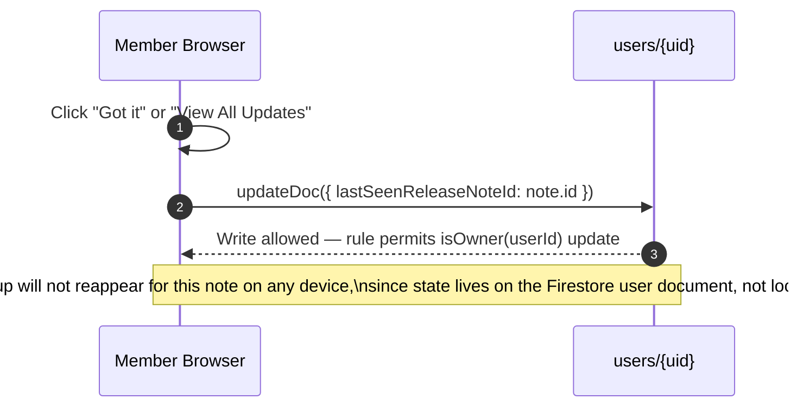
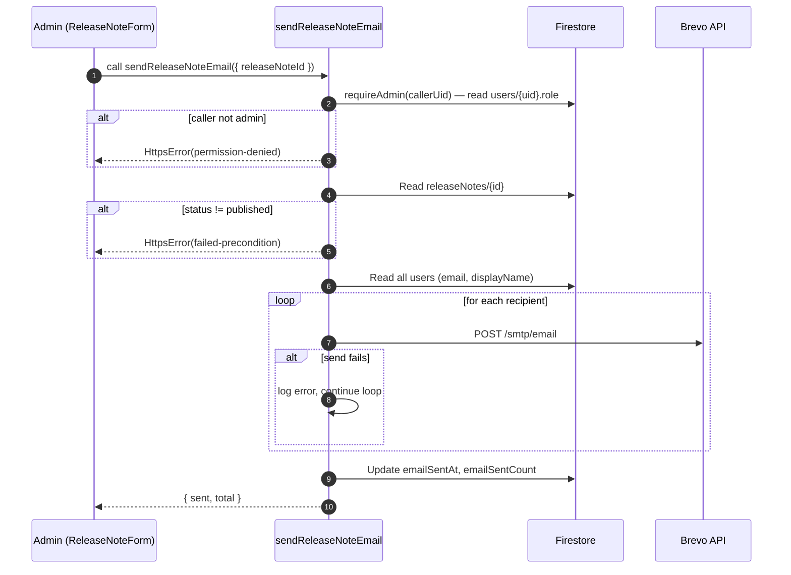
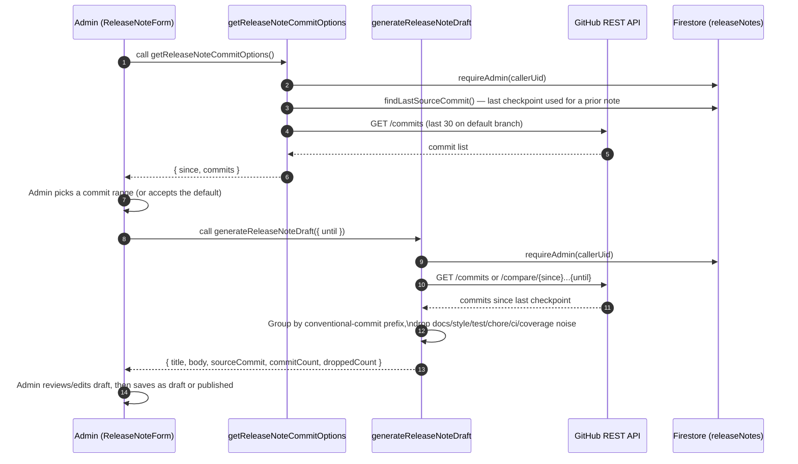
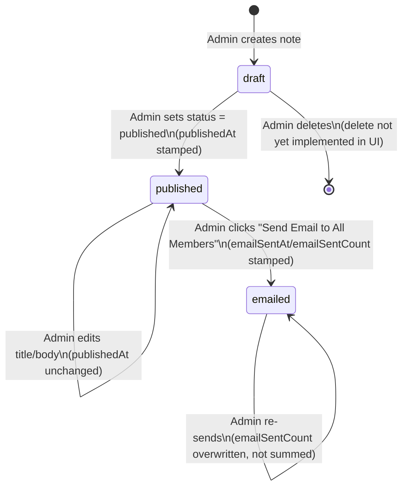

# Release Notes Feature — Audit, Roadmap, and Governance Plan

## Table of Contents

- [Purpose](#purpose)
- [Current Status](#current-status)
- [Architecture Overview](#architecture-overview)
- [Data Model](#data-model)
- [Core Flows](#core-flows)
  - [Publish and Notify Flow](#publish-and-notify-flow)
  - [Popup Dismissal Flow](#popup-dismissal-flow)
  - [Email Blast Flow](#email-blast-flow)
  - [Commit-Based Draft Generation Flow](#commit-based-draft-generation-flow)
  - [Release Note Lifecycle](#release-note-lifecycle)
- [Component Reuse Ledger](#component-reuse-ledger)
- [Implementation Roadmap](#implementation-roadmap)
  - [Phase 1 — Core Feature (Implemented)](#phase-1--core-feature-implemented)
  - [Phase 2 — Hardening and Usability (Planned)](#phase-2--hardening-and-usability-planned)
  - [Phase 3 — Governance and Scale (Future)](#phase-3--governance-and-scale-future)
- [Dead Code and Gap Audit](#dead-code-and-gap-audit)
- [Risks and Challenges](#risks-and-challenges)
- [Future Recommendations and Enhancements](#future-recommendations-and-enhancements)
- [Proposed Governance-Ready Architecture](#proposed-governance-ready-architecture)
- [Cross-References](#cross-references)

---

## Purpose

Release Notes gives admins a way to publish "what's new" updates and reach members through two channels: a passive in-app notice (popup + history page) and an active email blast. It reuses the existing Firestore + Cloud Functions + Brevo pipeline rather than introducing new infrastructure.

This document is the single source of truth for the feature's current state, what remains to be built, and how the design should evolve as the club's usage grows (more members, more frequent releases, a need for approval workflows). It is intended to be read alongside [ARCHITECTURE.md](ARCHITECTURE.md), [API.md](API.md), [DATA.md](DATA.md), and [SECURITY.md](SECURITY.md), which have been updated to cross-reference this feature rather than duplicate it.

---

## Current Status

| Area | Status |
| --- | --- |
| Data model (`releaseNotes` collection) | Implemented |
| Firestore security rules | Implemented |
| Firestore composite index (`status` + `publishedAt`) | Implemented |
| Admin list/create/edit UI | Implemented |
| Member popup notice ("what's new") | Implemented |
| Member history page (`/release-notes`) | Implemented |
| Header navigation entry | Implemented |
| Email blast callable (`sendReleaseNoteEmail`) | Implemented |
| Email template (`tplReleaseNote`) | Implemented |
| AI/commit-based draft generation (`getReleaseNoteCommitOptions`, `generateReleaseNoteDraft`) | Implemented |
| Standalone CLI generator (`scripts/generate-release-notes.mjs`) | Implemented |
| Frontend test coverage | Implemented |
| Cloud Function test coverage for `sendReleaseNoteEmail` | Gap — not yet covered (see [Dead Code and Gap Audit](#dead-code-and-gap-audit)) |
| Async/batched email dispatch for large member lists | Planned (Phase 2/3) |
| Approval workflow / release-manager role | Future (Phase 3) |

---

## Architecture Overview

The feature adds one new Firestore collection, one new Cloud Function, four new React components/pages, and one new field on the existing `users` document. No new external services were introduced — it reuses Firestore, the existing Brevo `sendEmail()` helper, and the existing admin-only callable pattern (`requireAdmin`).

**Design principle carried over from the rest of the app:** authorization is enforced twice — client-side route guards for UX, Firestore security rules and the `requireAdmin()` Cloud Function helper as the actual security boundary. See [SECURITY.md](SECURITY.md#firestore-security-rules).

---

## Data Model

`releaseNotes/{id}` — see the full field table in [DATA.md](DATA.md#releasenotes). Summary:

| Field | Type | Notes |
| --- | --- | --- |
| `title`, `body` | string | Author-supplied content |
| `status` | string | `draft` \| `published` — gates visibility and emailability |
| `createdAt`, `updatedAt`, `publishedAt` | timestamp | `publishedAt` drives "newest note" ordering |
| `createdBy` | string | Authoring admin's UID |
| `emailSentAt`, `emailSentCount` | timestamp, number | Set by `sendReleaseNoteEmail` after a successful blast |

`users/{uid}.lastSeenReleaseNoteId` — the ID of the last release note a member dismissed. Chosen over a per-note subcollection (the pattern `notifications` uses) because the popup only ever needs to compare against the single newest note, not maintain a full read history. This keeps writes to one field on a document the client already owns, instead of fanning out a document per member per release.

---

## Core Flows

### Publish and Notify Flow

### Popup Dismissal Flow

This deliberately differs from `WelcomeModal`'s "seen" tracking, which uses `localStorage` (`oc_welcomed_{uid}`) and therefore does not sync across devices or browsers. Release notes use the Firestore-backed field specifically so a member who dismisses the popup on their phone does not see it again on desktop. See [ARCHITECTURE.md — State Management](ARCHITECTURE.md#state-management) for the general pattern.

### Email Blast Flow

The loop is sequential and best-effort per recipient — one failed send is logged and does not abort the batch. This mirrors nothing else in the codebase exactly (existing triggers only ever email a handful of officers/admins per event), which is why it is flagged as a scaling risk in [Risks and Challenges](#risks-and-challenges) rather than treated as a proven pattern.

### Commit-Based Draft Generation Flow

To avoid admins writing release notes from scratch, `ReleaseNoteForm.jsx` can generate a draft title and body from git history via two admin-only callables:

This is a convenience layer only — it populates the same `title`/`body` fields an admin could type by hand; it does not change how a note is stored, published, or emailed. `scripts/generate-release-notes.mjs` implements the same commit-grouping approach as a standalone CLI (signing in via the Firebase Auth REST API) for admins who prefer generating and writing a release note directly from a terminal instead of the in-app form. See [API.md — getReleaseNoteCommitOptions](API.md#getreleasenotecommitoptions) and [API.md — generateReleaseNoteDraft](API.md#generatereleasenotedraft).

### Release Note Lifecycle

`emailed` is not a stored `status` value — it is a derived state (`status == "published" && emailSentAt != null`) used here to describe the lifecycle a note actually goes through, not a field in Firestore.

---

## Component Reuse Ledger

Everything below is an existing pattern applied to release notes, not a new abstraction:

| New piece | Reused from |
| --- | --- |
| Admin list page (`ReleaseNotesManage.jsx`) | `ClimbsManage.jsx` — table layout, search-less list variant, `.admin-table` classes |
| Admin form page (`ReleaseNoteForm.jsx`) | `ClimbForm.jsx` — create/edit-in-one-component pattern, `.admin-card`/`.form-group` classes |
| Callable invocation (`sendReleaseNoteEmailFn`) | `UsersManage.jsx` — module-scope `httpsCallable`, `err.code` handling |
| `sendReleaseNoteEmail` Cloud Function | `requireAdmin()` and `sendEmail()` helpers in `functions/src/index.js` — no new email transport |
| `tplReleaseNote` email template | `tplBase()` wrapper shared by every other template |
| Popup notice (`ReleaseNotesNotice.jsx`) | `WelcomeModal.jsx` — `.welcome-overlay`/`.welcome-modal` CSS, overlay structure |
| History page (`ReleaseNotes.jsx`) | `MyRegistrations.jsx` — `.myreg-page`/`.myreg-main`/`.reg-card` layout classes |
| Dashboard nav card | `Dashboard.jsx` — existing nav-card grid, one entry added |
| Header nav link | `Header.jsx` — existing `NavLink` pattern, desktop and mobile drawer |

No new CSS was written and no new npm dependency was added.

---

## Implementation Roadmap

### Phase 1 — Core Feature (Implemented)

- `releaseNotes` Firestore collection, security rules, composite index
- Admin create/edit/list UI with draft/published status
- Member popup notice with cross-device dismissal state
- Member history page and header navigation entry
- Admin-triggered email blast to all members via existing Brevo pipeline
- Frontend test coverage for all four new components/pages

### Phase 2 — Hardening and Usability (Planned)

| Item | Rationale |
| --- | --- |
| Cloud Function test coverage for `sendReleaseNoteEmail` | Currently the only untested callable in `functions/src/index.js`; see [Dead Code and Gap Audit](#dead-code-and-gap-audit) |
| Delete/archive action in admin UI | Notes can currently only be created and edited, never removed — no `deleteDoc` call exists anywhere in `ReleaseNotesManage.jsx` or `ReleaseNoteForm.jsx` |
| Rich text or Markdown rendering | `body` is rendered as plain text (`white-space: pre-line`) — acceptable for short updates, limiting for anything needing links or emphasis |
| Scheduled/future publish date | `publishedAt` is stamped immediately on publish; there is no way to queue a note to go live at a future time |
| Search/pagination on `/release-notes` | Fine at low volume; the query has no `limit()`, so the history page will load the entire published history on every visit |
| Per-note email send confirmation preview | Admin currently sends blind — no preview of the rendered email before committing to a send-to-all-members action |
| Categorization/tagging (feature, fix, announcement) | Useful once note volume grows; currently every note looks the same in the history list |

### Phase 3 — Governance and Scale (Future)

| Item | Rationale |
| --- | --- |
| Asynchronous, batched email dispatch (Cloud Tasks or a Firestore-triggered queue) | The current callable emails every recipient sequentially inside a single HTTPS request — see [Risks and Challenges](#risks-and-challenges) |
| Approval workflow (`draft` → `in review` → `published`) | Today any single admin can publish and immediately email the entire membership with no second reviewer |
| Dedicated "release manager" permission distinct from full `admin` | Currently anyone with `role: admin` can send a mass email; there is no narrower grant |
| Audience segmentation (e.g. only climb officers, only a specific climb's registrants) | The callable currently always targets every document in `users` |
| Delivery/engagement tracking (Brevo webhook → bounce/open tracking) | No feedback loop exists today between "email sent" and "email actually delivered/opened" |
| Formal ADR for the notification-channel decision | See [Proposed Governance-Ready Architecture](#proposed-governance-ready-architecture) — `docs/adr/` is referenced by `CONTRIBUTING.md` but does not yet exist in the repository |

---

## Dead Code and Gap Audit

Findings from reviewing the four new frontend files, the new Cloud Function, the rules change, and the surrounding docs:

| Finding | Severity | Detail |
| --- | --- | --- |
| No dead code in new frontend files | — | All imports in `ReleaseNotesManage.jsx`, `ReleaseNoteForm.jsx`, `ReleaseNotes.jsx`, and `ReleaseNotesNotice.jsx` are used; no unreachable branches or leftover scaffolding found. |
| `sendReleaseNoteEmail` has no Jest coverage | Gap | `functions/tests/index.test.js` only mocks `mockDb.doc()`, not `mockDb.collection()`. `functions/tests/notifications.test.js` has since added a working `mockDb.collection()` implementation and closed this gap for `getNotifyLists`, `onRegistrationCreated`, `onRegistrationUpdated`, and `sendReminderNotifications` — `sendReleaseNoteEmail` is now the only remaining collection-based callable without Cloud Function test coverage. |
| No delete/unpublish action | Gap | A note published in error can only be fixed by editing it back to `draft` — there is no way to remove it from Firestore through the UI. |
| `docs/adr/` referenced but absent | Pre-existing gap | `CONTRIBUTING.md` and `README.md` both point to `docs/adr/` for architecture decision records; the directory does not exist in this repository. Not caused by this feature, but this feature is the first one large enough to warrant an ADR (see [Proposed Governance-Ready Architecture](#proposed-governance-ready-architecture)). |
| No rate limiting or size cap on the email blast | Gap | `sendReleaseNoteEmail` iterates every document in `users` with no batching, concurrency limit, or hard cap — acceptable at the club's current membership size, a real risk beyond a few hundred members. |
| Popup query has no error boundary | Minor | If the `releaseNotes` `onSnapshot` listener errors (e.g. missing index before the fix landed), `ReleaseNotesNotice` fails silently rather than surfacing a console warning distinct from other listeners. |

---

## Risks and Challenges

| Risk | Impact | Mitigation status |
| --- | --- | --- |
| Callable function timeout on large membership | An HTTPS callable has a bounded execution window; a sequential per-recipient loop against Brevo will eventually exceed it as membership grows. | Not yet mitigated — flagged for Phase 3 async dispatch. |
| Brevo API rate limits | Brevo enforces per-account send-rate limits; sending to hundreds of members in a tight sequential loop risks 429 responses mid-batch. | Not yet mitigated — the loop currently only logs and continues past a single failed send, it does not back off or retry. |
| Single point of authorization (any `admin`) | Any admin account compromise (or accidental misuse) can immediately blast every member's inbox with no second approval step. | Not yet mitigated — same authorization boundary as every other admin-only callable in the app. |
| No delivery confirmation loop | `emailSentCount` reflects Brevo API acceptance, not actual delivery or open — the admin has no way to know if the send genuinely reached inboxes. | Not yet mitigated — would require Brevo webhook integration. |
| History page has no query limit | As the number of published notes grows over multiple seasons, `/release-notes` will fetch and render the entire history on every page load. | Not yet mitigated — low risk at current release cadence, worth revisiting before the second season of use. |
| Popup and history page both require a live Firestore composite index | The `status == published` + `orderBy(publishedAt)` query pattern used by both components requires the composite index in `firestore.indexes.json` to be deployed — a missed `firebase deploy --only firestore:indexes` step silently breaks both surfaces. | Mitigated — index is present in `firestore.indexes.json` and was already deployed as a follow-up fix. |

---

## Future Recommendations and Enhancements

- **Add a delete/archive control** to `ReleaseNotesManage.jsx`, following the confirm-then-call pattern already used for `deleteUserAccountFn` in `UsersManage.jsx`.
- **Cap and paginate** the `/release-notes` history query once note volume grows (e.g. `limit(20)` with a "load more" affordance), mirroring how `NotificationBell` bounds its query with `limit(30)`.
- **Preview the rendered email** in the admin form before the "Send Email to All Members" action executes, so admins are not sending blind.
- **Move to asynchronous dispatch** once membership size makes a synchronous callable risky — see [Proposed Governance-Ready Architecture](#proposed-governance-ready-architecture) below for the concrete shape of this change.
- **Introduce audience segmentation** (all members vs. a specific climb's registrants vs. climb officers only) by reusing the `getNotifyLists()`-style targeting already built for registration emails, rather than hardcoding "all of `users`".
- **Backfill Cloud Function tests** for `sendReleaseNoteEmail` — `functions/tests/notifications.test.js` already demonstrates the `mockDb.collection()` pattern needed (used there for `getNotifyLists`, `onRegistrationCreated`, `onRegistrationUpdated`, and `sendReminderNotifications`), so extending that same mock to cover `sendReleaseNoteEmail` should be a small, well-precedented addition rather than new groundwork.
- **Formalize an ADR process** — create `docs/adr/` (currently only referenced, never created) and write the first entry for the notification-channel decision described below, so the next architectural change to this feature has a documented decision trail to build on.

---

## Proposed Governance-Ready Architecture

The current design (Phase 1) is intentionally the simplest thing that works: a synchronous callable, single-tier admin authorization, and no approval gate. That is appropriate for a club-scale membership and an infrequent release cadence. The proposal below describes how to evolve it **without a rewrite** as usage grows — each change is additive to the existing pipeline, not a replacement of it.

```mermaid
flowchart TB
    subgraph Today["Phase 1 — Current (synchronous)"]
        A1["Admin clicks Send Email"]
        A2["sendReleaseNoteEmail callable\nloops recipients inline"]
        A3["Brevo API"]
        A1 --> A2 --> A3
    end

    subgraph Proposed["Phase 3 — Proposed (async, governed)"]
        B1["Admin clicks Send Email"]
        B2["requireRole('release_manager')\nnarrower than full admin"]
        B3["Optional approval step\nstatus: pending_review -> approved"]
        B4["enqueueReleaseNoteEmail callable\nwrites one job doc, returns immediately"]
        B5["releaseNoteEmailJobs/{jobId}\nFirestore document as work queue"]
        B6["onDocumentCreated trigger\nprocesses recipients in bounded batches"]
        B7["Brevo API\nwith backoff and retry per batch"]
        B8["Job doc updated with progress\nsent / failed / total"]
        B9["Admin UI shows live progress\nvia onSnapshot on the job doc"]

        B1 --> B2 --> B3 --> B4 --> B5 --> B6 --> B7 --> B8 --> B9
    end
```

Key differences and why each is additive rather than disruptive:

| Change | What stays the same | What's new |
| --- | --- | --- |
| Job document (`releaseNoteEmailJobs/{jobId}`) instead of inline loop | `sendEmail()` helper, `tplReleaseNote()` template, Brevo endpoint — unchanged | A Firestore document becomes the unit of work, so the callable only has to write one document and return, matching the existing "callable does the minimal write, a trigger does the heavy lifting" shape already used by `onRegistrationCreated`/`onRegistrationUpdated`. |
| Batched trigger processes recipients in chunks with backoff | The trigger pattern itself — this app already reacts to Firestore document events for all its email dispatch | Removes the callable timeout risk entirely; batches can retry independently instead of the whole blast failing on one flaky Brevo response. |
| `release_manager` custom role/claim | The existing `role` field on `users/{uid}` and the existing `isAdmin()` rule helper | A narrower grant (e.g. `role: admin` plus a `canSendReleaseEmails: true` flag, or a dedicated custom claim) so blast-sending is not implicitly available to every admin account by default. |
| Approval sub-status before send | The `draft`/`published` status field already on `releaseNotes` | An optional `pending_review` status admins can require before `published` unlocks the email button — purely additive to the state diagram in [Release Note Lifecycle](#release-note-lifecycle). |
| Live progress in the admin UI | The `onSnapshot`-based realtime patterns already used everywhere in the admin pages | The admin form subscribes to the job document instead of awaiting a single callable response, giving visible progress on large sends instead of a single opaque "Sending..." spinner. |

This keeps every existing building block (`sendEmail`, `tplReleaseNote`, Firestore rules conventions, `requireAdmin`) intact and only changes the shape of *how work gets scheduled and executed*, which is exactly the kind of decision that belongs in an ADR (`docs/adr/ADR-0001-release-notes-notification-channel.md`, proposed but not yet created) so that if a future contributor reverts to a synchronous design, the tradeoff is documented rather than rediscovered.

---

## Cross-References

| Topic | See |
| --- | --- |
| `releaseNotes` schema and `users.lastSeenReleaseNoteId` field | [DATA.md](DATA.md#releasenotes) |
| `sendReleaseNoteEmail` callable reference (payload, response, error codes) | [API.md](API.md#sendreleasenoteemail) |
| `getReleaseNoteCommitOptions` / `generateReleaseNoteDraft` callable reference | [API.md](API.md#getreleasenotecommitoptions) |
| Firestore rules for `releaseNotes` | [SECURITY.md](SECURITY.md#firestore-security-rules) |
| Component hierarchy placement | [ARCHITECTURE.md](ARCHITECTURE.md#frontend-architecture) |
| Composite index deployment step | [DEPLOYMENT.md](DEPLOYMENT.md#step-2--firestore-database-and-rules) |
| Test file locations | [TESTING.md](TESTING.md#test-structure) |
| End-user and admin usage guide | [USER_MANUAL.md](USER_MANUAL.md#12-for-administrators) |
